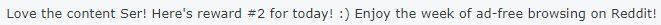
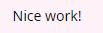
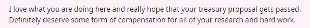
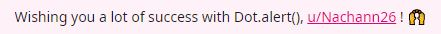

# Our supporters

## Reviewer(s)

_<mark style="background-color:green;">Those who give us feedback.</mark>_

\[Get your name here!]

<figure><figcaption>
<em><mark style="color:green;">Anonymous Reddit user</mark></em> 
</figcaption></figure>

<figure><figcaption>
<em><mark style="color:green;">u/Bitman321</mark></em>
</figcaption></figure>

<figure><figcaption>
<em><mark style="color:green;">u/Gr33nhatt3r</mark></em>
</figcaption></figure>

<figure><figcaption>
<em><mark style="color:green;">u/elodie_w3f</mark></em>
</figcaption></figure>

## **Fundraiser(s)**

_<mark style="background-color:green;">Those who fund our developments.</mark>_

[**The Polkadot Treasury**](https://polkadot.subsquare.io/council/motion/263) ****&#x20;

