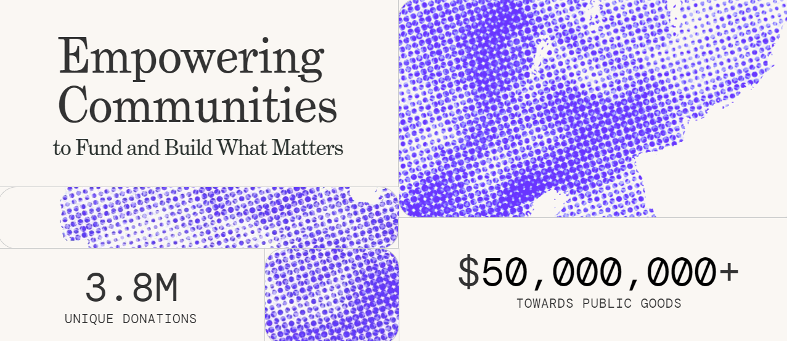

# Blog

## [Measuring Impact of Grant Funding](https://twitter.com/grantsstack/status/1679203929526259712)

_14th July 2023 | A report by Onyinye M._

**Host: Gitcoin Grants stack**

**Co-hosts: Hypercerts and Gitcoinreviews**

In the realm of cryptocurrency funding, the importance of measuring impact cannot be overstated. Impact measurement provides valuable data to substantiate the relevance and effectiveness of crypto funding initiatives, such as the Gitcoin Grants Programme. This data is crucial in demonstrating why web3 funding surpasses traditional methods. Various methodologies can be employed to gauge impact, ranging from the conventional approach of evaluating project proposals to a retrospective analysis of actual performance. This article delves into the significance of impact measurement and highlights the potential of decentralized standards, while addressing questions raised during an interactive space hosted by Gitcoin.

### The Importance of Impact Measurement

Impact measurement serves as a means to validate the value of crypto funding. By assessing the outcomes and accomplishments of funded projects, impact measurement offers tangible evidence of the positive change enabled by crypto grants. This empirical data aids in substantiating the superiority of web3 funding over traditional models, encouraging broader adoption and support.

### Approaches to Impact Measurement

#### **1. Traditional Method:**&#x20;

The traditional approach involves evaluating projects based on their stated objectives and proposed scope of work. By comparing the actual outcomes with the initial expectations, impact can be assessed. However, this method may fall short in the crypto space, as it is a fast-evolving space where projects may not always strictly adhere to their original plans and market conditions can cause rapid changes.

#### **2. Retrospective Approach:**&#x20;

In the crypto realm, a retrospective approach is more suitable for impact measurement. This approach entails reviewing a project's past performance and evaluating its actual achievements. Rather than relying solely on promises, this method analyses what has been accomplished, enabling a more accurate assessment of impact.

### Monetising Impact and Performance Metrics

Beyond securing funding, funded projects can also monetize their impact. Instead of solely relying on continuous funding, projects can leverage their demonstrated impact to attract more investments. Investors are increasingly interested in supporting projects with tangible and visible impact, allowing projects to sustain themselves and reduce their reliance on continuous grants.

<figure><figcaption>
The socio-financial impact of the Gitcoin grants programme on Public Goods projects.
</figcaption></figure>

### Decentralized Measurement Standards

One of the challenges with quadratic funding is the potential for it to become a popularity contest. The discussion highlighted the importance of decentralized measurement standards. Implementing a decentralized system for measuring impact would enhance transparency, trust, and credibility, ensuring fair evaluation of projects and a fair chance for projects to attract funding. By establishing a neutral and widely accepted standard, the decentralized approach would foster a more accurate assessment of projects' impact.

### **Questions and Answers**

During the discussion, several questions were posed to the host regarding Gitcoin's funding system and impact measurement. Here are some responses provided:

_**1. Are there any stats on grantees reapplying for Gitcoin grants over time?**_

Yes, Gitcoin does have statistics on grantees reapplying for grants. However, Gitcoin is actively working on making these external resources available to the public to enhance transparency. The host of the discussion committed to following up on this question to provide more detailed information.

_**2. How can we keep track of the history of projects, considering some use a unique address for each round?**_

While some projects may use unique addresses for each funding round, it is possible to monitor their activities by tracking their social media presence, websites, and other online platforms. These channels can provide insights into the project's progress and activities, even if they use different addresses for identification purposes.

**3. Does participating in successive rounds help projects drive engagements beyond one-time donations?**

Yes, participating in successive funding rounds can indeed help projects drive ongoing engagement beyond one-time donations. However, projects are encouraged to explore more sustainable avenues beyond repetitive participation

Impact measurement is important for both funding platforms like Gitcoin, and funded projects. It helps platforms examine the value they are providing while assisting funded projects in realising and monetising their impact. Decentralised measurement standards on the other hand  further contributes to the credibility and sustainability of crypto-funded projects.

