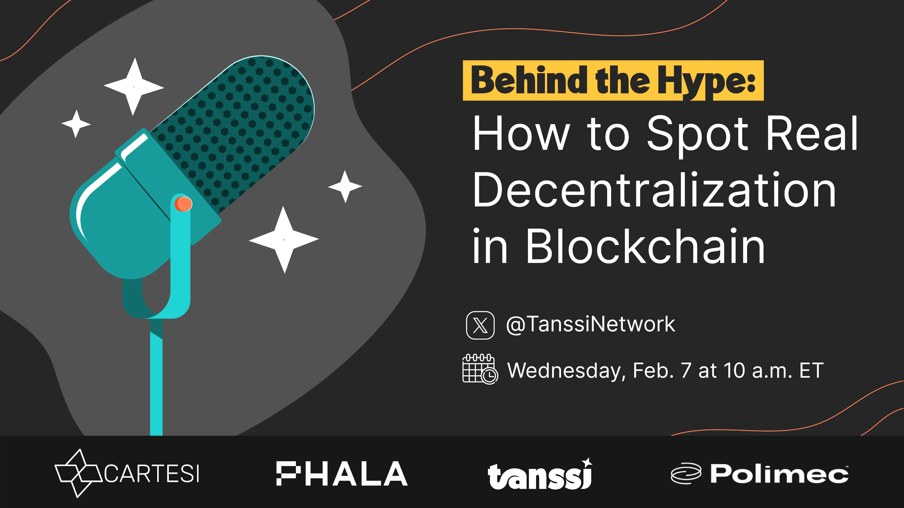
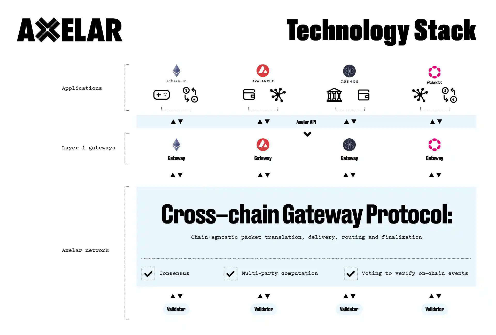
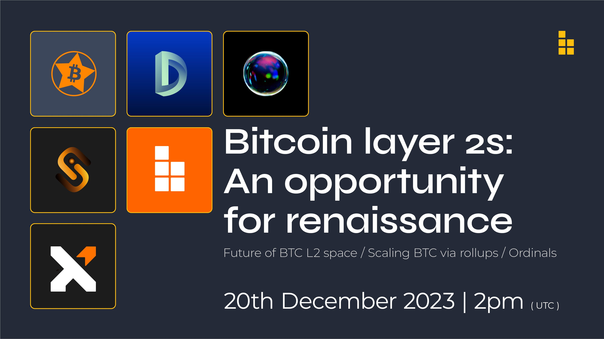
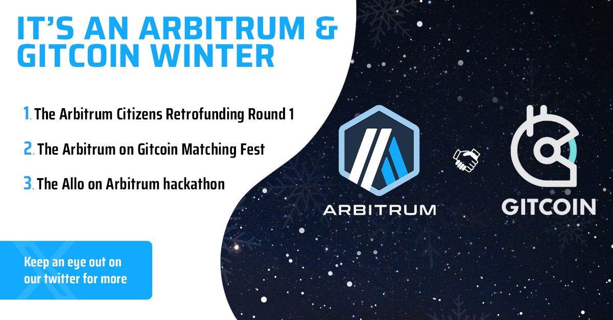
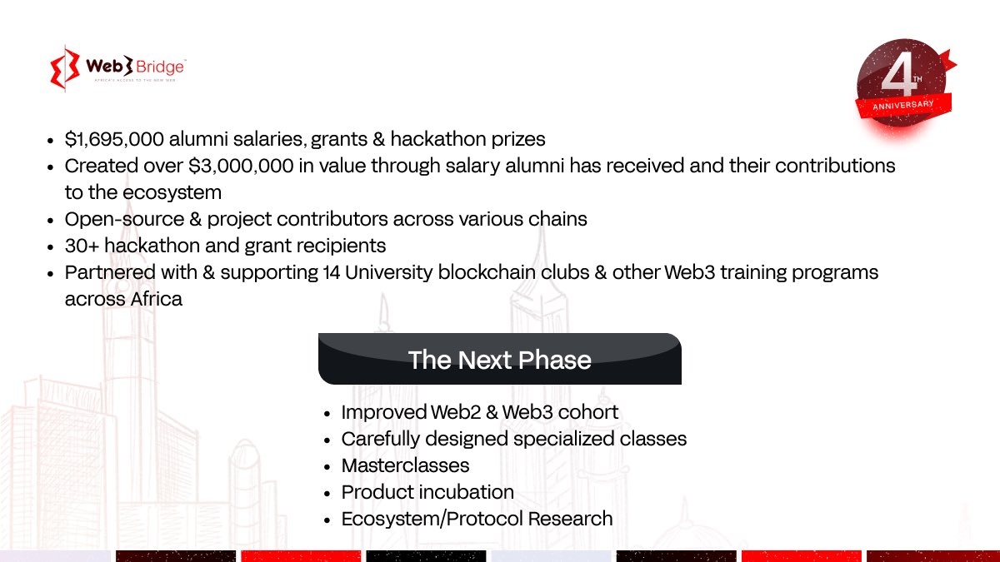

# Web3 Reports

## [Beyond the Narratives: Multi-chain Liquid Staking](https://x.com/PolytopeLabs/status/1796226935191666815)

_10th June 2024 | A report by Amed K._

**Host: Polytope Labs**

Over the past few years, Liquid staking has become a very popular derivative tool for DeFi users looking to release liquidity for staked tokens and get extra yields across different platforms.&#x20;

This report recaps on the discussion led by Seun Lanlege (founder of _Polytope Labs_) and Thomas (community lead at _Bifrost_) as they explore the fundamental role that bridges play in facilitating the operations of multi-chain liquid staking protocols.

### Expanding Opportunities for Yield Farming

Liquid staking is a mechanism that token holders can leverage to earn income from both non-custodial staking and DeFi farming. Bifrost is a DeFi protocol that allows users to mint Liquid Staking Tokens (LSTs) and earn yields on multiple [dapps of the Polkadot ecosystem](https://polkadot.network/ecosystem/dapps/), depending on the level of risk that they are willing to take.&#x20;

Before LSTs are minted, the Liquid Staking Protocol needs to have determined and chosen a set of validators and a nomination pool to maximise the "base yields". Once LSTs are issued, minters can use them on different platforms and for different purposes, such as:

* governance operations on OpenGov
* leverage staking
* liquidity provision on DEXes
* collateral for loans
* collateral for minting stablecoins
* collateral for providing security on decentralised bridges

<figure><figcaption>
<em>Beyond the Narratives</em> explores critical developments in multi-chain infrastructure.
</figcaption></figure>

### **Supporting Multi-chain Solutions for Liquid Staking**

To align with multi-chain developments observed in DeFi, Bifrost has developed two different protocols for liquid staking: _Staking Liquidity Protocol_ (SLP) whose core features strictly belong to the Bifrost parachain, and _Multi-chain staking_ (SLPx) which has cross-chain capabilities.

Bifrost uses third-party bridging infrastructure to support liquid staking for assets that are held on Ethereum and Filecoin. However, given that most of the current offerings for bridges rely on multisigs, the team recognises that more trustless and decentralised solutions are needed to prevent multi-chain liquidity from being compromised by hackers.&#x20;

### Developing Resilient Bridging Infrastructure&#x20;

Aside empowering users to freely move assets between existing ecosystems, comprehensive solutions are needed to standardise interoperability in the blockchain industry. Polytope Labs is developing _Hyperbridge_ as a secure bridging infrastructure with:

* cryptographic verifications to authenticate cross-chain requests
* a decentralized set of relayers for multi-chain transaction executions
* a fee-earning model for services&#x20;
* integration of all major Ethereum L2s and BNB chains&#x20;

Optimisations for _Hyperbridge_'s cryptography are ongoing to align with the latest developments in ZKPs. These are also necessary to improve the cost of verifications on Ethereum and allow the bridge to integrate Ethereum network, just like _Snowbridge_.&#x20;

Liquid staking is the new frontier of DeFi because it drives traditionally isolated protocols to push the boundaries of their native ecosystems and become multi-chain platforms. In this quest for censorship-resistant interoperability, decentralised bridges will serve as a major avenue for both portfolio managers and infrastructure builders to effectively grow and secure their revenue streams over time.

***

## [Boring Security Monthly: Account Abstraction](https://twitter.com/BoringSecDAO/status/1786047823122772409)

_6th May 2024 | A report by Amed K._

**Host: Boring Security**

A recurring trend in blockchain consists of adding new functionalities to crypto products before finding ways to secure these, which exposes first-time users of the technology to vulnerabilities and serious threats.

This report summarises key observations shared by a discussion panel with FΞLD (contributor at _Boring Security_), NFT\_Dreww (ambassador at _Wallet Guard_), and Toven (contributor at _Server Forge_) on the implementation of Account abstraction and its implications for security best practices.

### Simplifying Asset Storage

Account abstraction is a generic blockchain concept and technology that underpins a new way for user to interact with EVM networks and ecosystems. Under this approach, users' assets can be stored in the form of Smart contracts (ERC-4337) rather than traditional Externally-owned accounts (EOAs).

This technology aims to solve long-standing UX problems such as the complexity of private key management and the lack of functionalities around transaction customisation. Account abstraction introduces new solutions for batching and/or automating transactions as part of subscription-based payments, including spending limits and a lot more features.&#x20;

### Identifying Technological Risks

In principle, account abstraction allows developers to reduce the number of layers and micro-services between users and on-chain transactions. But, in practice, this also brings some security risks:

1. **Signatures:**&#x20;

When using a traditional wallet, signing a transaction such as a coin swap on an AMM requires two different types of signatures. First, to approve the Smart contract interaction for the given token, and second, to confirm the amount of tokens to be swapped. With account abstraction, these steps are bundled into one with a single signature. Therefore, there is an increased risk of interaction with erroneous addresses, and there are also fewer steps for potential drainers to rob people of their assets.

2. **Delegations:**&#x20;

When managing assets under the account abstraction paradigm, users have the option to delegate their entire wallet to multiple Smart contracts through an access policy. Unlike [Polkadot SDK's multi-level account abstraction functionalities](https://wiki.polkadot.network/docs/learn-account-abstraction), this is a persistent type of access by which the other Smart contracts can act on behalf of users to sign anything prescribed within the access policy. However, in this context, authorising a malicious contract as a delegate would be equivalent to getting one's private keys stolen.

<figure><figcaption>
Boring Security is a DAO specialised in Web3 security training and education.
</figcaption></figure>

### Prioritising the User Experience

Account abstraction has a lot room for evolution, but some suggestions can already be made to improve its implementation.&#x20;

An important recommendation for all major wallet builders is to make Smart contract wallets an opt-in instead of the default choice. Users could then be given some help to navigate upcoming changes through disclaimers, pop-ups, and articles discussing new features. Before opting for either the traditional or the Smart contract wallet, it will be important for newcomers to know what the basics of the technology are.

And the technology itself needs refining, as delegations on smart wallets do not currently support cross-chain operations. Additionally, signatures come with some nuances that affect the ordering and execution of individual transactions. This can make it difficult for users to submit multiple transactions asynchronously without some of them being automatically revoked.

Despite its rising popularity and adoption, Account abstraction is still a proof-of-concept technology that comes with noted drawbacks that users must be aware of. This is why up-to-date tutorials and learning resources will be needed to walk new users through its low-level technicalities and future use cases.

***

## [Mad Scientists Enter the Lab](https://twitter.com/osmosiszone/status/1775530819215634828)

_13th April 2024 | A report by Amed K._

**Host: Osmosis**

In the blockchain industry, established use cases such as DeFi and NFTs are becoming the playgrounds of choice for technologists, researchers, and economists. New projects have to be radically innovative to capture the attention of users and build their communities.

In this report, we recap the discussion led by Aaron Kong (Growth & strategy lead at _Osmosis Labs_) and Sunny Aggarwal (founder of _Osmosis Labs_) with Zerk and Cudo (co-founders of _Mad Scientists_), in partnership with JGnft (founder of _Backbone Labs_), during which they expanded on the collaborative efforts behind the launch of their first NFT collection.

### Unifying the Ecosystem

_Osmosis_ is a long standing DeFi hub that aims to simplify access to liquidity and markets in the Cosmos ecosystem. Meanwhile, _Backbone Labs_ is a launchpad that is incubating _Mad Scientists_ as a proof-of-concept NFT collection. These project teams have been using existing ecosystem dapps for the fair launch and the trade of $LAB tokens (_Stream swap, OsmosisDEX, etc._) which will be burnt to mint NFTs at a later date. They are also tapping into popular community platforms for airdrops (_OmniFlix_) and NFT trading (_Stargaze_) for future growth prospects.

More than an NFT marketplace, _Backbone Labs_ is building a protocol halfway between DeFi and NFT on which creators, builders, and founders can freely experiment. Examples of new propositions include allowing NFT communities to manage and share revenues through Liquid Staking Tokens (LST) protocols, but also creating NFT-centric dApps that can work seamlessly across the ecosystem.

<figure><figcaption>
<em>Updates from The Lab</em> presents the latest developments in and around Osmosis.
</figcaption></figure>

### Cultivating Experiments &#x20;

The joint venture between _Backbone Labs_ and _Mad Scientists_ aims to bring in a new tinkering culture and more freedom to transact in the decentralised space. This also means making new social, financial, and technological experiments. At a basic level, their plan is to start sponsoring collaborative spaces to activate new contributors and give back to the community.&#x20;

In this context, hackathons are seen as a funnel for creativity to translate into new applications that can then be integrated on Osmosis to push the NFTfi space forward. Rethinking schemes such as 0% staking commissions and token buybacks are also viable options for making the most of the underlying technologies to provide engaging and fun experiences.

Minting NFTs is envisioned as the first step towards building a DAO, because the initial spread of stake and ownership is still concentrated. This does not reflect the degree of decentralisation needed by DAOs to make an impact. And so, the teams will offer incentives such as royalties rights on secondary sales and timely airdrops to bring in more active participants.

With over a decade of developments, blockchain technologies have reached a stage where they can deliver standardised services and innovative solutions to all stakeholders. This requires a cultural shift in the way project teams capture and distribute value while growing their communities.

***

## [Tokenizing the World](https://twitter.com/0xPolygon/status/1763691036428447943)

_8th March 2024 | A report by Amed K._

**Host: Polygon**

The idea of tokenisation is as old as blockchain technology itself. It is a process that plays a crucial role in the advancement of the industry by enabling the representation of real-world assets or utilities as digital tokens on a blockchain.&#x20;

In this report, we summarise insights from a discussion led by Colin Butler (Global Head of Institutional Capital at _Polygon_), alongside _Franklin Templeton Digital Assets_ and various _Polygon_ ecosystem contributors, which focused on how tokenisation is inspiring a range of innovative solutions to real-world problems.

### Relevance of Tokenisation

In traditional finance (TradFi), contracts that govern assets are kept separately from the assets themselves.  Consequently, most of the workforce in the TradFi industry is tasked with handling assets, negotiating contracts, and then resolving asset-related transactions. Because these operations are mainly conducted offline and involve multiple participants, accountability and transparency are often lacking across the board.

One of the unique properties of cryptographic tokens as an asset class is that they can embed the contract that governs an asset within the asset itself. Since all assets and contracts are created and tracked on a public ledger built on a Digital Ledger Technology, all their terms, and conditions can be cross-checked at any time.  Furthermore, contracts can be programmed to execute specific transactions once certain requirements are fulfilled, which illustrates why tokenisation has the potential to save financial institutions billions in operational costs.

<figure><figcaption>
Polygon is running a five-part series focused on tokenisation for accessible, transparent, and liquid markets.
</figcaption></figure>

### Integrating TradFi

While digital assets can represent an opportunity for investment portfolio diversification, they are not easily tradable for many reasons. This is the case for royalties on digital art pieces traded on NFT marketplaces. Even though is possible for institutional investors to acquire royalties, difficulties remain in scaling the administration of royalty pools to, not just a handful, but millions of participants.&#x20;

Tokenisation allows a wider range of asset classes to be issued both digitally and physically, including collectibles, financial contracts, and real estate deals. In this context, physical assets are kept in an accredited storage of facility and their related data is embedded digitally into a token to provide the purchaser with custom rights (intellectual, property, custody, trading, etc.).  This process can also help address pervasive problems such as bureaucracy, forgery, and fraud.

### Improving Cross-border Transactions

One added advantage of tokenisation as a technology is that it can enable access to international capital for businesses and enterprises from around the world. This would result in increased access to global markets and greater circulation of funds, which can help optimise hedging strategies for institutional players.

For everyday users and consumers, tokenisation can democratise trading, peer-to-peer borrowing, and liquidity pooling, with revenue generated through market-making fees and interest rates. It becomes possible for a project to create real world value and then issue custom-made financial instruments to fund its growth, with minimal intervention from external parties.&#x20;

The necessity to embrace tokenisation arises from the imperative to build portfolios that offer much more than equities or bonds to traditional investors. Unlike utility tokens that are exclusively designed for blockchain operations, tokenised securities could work to bridge the divide between new digital solutions and existing financial practices to redefine markets on a global scale.

***

## [Behind the hype: How to spot real decentralization in blockchain](https://twitter.com/TanssiNetwork/status/1753277786545123508)

_9th February 2024 | A report by Amed K._

**Host: Tanssi Network**&#x20;

Decentralisation is the principle that underpins the evolution and resilience of blockchain networks. By definition, it seeks to overcome the shortcomings of centralised entities and pave the way for a more equitable, transparent, and dynamic approach to innovation.&#x20;

This report explores the perspectives shared by Bruno Maia (contributor at _Cartesi_), Hang Yin (co-founder of _Phala_), Kasper Jørgensen (co-founder of _Polimec_), and Francisco Agosti (co-founder of _Tanssi_) on decentralisation as a mean to achieve trustlessness.

### Significance of Decentralisation in Blockchain

Blockchain technologies revolve around building decentralised systems, but the blockchain industry itself stands to benefit from decentralisation, with positive outcomes anticipated in the following areas:

* **Privacy:** Decentralised systems emphasise data preservation and privacy at different levels, including KYC. Personal data is primarily controlled by users themselves through various encryption mechanisms.&#x20;
* **Global access:** Individuals from diverse socio-economic backgrounds can leverage financial services without experiencing the social and monetary restrictions brought about by centralised entities.
* **Governance:** Digital communities are empowered through on-chain governance with self-executing functionalities. Members have a direct influence on protocols and their trajectories.
* **Community-based economies:**  Decentralised organisations define the impact that they want to have within networks and become tools for value creation and value sharing among communities.

<figure><figcaption>
<em>Behind the Hype</em>'s panel featured a diversity of Web3 infrastructure projects supporting truly decentralised systems.
</figcaption></figure>

### Spotting Real Decentralisation

The concept of decentralisation still suffers from misconceptions because projects that are hyped for being built on blockchains aren't necessarily decentralised. But there are qualities to look out for when evaluating blockchain projects that claim to be fully decentralised:

* The barriers to entry for participation in terms of financials and computational capacities are minimal. This is because the easier it is for a diversity of node operators to participate in consensus, the more decentralised the network will be.
* Single points of failure whereby an issue in parts of the network lead to the whole network halting or crashing are rare. Networks with an architecture that provides contingencies for self-preservation are better primed for decentralisation.
* The presence of on-chain governance with enforceable and irrefutable outcomes ensures that agents or select groups can't reverse decisions independently or through secret backdoors. This also means that there is little room for unilateral decision-making.
* An equitable token distribution among VC investors, core stakeholders, ecosystem builders, and community members implies that control does not initially fall into the hands of a select few during on-chain voting.

The path to decentralisation is chaotic, filled with disagreements, before a common goal is reached between contributors and participants. Real decentralisation usually emerges as the result of an evolution: from semi-decentralised systems to fully decentralised networks. And this is only possible to achieve for projects with viable road maps that meet their targets over time.

***

## [AXL Technical solutions for cross-chain interoperability](https://twitter.com/validatrium/status/1744676938243809408)

_22nd January 2024 | A report by Amed K._

**Host: Validatrium**&#x20;

Cross-chain interoperability has become a major driving force in the blockchain industry, with a focus on harnessing the best that all networks have to offer. By pivoting to seamless communication and collaboration, blockchain ecosystems attempt to improve the security, liquidity, and accessibility of their user-facing products.&#x20;

In this report, we summarise the discussion led by Sergey Gorbunov (co-founder of _Axelar Network_) on the key role that the protocol wants to play in enhancing the standards for cross-chain interoperability.

### Automating Cross-chain Deployment&#x20;

Axelar network is a decentralised Proof-of-Stake protocol with an open and secure blockchain-based economy. As a layer 1, it provides easy onboarding for validators and a deployment-ready environment for dapp builders.&#x20;

Axelar distinguishes itself with a Programmable Interoperability stack which makes it possible to host application logic on the network and automate smart contract processes such as initiating connections to other blockchain networks.&#x20;

This universal tech stack allows developers to overcome the barriers imposed by each individual blockchain's infrastructure. It creates a simple and frictionless process for growing existing and future ecosystems and empowers builders to write their codebase once and run it anywhere.

<figure><figcaption>
Axelar network proposes a chain-agnostic tech stack for building frictionless interoperable dapps.
</figcaption></figure>

### Core Functionalities of GMP

General Message Passing (GMP) is the main feature of Axelar's interoperability stack. It relies on the _Axelar Gateway contract_ to relay cross-chain transactions. It also comes with a set of tools for testing and running smart contracts calls that will later be finalised on the destination chain. One added advantage of GMP is that it simplifies and standardises dapp development, which can help speed the onboarding of new contributors to blockchain ecosystems.

Developers who leverage GMP can grow a userbase for their dapps across multiple chains at minimal cost, because the performance of cross-chain dapps is comparable to native dapps'. Users are no longer required to manually bridge their tokens and sign multiple individual transactions because these actions are automated.

### Securing Blockchain-based Products

As a core player of interoperability, Axelar network is regularly adding new chains and their related technologies to its ecosystem. This brings the need for best practices in terms of security at many levels.

Apart from decentralising the base layer with a diversity of validators, network engineers and contributors monitor that protocols and products have undergone rigorous tests and audits. Ongoing bug bounties are offered to identify and fix outstanding and emerging security issues on the network.

Additionally, there are limits set on the quantity of individual assets that can be transferred within a certain time frame through Gateway contracts. These caps are designed to anticipate and prevent congestion on the network, which is relevant for smart contracts that route popular and highly-liquid assets such as stablecoins.&#x20;

The future of blockchain technology as envisioned by Axelar Network is one where the conversation will no longer be about individual chains or ecosystems. Instead, the focus will be shifted to dapps and the value that they provide to all industry participants. For this to happen, it is necessary to build a chain-agnostic environment where cross-chain interoperability is integrated as a backend feature.

***

## [Driving innovation on BTC with Build on Bitcoin (BOB)](https://twitter.com/build_on_bob/status/1737722153489842264)

_25th December 2023 | A report by Amed K._

**Host: DIA Community Hub**&#x20;

As the first decentralized digital currency, Bitcoin is the main point of reference for blockchain projects and their associated cryptocurrencies. It has been exemplary as a store of value, a unit of payment, a censorship resistant protocol; but is now lagging behind in other departments.

This report looks into a conversation with Alexei Zamyatin (co-founder of _Build on Bitcoin_), as he presents the role of the platform in bringing new use cases for Bitcoin that will help secure a sustainable future for the crypto industry.

### Expanding the Value Proposition of Bitcoin

Build on Bitcoin (also called BOB) is a set of tooling that encourage building on the Bitcoin network and aim to enable $BTC to support real-world use cases.&#x20;

BOB has developed the first economically trustless $BTC bridge as a solution to securely transact in and out of Layer-2 chains (also called L2s). This novel technology replaces the old centralised model of multisig and single bridge operators with a decentralised and permisionless approach.

Under this design, anybody can become a bridge operator by depositing the required collaterals on their target chains, which guarantees that users' funds can be reimbursed in case of thefts or attacks. As part of this system, a cross-chain Bitcoin-like client also monitors bridge operators' transactions to detect unusual activities.

<figure><figcaption>
Build on Bitcoin (BOB) is pioneering an innovative toolkit for deploying novel use cases on Bitcoin.
</figcaption></figure>

### Leveraging L2s for the Bitcoin Economy

Ethereum is built specifically for Smart Contracts and relies on L2s to improve its computational capabilities. By contrast, Bitcoin has no smart contracts and needs an L2 ecosystem to extend its functionalities natively; without interfering with the base layer of security, storage, and settlement.

Bitcoin currently has over 300 million users, and over 90% of the people onboarding the crypto industry start their journey with BTC. Deploying L2s specialised in DeFi, NFTs, and other user-focused products would benefit the Bitcoin network by bringing in more activity, diversification, and innovation. In the absence of these, it is possible that many users end up leaving the network and eroding the value proposition of the industry.

### Fostering Future Developments on Bitcoin

BOB tooling aims to enhance Bitcoin's utility in real-world scenarios and optimise its developments through various strategies:

* Enhance faster Bitcoin payment validation.
* Create user-friendly interfaces for Bitcoin.
* Introduce intuitive Smart Contracts for Bitcoin DeFi.
* Facilitate interoperability across diverse Bitcoin applications.

Ultimately, BOB's vision is that of Ethereum's versatility complementing Bitcoin's robust security. This serves as a catalyst for existing and future project teams to start developing sophisticated decentralized applications tapping into Bitcoin’s network effects.

&#x20;

Build on Bitcoin is laying the foundations for protocols that will reduce the trade-offs and limitations of Bitcoin, so that people can have more practical reasons to access, hold, and use $BTC. With stronger real-world use cases and a wider user base for the network, Bitcoin can turn into a positive sum game for its stakeholders on longer time frames, without relying exclusively on speculative bubbles to attract new participants.

***

## [ArbitrumDAO](https://twitter.com/arbitrum/status/1726244427482501593)

_27th November 2023 | A report by Amed K._

**Host: Thank ARB**

Decentralized Autonomous Organisations (DAOs) are evolving to become the preferred model for Web3 governance because they facilitate consensus and level the playing field for individuals who want to get involved in the decision-making.

Today we report on an enlightening conversation between major contributors to the ArbitrumDAO; namely Carl Cervone, Devansh Mehta, Mahesh Murthy, DisruptionJoe, Razvan-ZER&#x38;_;_ and also recap on the various tooling they propose for shaping the Arbitrum ecosystem.

### Shaping the ArbitrumDAO

_Plurality Labs_ is an entity that is solely focused on refining the Arbitrum Grants Program, as they lay down the principles and key metrics that sustain the DAO structure. The North Star includes the following objectives:

* Scale the amount of funds the DAO can safely allocate. This will maximise the value handed out to bring more valuable outcomes for the ecosystem.
* Provide a real-world correlation or alignment for the DAO. These logical narratives will unlock complementarity between the tasks completed and allow all actors to benefit from economies of scale.
* Engage in on-chain experiments with governance frameworks. Evaluations of grantors and grantees' success will support upward mobility by bringing in more participants and decreasing voter apathy.

<figure><figcaption>
ArbitrumDAO leverages the Gitcoin Grants Stack to diversify its funding mechanisms. 
</figcaption></figure>

### Key Mechanisms of the ArbitrumDAO

#### Treasury and Sustainability Working Group:

ArbitrumDAO operates with a novel RFP (Request For Proposals) process that is similar to governments' tenders for a bid, with individuals or projects applying in their areas of interests or needs.&#x20;

The Treasury and Sustainability Working Group is responsible for maintaining the RFP lifecycle, encouraging community participation while preventing excessive lobbying. The group also drafts frameworks for RWA (Real World Assets) providers to procure and deploy loans, earn yields, and then repay the loans within a pre-agreed time frame.

#### Karma GAP:

The GAP (Grantee Accountability Protocol) is an on-chain protocol designed to ensure that all grantees are held accountable and work to deliver on their stated objectives. It seeks to provide answers to basic queries such as:  How we know if the grantees are executing on their funded projects? What is the status of the funded projects? How are funded projects performing with respect to their milestones?

The Karma GAP protocol primarily wants to have a net positive effect, making that sure a grantee executes its project successfully to build a reputation. It also assists with impact measurement of grants in the ecosystem, which involves community sentiments on executed projects, identifying positive signalling for future and additional funding, and gauging past successes. All this data is streamlined to help the DAO make better decisions regarding the allocation of its capital.

### Governing the ArbitrumDAO

The ArbitrumDAO is made of $ARB token holders and the 12-seat Arbitrum Security Council, with DAO proposals (including grants) being voted upon by members using $ARB. The weight of a member's vote is directly proportional to the amount of $ARBs s/he holds, a parameter that contrasts with the conviction voting implemented in [Polkadot OpenGov](../../content/3.operations/voting/).

The ArbitrumDAO tends to approve grants for projects that are working towards well thought-out objectives, however, application timelines vary, since projects working on ecosystem Dapps, infrastructure, and tooling are currently being considered for grants. A noteworthy point is that most of the funding is milestone-gated, with payments released upon completion of specific deliverables.

The ArbitrumDAO looks to make a positive impact in its nascent ecosystem by building upon a set of established tooling and experimenting with existing governance models for coordination and value creation. Regardless, the growth of the ArbitrumDAO will depend on its ability to monitor grants processes, mobilise high-value participants, and provide fast responses to community feedback.

***

## [Infinite access to FX for African businesses](https://twitter.com/i/spaces/1RDGllenRQoGL)

_20th October 2023 | A report by Onyinye M._

**Host: Bankless Africa**

**Co-host: Canza Finance**

African economies have been on a consistent path of growth and development in recent years, with an increasing number of businesses engaging in international trade. However, one significant issue faced by African businesses is navigating Foreign Exchange, because existing solutions do not address the unique challenges of poorly performing currencies and the specific risks associated with these markets.

In this report, we summarise the observations made during an AMA held by @Banklessafrica and @Canzafinance, breaking down the complex landscape surrounding African currencies in contrast to new fintech developments available for African businesses looking to go global.

### Highlighting Challenges Faced by African Businesses

African vendors routinely have to grapple with critical problems linked to missing financial infrastructure, inadequate national policies, and insufficient opportunities for growth.

#### **Limited access to Foreign Exchange:**&#x20;

Most consumer goods are imported via international markets and this type of trade requires access to foreign currencies. For many businesses, restrictive regulations at the national level create a lot of friction and obstacles.

#### Adversarial Exchange Rates:

Banks often use official exchange rates which are not always advantageous to African traders. They end up being less competitive than those available in the parallel market. This is a problem for African businesses using traditional banking because they might indirectly cut themselves from operating on the global stage.

#### Currency Devaluations:

Within the broad category of Emerging Markets, African currencies are most vulnerable to devaluations compared to their Asian counterparts. This poses a risk to businesses engaged in international trade, as it can erode their profit margins and make it challenging to plan for future developments.

#### Volatile Exchange Rates:

African businesses have to contend with fluctuating exchange rates that interfere with forecasting costs, revenues, and profits. This volatility can stem from political instability, economic uncertainty, and external factors, leading to substantial risks for internationally-trading companies.

#### Inflation:

In the context of globalisation that pushes emerging markets to align with developed economies, African countries have always faced inflationary pressures. As a result, national businesses need to find hedges against inflation to protect their purchasing power and maintain their profitability.

<figure><figcaption>
<a href="https://twitter.com/Web3Bridge">Web3Bridge</a> runs training programmes, hackathons, and conferences for aspiring Web and Blockchain developers in Nigeria.
</figcaption></figure>

### Developing Unique FinTech Solutions&#x20;

To address the above challenges, a number of fintech products are being developed to offer innovations tailored to the African market. These solutions aim to level the playing field for African businesses and give certain advantages to African traders.

**FX and Currency-focused products:**

Fintech solutions can help streamline access to Foreign Exchange, providing businesses with a convenient and cheap way to obtain the currencies they need for their international transactions. Given the recurring issues of inflation and devaluation, it is also possible to develop custom pegging solutions to maintain business balance sheets in a neutral position during times of instability.&#x20;

**Blockchain-based solutions:**

For many developers and technologists, deploying the equivalent of African currencies on top of  blockchain protocols has numerous advantages. It can enhance transparency, reduce the risk of fraud, and provide a more secure way to transact with foreign currencies. However, the holy grail for African businesses and DeFi traders alike remains the provision of resilient stablecoins within fintech products. But beyond these individual experiments, there are established Money market players in Africa that are looking to leverage DLT tools to enhance their strategies for risk management and investment portfolio diversification.

African businesses are poised for growth on the international stage, but they face a lot of hurdles inherited from redundant banking products and poor FX onramp infrastructure. By embracing a range of new digital solutions built locally by an emerging workforce, African businesses can grow their capabilities, attract international funding, and begin to position themselves in the global marketplace.

***

## [Farmers Market: Censorship Resistance](https://twitter.com/erableofficial/status/1701895104594682307)

_15th September 2023 | A report by Onyinye M._

**Host: DAOChemist**

**Co-hosts: LandX and Kmens**&#x20;

Censorship resistance is an important aspect of DeFi, as it guarantees the freedom to transact for users and the integrity of transactions for blockchain networks. To expand on this important topic, the "Farmers market" livecast staged an interactive 2-hour session with prominent guests _Angle Protocol, Defi Africa, PWN, Polytope Labs,_ _Erable_ and Adriano Feria. The discussion focused on censorship resistance within the Decentralized Finance (DeFi) industry and its impact on the adoption of cryptocurrencies.&#x20;

Today, we report on the observations made throughout this conversation, from the significance of censorship resistance to its associated challenges, explaining the role that both individuals and governments play in practice.

### Understanding Censorship Resistance

In the context of blockchain technologies, censorship resistance relies on three major principles: Freedom to transact, Freedom from confiscation, and Immutability of transactions.&#x20;

**1. Freedom to Transact:**

The ultimate goal of censorship resistance is to shield users from undue control and give them the ability to access, transmit, and execute transactions without interference from external entities.&#x20;

#### **2. Freedom from confiscation:**

This positions censorship resistance as a safeguard against oppression, by ensuring that users' assets cannot be obtained by third-party entities at will.

#### **3. Immutability of transactions:**

Censorship resistance exists whenever there is evidence that no single entity can reverse a transaction, blacklist a wallet or address, or manipulate transactions for personal gains.

<figure><figcaption>
Farmers Market is an educational space exploring core DeFi topics and trends to empower Web3 users.
</figcaption></figure>

### **Achieving Censorship Resistance**

In practice, censorship manifests itself under two primary forms:&#x20;

* On-chain censorship which takes place at the networking layer and involves blockchain participants and stakeholders.
* Off-Chain / Social censorship which pertains to human interactions between the crypto ecosystem and the broader society and can be translated into governments/centralized authorities' interference.

Resisting on-chain censorship can be achieved through node decentralisation, Smart contracts security, and active engagement within governance. Diversifying interoperability protocols and implementing privacy-preserving solutions can also contribute to more censorship resistant networks.&#x20;

At the social layer, censorship resistance begins in the minds of the individuals: ‘_The people have to be stronger than the entities_’. It is important to establish grassroots educational initiatives for every protocol that aim to empower users with the knowledge and the awareness that they need to assert their rights.

### Practical Challenges to Censorship Resistance

Large corporations often lack plans to mitigate the risk of censorship, and this makes them vulnerable to government pressure. At the same time, censorship resistance is meant to be a built-in system for pushing back against encroachment by strong entities, but if users rely heavily on these monopolies, then resisting becomes difficult.

There are also constraints to censorship resistance for both Proof-of-Stake and Proof-of-Work networks. Depending on their geographical locations, some startups can experience heavy crypto bans that freeze their projects and users can be flagged by banks for their fiat on-ramp transactions. For mining consortia, it is not always possible to run and maintain operations in certain cities. Building mining facilities and transporting mining rigs require access to natural resources and infrastructure that are controlled by local authorities.

Censorship resistance is critical for the crypto space, because it represents both a concept and a tool needed to preserve freedom and prevent stifling. And so, DeFi builders and users looking to make the most of new digital finance opportunities should pro-actively care about censorship resistance, not just show concern when one is directly affected.&#x20;

***

## [FEST IRL Onchain Exposition](https://twitter.com/optimismFND/status/1689309343852761089)

_17th August 2023 | A report by Onyinye M._

**Host: Optimism Foundation**

**Co-hosts: Friends With Benefits and binji**

Real-life events in the crypto industry offer a holistic view of blockchain, extending beyond DeFi or NFTs and enabling meaningful connections between individuals across various sectors. _Optimism_ recently hosted an enlightening session during which they dived into the successful FEST event and discussed on-chain culture, L2 NFTs, and the fusion of on-chain with real life.&#x20;

This report highlights the role of Optimism in supporting Public Goods and the pivotal insights noted on creating an all-inclusive, educational, and fun event.

### The Fusion of On-chain with Real-life

Optimism's involvement with FEST stems from its commitment to building an economy for people and recognising projects making a positive impact to the Optimism collective. The RetroPGF rewards Public Goods projects of all kinds as well as individuals such as artists and educators through retroactive funding. It acts as an enabler for contributors' ideas to come to life and create value.

### **On-Chain Community-Building**

The importance of on-chain community-building cannot be overstated. In the crypto industry, having solid online communities enhances real-life events, and prior familiarisation between community members helps foster deeper connections.&#x20;

While developers and tech developments facilitate onboarding, the true growth of a project stems from community engagement. And since on-chain actions can influence real-life engagement, having a strong digital presence is critical.&#x20;

<figure><figcaption>
FWB FEST 2023: An internet exposition showcasing the convergence of digital, on-chain, and real-life communities.
</figcaption></figure>

### **Inclusivity and Balance**

Creating an all-inclusive atmosphere means that everyone in the community should feel relevant, from the crypto-curious novices to the seasoned experts. Behind NFT pfps, there are real people who want to be seen, heard, and who want to connect. IRL events would also benefit from being structured in a way that facilitates involvement in practice.&#x20;

Generally, events that cater to a wide range of audiences rather than targeting specific niches will add value to the collective. But it is also recommended to strike a balance between networking, education, and relaxation, which makes events both enriching and enjoyable. Blockchain-related initiatives don't have to be geared towards on-chain value creation: some could also aim for connection and fun - just like FEST!

### **Prioritising Cultural Integration and Affinity**&#x20;

Researching the significance of a location before hosting an event can help find unique ways to merge the distinct culture of crypto with the local culture. This is also a factor for success because maintaining authenticity adds resonance.

Bigger doesn't always mean better. Organising IRL events should focus on quality and not quantity. In fact, having a small number of participants can bring a sense of togetherness to an event and promote connecting on a personal level for attendees.&#x20;

Conducting successful IRL events depends on the vitality of the on-chain community. There is no doubt that high-profile speakers and projects can contribute greatly to the success of an event and that intentional collaboration remains an important piece of community-building. However, adopting an all-inclusive approach and maintaining authenticity stand as guiding principles for building thriving crypto-based communities in the real world.&#x20;

***

## [Measuring Impact of Grant Funding](https://twitter.com/grantsstack/status/1679203929526259712)

_14th July 2023 | A report by Onyinye M._

**Host: Gitcoin Grants Stack**

**Co-hosts: Hypercerts and Gitcoinreviews**

In the realm of cryptocurrency funding, the importance of measuring impact cannot be overstated. Impact measurement provides valuable data to substantiate the relevance and effectiveness of crypto funding initiatives, such as the Gitcoin Grants Programme. This data is crucial in demonstrating why web3 funding surpasses traditional methods. Various methodologies can be employed to gauge impact, ranging from the conventional approach of evaluating project proposals to a retrospective analysis of actual performance.&#x20;

This article delves into the significance of impact measurement and highlights the potential of decentralized standards, while addressing questions raised during an interactive space hosted by _Gitcoin_.

### The Importance of Impact Measurement

Impact measurement serves as a means to validate the value of crypto funding. By assessing the outcomes and accomplishments of funded projects, impact measurement offers tangible evidence of the positive change enabled by crypto grants. This empirical data aids in substantiating the superiority of web3 funding over traditional models, encouraging broader adoption and support.

### Approaches to Impact Measurement

#### **1. Traditional Method:**&#x20;

The traditional approach involves evaluating projects based on their stated objectives and proposed scope of work. By comparing the actual outcomes with the initial expectations, impact can be assessed. However, this method may fall short in the crypto space, as it is a fast-evolving space where projects may not always strictly adhere to their original plans and market conditions can cause rapid changes.

#### **2. Retrospective Approach:**&#x20;

In the crypto realm, a retrospective approach is more suitable for impact measurement. This approach entails reviewing a project's past performance and evaluating its actual achievements. Rather than relying solely on promises, this method analyses what has been accomplished, enabling a more accurate assessment of impact.

### Monetising Impact and Performance Metrics

Beyond securing funding, funded projects can also monetize their impact. Instead of solely relying on continuous funding, projects can leverage their demonstrated impact to attract more investments. Investors are increasingly interested in supporting projects with tangible and visible impact, allowing projects to sustain themselves and reduce their reliance on continuous grants.

<figure><figcaption>
The socio-financial impact of the Gitcoin grants programme on Public Goods projects.
</figcaption></figure>

### Decentralized Measurement Standards

One of the challenges with quadratic funding is the potential for it to become a popularity contest. The discussion highlighted the importance of decentralized measurement standards. Implementing a decentralized system for measuring impact would enhance transparency, trust, and credibility, ensuring fair evaluation of projects and a fair chance for projects to attract funding. By establishing a neutral and widely accepted standard, the decentralized approach would foster a more accurate assessment of projects' impact.

### **Questions and Answers**

During the discussion, several questions were posed to the host regarding Gitcoin's funding system and impact measurement. Here are some responses provided:

_**1. Are there any stats on grantees reapplying for Gitcoin grants over time?**_

Yes, Gitcoin does have statistics on grantees reapplying for grants. However, Gitcoin is actively working on making these external resources available to the public to enhance transparency. The host of the discussion committed to following up on this question to provide more detailed information.

_**2. How can we keep track of the history of projects, considering some use a unique address for each round?**_

While some projects may use unique addresses for each funding round, it is possible to monitor their activities by tracking their social media presence, websites, and other online platforms. These channels can provide insights into the project's progress and activities, even if they use different addresses for identification purposes.

**3. Does participating in successive rounds help projects drive engagements beyond one-time donations?**

Yes, participating in successive funding rounds can indeed help projects drive ongoing engagement beyond one-time donations. However, projects are encouraged to explore more sustainable avenues beyond repetitive participation.

Impact measurement is important for both funding platforms like Gitcoin and funded projects. It helps platforms examine the value they are providing while assisting funded projects in realising and monetising their impact. Decentralised measurement standards on the other hand further contributes to the credibility and sustainability of crypto-funded projects.
