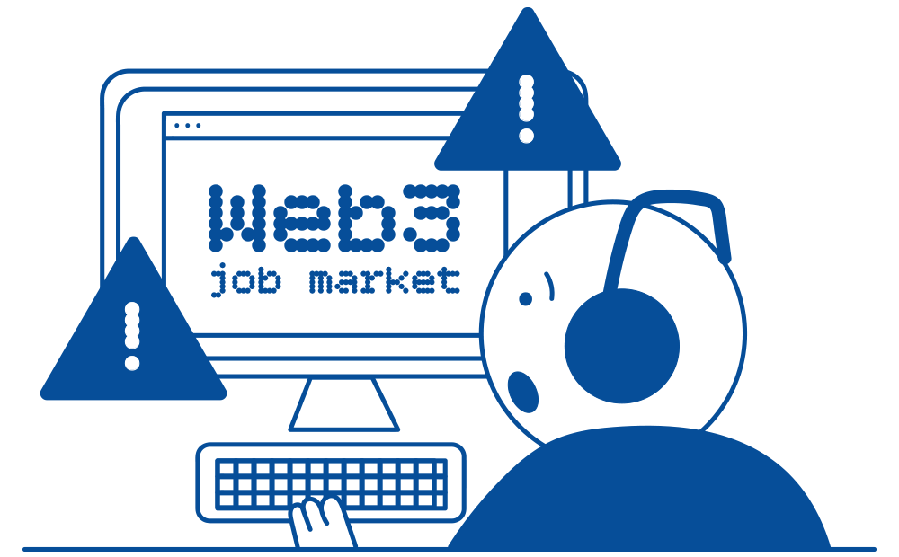

# Work in Web3

## Safety tips for the Web3 Job Market

_14th January 2025 | A report by Eliud K._

The crypto space has been grappling with scams since its inception as unregulated fintech. As such, it’s no surprise that fraudsters have found their way into the Web3 job market, all aiming to rob job seekers off their digital and financial assets. So, how do you protect yourself in these conditions?

### Screen all job ads&#x20;

Bogus jobs are often posted on Web3 job boards and social media, but they can also be sent directly to your email address. Search into job offers posted by newly-created or pseudonymous accounts on professional platforms. This will be helpful to protect your personal information and limit your exposure to mailing lists with fake job ads.

### Safeguard your personal details&#x20;

You should be wary of recruiters that ask you to download zip files to complete a task without a prior meeting. Law-abiding companies or startups typically conduct thorough interviews to funnel candidates remotely and do not require extensive details from you upfront. To get a better sense of what is acceptable or not for a job application, you can always [ask for feedback](../../content/4.social-support/) on community forums or channels.

<figure><figcaption>
The Web3 job market can expose candidates to data breaches. 
</figcaption></figure>

### Evaluate payment methods&#x20;

Typically, as part of your Web3 role, you will be paid with large-cap cryptocurrencies or stablecoins. These are easier to swap or trade across CEXes and DEXes compared to niche tokens or assets. Some startups might offer compensation in their [native tokens](../../content/5.regulations/investments/issuance.md), but this could cut your pay check down to zero if their project doesn’t materialise.

### Research all recruiters

A sure way to verify the legitimacy of a startup or team is to get in touch with former employees or past contractors and ask for background information. But since this is not always possible, you can adopt other strategies that involve verifying that any claim of partnerships, awards, and funding rounds made on official websites are valid in real life.&#x20;

All in all, remaining safe in the [Web3 job market](work-in-web3.md#overview-of-the-web3-job-market) comes down to sourcing information on recruiters and staying grounded to avoid being talked into social engineering scams. Briefly checking a social media page is never enough, because a lot of projects use paid shills and bots to pitch themselves positively.

***

## Risks in the Web3 Job Market (Part 4) - When Taxes Bring Trouble

_10th December 2024 | A report by Eliud K._

The Web3 job market brings a wealth of opportunities for go-getters. But as more people earn income through blockchain platforms, navigating taxation becomes a challenge. Without proper guidance or tools, these complexities can lead to costly mistakes.

### No tax summaries&#x20;

Traditional companies have the obligation to send you tax summaries to report on the wages paid to you over a year. But this is generally not the case for [Web3 projects](../../content/5.regulations/platforms/) and startups, as they don't provide anything similar. Whether you're earning in stablecoins or cryptocurrencies, it's often up to you to create receipts for your income by tracking on-chain transactions.&#x20;

When it comes to taxes, choosing the right legal structure for your Web3 work is also very important. A sole trader or freelancer faces different tax liabilities compared to a registered company or a startup. In both cases, a major hurdle is that most accountants are not yet familiar with the Web3 industry, which means that workers likely have to create their own templates for handling tax reporting.

### Low-quality tax software

Even though there are different crypto tax software available today, those are still in early stages of development and often fall short of sifting through the complexities of multichain transactions. Most tools are not equipped to accurately track and record [specific activities ](../../content/3.operations/)like staking income, liquidity provision rewards, or airdrops.&#x20;

If you're involved in ecosystems like _Ethereum_ or _Solana_ where DeFi platforms can allocate some of their native tokens to their recruits, you will probably need to use separate portfolio management tools to capture all of your balances. And this could very well mean spending extra thousands of dollars each year just to minimise the risk of getting in trouble with tax authorities.

<figure><figcaption>
Tax obligations can prove costly for Web3 freelancers.
</figcaption></figure>

### Complex crypto-related tax laws

[Tax laws surrounding cryptocurrencies are not only complicated](../../content/5.regulations/investments/taxation.md), but they also vary widely depending on your country or state. In some jurisdictions that officially recognise cryptocurrencies, you can find helpful resources online every time there are big changes. In others, because cryptocurrencies are outright banned, your options for registering your business activities will be limited.&#x20;

Working out your earnings might be straightforward when you are employed at a registered company in the _Polkadot_ ecosystem, but the absence of taxation guidelines makes it difficult to know when and how you should report your earnings. You will still have to be extra cautious during tax time, since the legal consequences of your on-chain transactions are never clearly spelt out.

### Fines for misreporting transactions

There is a significant risk in misreporting income from Web3 gigs such as [bounties](../../content/3.operations/crowdfunding/treasury-spends.md) in your annual tax reports, which includes potential penalties. Misunderstanding your tax obligations can lead to hefty fines, even when the mistake is unintentional. Doing your taxes cannot be entirely automated from one year to the next, as you will miss on the chance to review and correct your previous reports.

Therefore, it's crucial to run your own system for recording your inbound and outbound transactions to get a clear idea of your monthly or quarterly earnings. Never discard your records after filling your tax reports, as these need to be kept for a long time. Tax authorities and government organisations may request audits or issue lawsuits years after contentious transactions occurred, especially when they are empowered to do so by new laws.

A Web3 career can seem like the holy grail for people who are self-driven, but managing taxes in the industry remains a headache. Improving your skills in bookkeeping as well as keeping up-to-date with tax regulations is necessary to maintain minimal compliance.

***

## Risks in the Web3 Job Market (Part 3) - When Wages Go Missing

_12th November 2024 | A report by Eliud K._

As decentralized technologies gain traction, traditional employment structures regarding pay are being disrupted. If you’re entering this industry as a job seeker, it’s crucial to understand potential risks related to Web3 salary and payment methods.

### No payroll

Payroll systems ensure that employees and contractors are paid regularly and on time. They are also useful for handling taxes and deductions. By contrast, decentralized projects tend to lack formal payroll structures. Payments are often handled through community-managed treasuries, smart contracts, and multisig accounts.

With blockchain technologies, international payments may be faster to complete, but these disbursements are rarely standardised by the issuers. This lack of predictability can cause delays and inconsistencies, especially because Web3 projects typically don’t have HR departments to [oversee these transactions](../../content/1.acquisition/transaction-explorers.md). As a result, the risk of errors in payment processing increases, directly impacting workers' financial stability.

### No benchmarks

In Web3, standards for salaries and wages are far from established. Salaries can vary widely depending on the project’s size, funding, and location. For example, developers working within the _Cosmos_ ecosystem might receive different compensation than those working on _Avalanche_. There’s also a lack of transparency that can lead to favouritism and nepotism in some communities and DAOs. This undermines the principles of meritocracy and equal opportunities that decentralized projects want to champion.&#x20;

Without clear salary expectations, workers often have to negotiate their pay check blindly. New contributors and participants from developing countries might accept much lower pay than what their counterparts would earn for the same role in traditional tech sectors. Over time, this makes it challenging to assess the fair market value of their contributions.

<figure><figcaption>
Obtaining fair compensation is a challenge for the Web3 workers. 
</figcaption></figure>

### Irregular payments

While traditional jobs offer fixed paydays and fiat amounts, Web3 projects pay their workforce in cryptocurrencies or tokens of volatile value. This presents significant challenges for workers, because their earnings can vary considerably even after payments are made. For instance, a payment that appears adequate in one moment may lose significant value within hours if [the exchange rate](../../content/3.operations/swapping/pairs-availability.md) of a stablecoin crashes. This can dramatically impact workers' financial stability.

Additionally, in ecosystems like _Polkadot_ and _Cardano_ that use decentralized on-chain treasuries, it can be hard to find support for top-up requests when funding falls short of expectations. Project teams could also be left in a vulnerable position if they rely exclusively on Web3 payments for their regular income. With no official authority to ensure that contributors and contractors receive their dues in various situations, long-term financial planning remains difficult for the Web3 workforce.

### MLM schemes

Multi-level marketing (MLM) involves a business model where individuals earn income not only through their sales, but also by recruiting new participants. However, this is very problematic because it blurs the lines between legitimate employment and unsustainable recruitment tactics.

Such schemes are used by some projects in the Web3 industry to give the illusion of growth: they prioritise recruitment metrics over direct compensation for work done. As such, it’s crucial for workers to evaluate the small print of their salary packages to avoid being trapped in exploitative cycles where the goal posts keep moving and work remains unpaid.&#x20;

While the Web3 job market offers unique opportunities, candidates need to actively engage in discussions about pay and transparency in the early stage of their job search. New recruits must constantly advocate for themselves to ensure that they receive fair and consistent compensation.

***

## Risks in the Web3 Job Market (Part 2) - When Dream Jobs Turn Sour

_8th October 2024 | A report by Eliud K._

Web3 has fundamentally changed the way companies and individuals interact and work by introducing the concept of decentralisation at many levels. This transformation in workplace conditions is also bringing in some risks for the workforce on a global scale.

### No HR department&#x20;

A Human Resources (HR) department typically handles employee relations, conflict resolution, [compensation structures](../../content/3.operations/community-building/crypto-payments.md), and workplace policies. However, many Web3 projects operate without a formal HR department, which can lead to issues around conflict resolution and staff grievances, because nobody is responsible for addressing these concerns. With no point of call for mediation or support, workers have to fend for themselves in case disputes arise.

### No social security

Conventional jobs typically come with benefits such as health cover, life insurance, and retirement plans. Meanwhile, the majority of Web3 roles don’t offer any form of social security, not even in ecosystems such as Bitcoin or Ethereum. This means that most of the Web3 workforce has no access to essential safety nets during periods of illness or unemployment. Without these financial buffers, individuals are put in a vulnerable position which can lead to unexpected financial difficulties. They need to set aside a portion of their earnings independently for their future. This requires a lot of discipline and a good understanding of investment plans.&#x20;

<figure><figcaption>
Web3's decentralisation makes workplace regulations difficult.
</figcaption></figure>

### No workplace protection&#x20;

Workplace protections such as labour laws, union representation, and safety regulations are often absent in the Web3 industry. But these legally binding arrangements are critical to ensure fair treatment, job security, and safe working environments. Without them, workers can face problems like arbitrary termination, non-payment, or overwork. For example, freelancers and contractors who make up a significant portion of the Web3 workforce often have no recourse if their contracts are unfairly terminated or if payments are delayed.

### Limited career pathways

While the Web3 industry can offer lucrative opportunities, career growth is not as straightforward as during periods of boom. People who are well-networked may find pathways to stability, often landing high-profile roles or advancing quickly. However, for many others, career progression is limited and job-hopping between projects may be necessary to gain professional recognition. Since many Web3 projects operate like startups, they need a lot of [funding](../../content/3.operations/crowdfunding/) from their ecosystems before they can offer long-term positions to their team members or staff. With no room for advancement, employees may find themselves stuck in roles that do not allow them to showcase their skills or upskill.\

It is crucial for interested candidates to weigh the risks and rewards of a career in Web3 before joining the workforce. The realities of this decentralised industry can be challenging to face, so taking proactive steps to safeguard your professional and financial well-being should remain your top priority.

***

## Risks in the Web3 Job Market (Part 1) - When Hiring Goes Wrong

_10th September 2024 | A report by Eliud K._

The Web3 job market is primarily a remote-first environment, attracting talent from across the globe with the promise of decentralized workspaces and lucrative salaries.  But the job market itself is riddled with potential pitfalls for both job seekers and employers.&#x20;

### Fake job opportunities&#x20;

The Web3 job market attracts not only genuine job seekers, but also scammers. These bad actors usually post fake job listings with exaggerated salaries and benefits with the aim of enticing job seekers and eventually collecting their personal information. To avoid such cases, you should verify recruiters’ history and companies’ track record on public forums and social media platforms. If a job application requires you to submit a lot of identity documents upfront, and especially your Bitcoin or Ethereum [private keys](../../content/2.storage/seed-secret-phrases.md), it's likely a scam.&#x20;

### Fake job applicants&#x20;

Recruiters in the Web3 job market also face the risk of fake job applicants, meaning they may end up hiring incompetent people. Usually, these applicants flood job postings with fake resumes and portfolios to secure a position. Later, they disappear after causing disruptions and denying a blockchain project the chance to hire qualified professionals. In some extreme cases, fake applicants can send resumes as downloadable zip files that contain spyware designed to collect sensitive information about important projects.

<figure><figcaption>
Hiring and applying in the Web3 job market is tricky.
</figcaption></figure>

### No contracts&#x20;

One of the most significant risks in the Web3 job market is the lack of formal contracts. Most Web3 jobs, especially those in decentralized autonomous organizations (DAOs) or startup projects, operate without traditional employment contracts. This leaves both parties vulnerable to various risks: employers find it difficult to enforce accountability while employees risk not getting paid for the work done. Although the lack of formal contracts is primarily due to the dynamic nature of the Web3 job market, it's best to insist on having clear agreements in place.&#x20;

### Complex industry&#x20;

Web3 is an inherently complex industry with rapidly changing technologies and [regulations](../../content/5.regulations/). For example, the Bitcoin ecosystem still grapples with regulatory challenges to this day, despite being the most established project in the decentralized space. Newer ecosystems such as Cosmos and Polkadot are constantly evolving, which can add confusion for those who contribute to their developments as a workforce. Job seekers may find themselves unprepared for the demands of their roles, while recruiters may struggle to find qualified candidates.

While the perks of Web3 jobs are appealing to professionals looking to start a career in the industry, there are still some notable downsides. Navigating these risks requires a cautious approach to opportunities that may seem too good to be true.

***

## Overview of the Web3 Job Market

_13th August 2024 | A report by Eliud K._

Web 3 is the next generation of the internet that is built on top of blockchain technology. Unlike Web2 which is controlled by centralised entities, Web3 promises to give users control of their own data, in an open and transparent model, without any intermediaries. As this revolutionary shift in the internet model takes root, there has been a boom in the Web3 job market. If you're looking to transition into a career in Web 3, here are some answers to the questions you might have been asking yourself.

### Who works in Web3?

Web3 attracts a diverse range of professionals, such as developers, designers, data analysts, content creators, marketers, and community managers. Currently, developers are in high demand because they are skilled in blockchain programming languages such as Solidity for the Ethereum ecosystem and Rust for the [Polkadot](../../content/5.regulations/networks/) network. As the blockchain industry matures, traditional roles such as legal advisors and compliance experts will be in demand to help investors and entrepreneurs navigate the regulatory landscape.

### Where are open positions advertised?

Most Web3 jobs are posted on dedicated Web3 job boards which include _CryptoJobsList_, _Web3.career_, and _Remote3_. Startups in the Web 3 space post open positions on their official websites, social media channels, and traditional platforms like _LinkedIn_ and _Indeed_. To get more Web3 job openings, you may also consider networking with fellow Web3 enthusiasts on _Reddit_, _Discord_, and _Telegram_.

<figure><figcaption>
The Web3 job market promotes diversity, flexibility,  opportunities.
</figcaption></figure>

### What kind of working conditions are provided?

Web3 jobs are well known for their flexibility and remote working conditions. Essentially, you can work from anywhere in the world, which is a true reflection of the decentralised nature of blockchain technologies. Usually, web3 companies consist of [diverse groups of talents](../../content/5.regulations/networks/participation.md) spread across the world who prioritise creativity and getting things done rather than the number of hours worked. This setup promotes work-life balance and fosters a culture of learning and experimentation.

### Which types of compensation are offered?

Web3 jobs offer lucrative rates that, in many cases, exceed those offered in traditional job markets. Salaries are usually paid in stablecoins or cryptocurrencies. Additionally, most Web3 companies and startups will offer their employees and contractors a stake in their project which can then be redeemed for other tokens or coins later on. Performance bonuses are also common, as they help align the interests of the team with the long-term goals of the project.

The Web3 job market is flooded with opportunities in various technical and non-technical fields. Whether you are a developer, designer, or marketer, there is likely a place for you in this exciting new world. As blockchain ecosystems like Bitcoin, Solana, and NEAR continue to grow, the demand for skilled professionals will only increase, making now an ideal time to explore a career in Web3.
