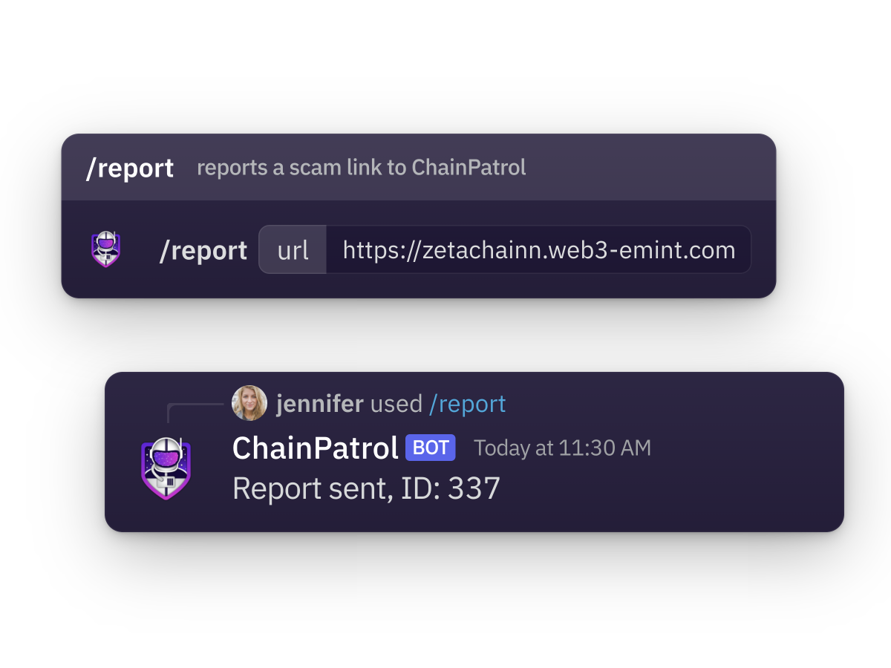
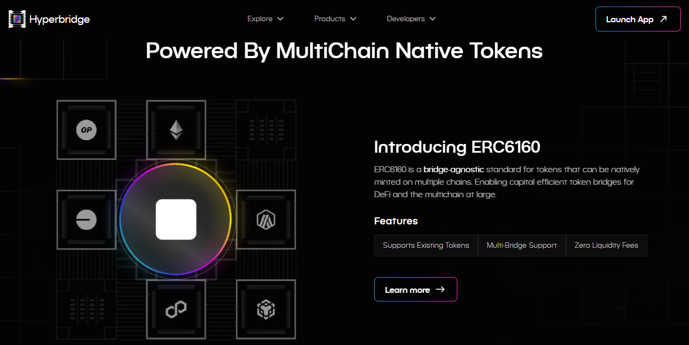
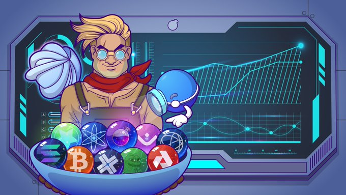

# World of Web3

## Web3 Security with [_ChainPatrol_](https://chainpatrol.com/)

_12th August 2025 | A report by Catherine N._

The decentralized environment surrounding blockchain technologies offers exciting opportunities, but it also attracts malicious actors who want to take advantage of users. ChainPatrol is a Web3 security platform that is on a mission to protect communities and brands from impersonations, scams, and other online threats.

**Which problems does&#x20;**_**ChainPatrol**_**&#x20;solve?**&#x20;

ChainPatrol addresses some of the most common threats in the Web3 industry: phishing attacks and fake domains that deceive users into revealing sensitive information. The team combines AI technology with human expertise to identify suspicious links and remove fake websites.

Additionally, ChainPatrol helps prevent users from falling victim to fake social media accounts and messages that often lead to wallet-draining incidents. First, it scans and monitors platforms like Twitter, Discord, and Telegram to detect social engineering threats, then it neutralises impersonators in real time.

Its advanced detection system uses large language models (LLMs), image recognition, and proprietary threat-detection models to spot impersonations. The project is also integrated with Google SafeBrowsing to flag risks across millions of devices.

<figure><figcaption></figcaption></figure>

**Who are the main users of&#x20;**_**ChainPatrol**_**?**

ChainPatrol is built for Web3 operators who need to safeguard their community members. Blockchain projects in the Ethereum ecosystem use ChainPatrol to guard themselves against fraud and scams. Developers of dApps, NFT platforms, and crypto-wallets can integrate these services to monitor and eliminate threats 24/7.

Community managers and moderators appreciate ChainPatrol’s user-friendly features, such as Discord and Slack bots, which allow users to report suspicious links and scams. ChainPatrol’s products are also well-suited for individual creators, DAOs, and other nonprofits that depend on trust and reputation to keep their business and operations going.&#x20;

Many users describe ChainPatrol as a "must-have" for Web3 security, praising its speed, transparent reporting, quick phishing takedowns, and responsive support on Telegram and Slack.

**How popular is&#x20;**_**ChainPatrol**_**&#x20;in the industry?**

Since its launch, ChainPatrol has gained significant recognition in the Web3 space, and is starting to expand to other non-Ethereum ecosystems such as Polkadot. Trusted by major names like Arbitrum, MetaMask, and Curve Finance, the project has demonstrated its bullet-proof security capabilities.

During the ARB token launch, ChainPatrol blocked over 1,200 phishing attempts across major crypto wallets in twelve days. More than 250,000 malicious assets have been reported to date, and over 150,000 threats blocked. This clearly shows the platform’s effectiveness and growing impact on Web3 security.

***

## Web3 Interoperability with [_Hyperbridge_](https://hyperbridge.network/)

_15th July 2025 | A report by Adewumi V._

To date, more than $2 billion in crypto assets have been lost due to inefficient cross-chain communication. Since most blockchain infrastructure projects operate independently from each other; retail users and dApp developers often face major hurdles when attempting to transfer data or assets between networks. Addressing these gaps has therefore become crucial for unlocking a truly decentralised web.

**Which problems does&#x20;**_**Hyperbridge**_**&#x20;solve?**&#x20;

Hyperbridge is a next-generation interoperability coprocessor developed by Polytope Labs. It is built with the Polkadot SDK and designed to connect multiple blockchains. Hyperbridge takes a new approach to cross-chain connectivity by enabling the transfer of assets between blockchains without any intermediaries, with the goal of eliminating losses tied to insecure multisig bridges.&#x20;

Hyperbridge also deals with other key challenges hindering Web3 interoperability, such as costly on-chain verification methods and limited scalability. The platform benefits from a strong security layer inherited from Polkadot, which prevents the many governance or consensus attacks that are common in weaker bridge architectures.&#x20;

<figure><figcaption></figcaption></figure>

**Who are the main users of&#x20;**_**Hyperbridge**_**?**

As a fully agnostic protocol, Hyperbridge allows developers to create secure cross-chain dApps that can interact with different types of blockchains and network operators.&#x20;

For end users, the main benefit is that they can enjoy faster and safer transactions that don’t involve trusting third parties. For example, withdrawals from Layer 2s are validated instantly and processed without delays.&#x20;

Additionally, Hyperbridge enables dApps and protocols to access pricing data, liquidity, and governance tools across multiple ecosystems securely. This also demonstrates that Polkadot's parachains (rollups) can be repurposed to provide functionalities for EVM chains.

**How popular is&#x20;**_**Hyperbridge**_**&#x20;in the industry?**&#x20;

Hyperbridge is currently the fastest-growing project within the Polkadot ecosystem. It supports various blockchains and rollups, including BNB Chain, Optimism, Gnosis Chain, and Mandala.&#x20;

Its growing influence in the Web3 space is reflected in strategic partnerships, most notably with TVVIN, a platform focused on tokenizing real-world assets like gold. As part of its collaboration with the liquid staking protocol Bifrost, Hyperbridge has replaced third-party bridge dependencies with trustless multichain operations.&#x20;

Hyperbridge has also received widespread recognition from industry leaders who are praising the platform as the most secure cross-chain bridge technology to date.&#x20;

***

## Web3 Usability with [_Osmosis_](https://osmosis.zone/)

_10th June 2025 | A report by Catherine N._

Decentralized finance (DeFi) platforms often struggle with complex interfaces, slow transactions, and high fees, creating barriers for both new and experienced users. Osmosis, a decentralized exchange (DEX) within the Cosmos ecosystem, works around these hurdles by providing a user-focused trading experience for the Web3 industry.&#x20;

**Which problems does&#x20;**_**Osmosis**_**&#x20;solve?**

One of the key issues Osmosis addresses is cross-chain interoperability. In common setups, users must bridge assets manually before they become available for use. This is confusing, time-consuming, and very risky. Osmosis uses the Inter-Blockchain Communication (IBC) protocol to enable automated and low-cost transfers across 100+ blockchain networks, including Ethereum, Polkadot, and Bitcoin. This eliminates friction to make users trade as if all their assets were on a single network.

The rigidity of liquidity pool structures seen in most DEXes often limits users' access to and control of their assets. Osmosis has introduced the concept of customizable liquidity pools, where liquidity providers can immediately adjust token weights, compositions, and fees through a simple interface.

Other major issues that deter users from engaging with DeFi are gas fees, transaction delays, and complex UIs. Through its Cosmos-based architecture, Osmosis pushes for low-cost and high-speed transactions, making DeFi trading more accessible for beginners and more responsive to experienced traders’ needs.&#x20;

<figure><figcaption></figcaption></figure>

**Who are the main users of&#x20;**_**Osmosis**_**?**

Osmosis serves a broad audience which includes traders, [liquidity providers](../../content/3.operations/lending/liquidity-provision.md), and developers. Traders mostly stand to gain, with features that support transacting with assets across multiple blockchains. User feedback on Twitter and Reddit highlights the platform’s improved transaction staging and fair fees.

For liquidity providers, Osmosis gives the option to have greater control over investments with customizable pool parameters and real-time analytics. Developers can use Osmosis’s open-source framework to build decentralized applications (dApps), AMMs, yield aggregators, and NFT marketplaces, all with various cross-chain integrations. Builders praise Osmosis for its ease of use and powerful cross-chain tools.

**How popular is&#x20;**_**Osmosis**_**&#x20;in the industry?**

Osmosis has established itself as a leading DeFi platform, with $39+ billion in all-time trading volume and over 1 million active users. Its success is driven by full integration with the Cosmos ecosystem and other major networks like Ethereum and Bitcoin.

Osmosis has also earned recognition from media outlets like CoinDesk and CryptoSlate, highlighting its role in cross-chain and simplified decentralized trading. Osmosis continues to expand on its original proposition through new offerings like the Polaris token portal and active collaborations with NFT communities like Mad Scientists.

***

## Web3 Utility with [_NOWPayments_](https://nowpayments.io/)

_13th May 2025 | A report by Adewumi V._

As businesses and individuals embrace blockchain technology, the need for secure and efficient payment solutions has increased. _NOWPayments_ is a gateway that bridges the gap between Web3 and traditional commerce by providing an easy-to-use platform for accepting cryptocurrency payments.

**Which problems does&#x20;**_**NOWPayments**_**&#x20;solve?**

One of the biggest hurdles to Web3 adoption is making cryptocurrencies easy to use. Accepting payments in cryptocurrencies like Bitcoin can be complicated due to technicalities such as wallet addresses and blockchain processes. NOWPayments proposes essential tech tools like APIs, plugins, and widgets, to empower businesses to accept over 300 cryptocurrencies with minimal effort.

Another challenge is price volatility. The value of cryptocurrencies can change rapidly, making it risky for businesses to accept them. NOWPayments offers an Auto Coin Conversion feature that instantly converts payments into stablecoins or any other cryptocurrency to mitigate financial uncertainty.

NOWPayments also seeks to enhance crypto security. The platform is non-custodial: users retain full control of their funds instead of relying on a third party. Unlike most payment processors which hold onto merchants’ crypto assets, NOWPayments allows direct deposits into the merchant’s wallet. The funds can be then used for various purposes like mass payouts.

<figure><figcaption></figcaption></figure>

**Who are the main users of&#x20;**_**NOWPayments**_**?**

NOWPayments is designed for a wide range of Web3 users. Businesses such as online stores, casinos, travel companies, and gaming platforms use NOWPayments to offer decentralized payment options to their customers.  These businesses get access to fast, low-cost, borderless payments across multiple blockchain [networks](../../content/5.regulations/networks/).

Dapps developers integrate NOWPayments' API to facilitate secure crypto transactions on many ecosystems. The platform’s compatibility with multiple blockchain networks like Ethereum and Polkadot makes it a preferred choice for Web3 projects looking to add payment functionality without complex coding. With features like donation buttons and widgets, it becomes easier for freelancers, content creators, and Non-profit organizations to accept payments globally without traditional banking fees and delays.

**How popular is&#x20;**_**NOWPayments**_**&#x20;in the industry?**

Since its launch in 2019, NOWPayments has grown rapidly and is still onboarding new participants to the blockchain industry. Some of the thousands of merchants and businesses operating on the platform include ADVABET, Nownodes, and Travala.com. Users appreciate the platform for its wide range of supported cryptocurrencies and user-friendly integration options.&#x20;

NOWPayments has also been featured in major media outlets such as PR Newswire, Newsfile, and BeInCrypto, all of which have highlighted its innovative approach to giving utility to cryptocurrencies as a medium of exchange. The company is focused on continuous improvements and adaptation to market needs.&#x20;

***

## Web3 Onboarding with [_Ramp Network_](https://ramp.network/)

_15th April 2025 | A report by Adewumi V._

Getting started in Web3 can be very challenging because participants are often forced to navigate complex interfaces and security layers. This initial process involving crypto exchanges and wallet setups can be discouraging, so there is a need for a solution that can make these experiences smoother for users.

**Which problems does&#x20;**_**Ramp Network**_**&#x20;solve?**&#x20;

_Ramp Network_ is a fiat-to-crypto on-and-off-ramp Web3 solution that allows users to buy and sell cryptocurrencies from dApps, wallets, NFT Marketplaces, and other platforms.

Many users hesitate to go through with Web3 because they fear they won’t be able to convert their [crypto](../../content/3.operations/community-building/crypto-payments.md) back into fiat. _Ramp Network_ solves this potential problem by allowing users to buy crypto without leaving the app. Instead of signing up on a separate exchange, users can enter their payment details and receive crypto in their wallets within minutes.

_Ramp Network_ also connects to multiple local and global payment systems, including _Visa, Mastercard, Apple Pay, Revolut_, bank transfers, and more. This ensures users can purchase crypto using familiar methods, reducing friction in the process.

<figure><figcaption></figcaption></figure>

**Who are the main users of&#x20;**_**Ramp Network**_**?**&#x20;

_Ramp Network_ has a use case for everyone in the Web3 ecosystem. Primarily, it is individuals who benefit the most through buying and selling crypto within dApps. According to many online reviews, _Ramp Network_ provides one of the best low-friction access to Web3 today.&#x20;

Developers do not need to build separate payment gateways, as _Ramp Network_ can manage these transactions. It also provides flexible UI options for developers that match their designs and workflow.

Brands and businesses are not left out either. By integrating _Ramp Network_’s SDKs and APIs directly into their platforms, they can onboard new users faster, increase sign-ups, and simplify cross-border transactions.

**How popular is&#x20;**_**Ramp Network**_**&#x20;in the industry?**

With global coverage in over 150 countries, _Ramp Network_ connects to 110+ crypto assets across 40+ blockchains, including Bitcoin, Ethereum, and Solana networks. The Web3 platform is also trusted by several industry leaders, such as _Metamask_ and _Ledger_, among others.&#x20;

Notably, _Ramp Network_ has helped _Brave browser_ bring over 55 million users to Web3. The project has also supported _Trust Wallet_ by increasing its sign-ups by 300%, reduced _Argent_ wallet’s onboarding time by over 60%, and improved monetization within _Sorare's_ games.&#x20;

***

## Web3 Accessibility with [_WalletConnect_](https://walletconnect.network/)

_11th March 2025 | A report by Adewumi V._

User experience (UX) is a crucial element of Web3, shaping how users interact with decentralized applications (dApps) and services. As Web3 expands, intuitive and accessible UX is essential to keep pace with its rapid growth and evolving regulations.&#x20;

**Which problems does WalletConnect solve?**

In a decentralized ecosystem where users have greater control over their data and transactions, UX must be designed to help users navigate these complexities. _WalletConnect_ plays a key role by simplifying interactions and reinforcing security across multiple platforms.&#x20;

_WalletConnect_ is an on-chain UX ecosystem that addresses a major User Experience (UX) and Developer Experience (DX) challenge in Web3: the disconnect between desktop-based dApps and [mobile wallets](../../content/2.storage/mobile-wallets.md). WalletConnect provides a universal and secure way for users to connect their wallets to dApps via QR codes or deep links.

Beyond refining accessibility, composability, and connectivity, _WalletConnect_ also ensures mobile compatibility, multi-wallet support, and cross-chain interactions. It simplifies authentication with one-click “Sign-In With Ethereum” (SIWE) and reduces friction in KYC.

<figure><figcaption></figcaption></figure>

**Who are the main users of&#x20;**_**WalletConnect**_**?**&#x20;

_WalletConnect_ serves everyone in the industry: UX designers, developers, and end users. UX designers can improve onboarding with authentication tools, while developers can use the SDK to integrate multi-wallet support into dApps. _WalletConnect_’s SDK is well-maintained and easy to use, because developers do not have to build separate solutions for each wallet.

End users also benefit from encrypted wallet-dApp interactions. Many users have praised _WalletConnect_ online for being safer than browser extensions or desktop wallets. By fostering collaboration across these groups, the project helps make Web3 intuitive, robust, and truly decentralized for everyone.

**How popular is&#x20;**_**WalletConnect**_**&#x20;in the industry?**

_WalletConnect_ is one of the most widely used on-chain UX solutions in Web3, serving retail users on both mobile devices and desktops. It is chain-agnostic and supports EVM networks (including Layer 2s), as well as the Solana, Cosmos, Polkadot, and Bitcoin ecosystems.&#x20;

By prioritizing accessibility and interoperability, _WalletConnect_ works to redefine on-chain interactions for all. To date, it has enabled over 150 million connections for 24 million users. The platform has also integrated 600+ wallets and over 40,000 dApps to establish itself as a leading solution for improving user experience in the decentralized web.&#x20;

