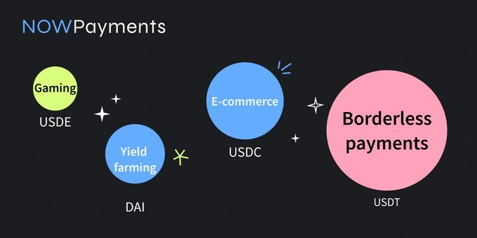
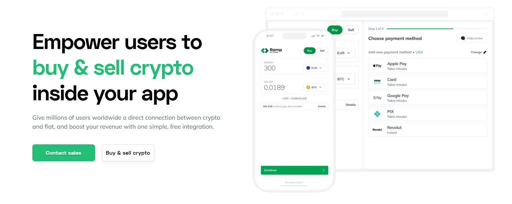
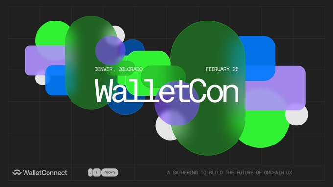

# World of Web3

## Web3 Utility with [_NOWPayments_](https://nowpayments.io/)

_13th May 2025 | A report by Adewumi V._

As businesses and individuals embrace blockchain technology, the need for secure and efficient payment solutions has increased. _NOWPayments_ is a gateway that bridges the gap between Web3 and traditional commerce by providing an easy-to-use platform for accepting cryptocurrency payments.

### Which problems does _NOWPayments_ solve?

One of the biggest hurdles to Web3 adoption is making cryptocurrencies easy to use. Accepting payments in cryptocurrencies like Bitcoin can be complicated due to technicalities such as wallet addresses and blockchain processes. NOWPayments proposes essential tech tools like APIs, plugins, and widgets, to empower businesses to accept over 300 cryptocurrencies with minimal effort.

Another challenge is price volatility. The value of cryptocurrencies can change rapidly, making it risky for businesses to accept them. NOWPayments offers an Auto Coin Conversion feature that instantly converts payments into stablecoins or any other cryptocurrency to mitigate financial uncertainty.

NOWPayments also seeks to enhance crypto security. The platform is non-custodial: users retain full control of their funds instead of relying on a third party. Unlike most payment processors which hold onto merchants’ crypto assets, NOWPayments allows direct deposits into the merchant’s wallet. The funds can be then used for various purposes like mass payouts.

<figure><figcaption></figcaption></figure>

### Who are the main users of _NOWPayments_?

NOWPayments is designed for a wide range of Web3 users. Businesses such as online stores, casinos, travel companies, and gaming platforms use NOWPayments to offer decentralized payment options to their customers.  These businesses get access to fast, low-cost, borderless payments across multiple blockchain [networks](../../content/5.regulations/networks/).

Dapps developers integrate NOWPayments' API to facilitate secure crypto transactions on many ecosystems. The platform’s compatibility with multiple blockchain networks like Ethereum and Polkadot makes it a preferred choice for Web3 projects looking to add payment functionality without complex coding. With features like donation buttons and widgets, it becomes easier for freelancers, content creators, and Non-profit organizations to accept payments globally without traditional banking fees and delays.

### How popular is _NOWPayments_ in the industry?

Since its launch in 2019, NOWPayments has grown rapidly and is still onboarding new participants to the blockchain industry. Some of the thousands of merchants and businesses operating on the platform include ADVABET, Nownodes, and Travala.com. Users appreciate the platform for its wide range of supported cryptocurrencies and user-friendly integration options.&#x20;

NOWPayments has also been featured in major media outlets such as PR Newswire, Newsfile, and BeInCrypto, all of which have highlighted its innovative approach to giving utility to cryptocurrencies as a medium of exchange. The company is focused on continuous improvements and adaptation to market needs.&#x20;

***

## Web3 Onboarding with [_Ramp Network_](https://ramp.network/)

_15th April 2025 | A report by Adewumi V._

Getting started in Web3 can be very challenging because participants are often forced to navigate complex interfaces and security layers. This initial process involving crypto exchanges and wallet setups can be discouraging, so there is a need for a solution that can make these experiences smoother for users.

### Which problems does _Ramp Network_ solve?&#x20;

_Ramp Network_ is a fiat-to-crypto on-and-off-ramp Web3 solution that allows users to buy and sell cryptocurrencies from dApps, wallets, NFT Marketplaces, and other platforms.

Many users hesitate to go through with Web3 because they fear they won’t be able to convert their [crypto](../../content/3.operations/community-building/crypto-payments.md) back into fiat. _Ramp Network_ solves this potential problem by allowing users to buy crypto without leaving the app. Instead of signing up on a separate exchange, users can enter their payment details and receive crypto in their wallets within minutes.

_Ramp Network_ also connects to multiple local and global payment systems, including _Visa, Mastercard, Apple Pay, Revolut_, bank transfers, and more. This ensures users can purchase crypto using familiar methods, reducing friction in the process.

<figure><figcaption></figcaption></figure>

### Who are the main users of _Ramp Network_?&#x20;

_Ramp Network_ has a use case for everyone in the Web3 ecosystem. Primarily, it is individuals who benefit the most through buying and selling crypto within dApps. According to many online reviews, _Ramp Network_ provides one of the best low-friction access to Web3 today.&#x20;

Developers do not need to build separate payment gateways, as _Ramp Network_ can manage these transactions. It also provides flexible UI options for developers that match their designs and workflow.

Brands and businesses are not left out either. By integrating _Ramp Network_’s SDKs and APIs directly into their platforms, they can onboard new users faster, increase sign-ups, and simplify cross-border transactions.

### How popular is _Ramp Network_ in the industry?

With global coverage in over 150 countries, _Ramp Network_ connects to 110+ crypto assets across 40+ blockchains, including Bitcoin, Ethereum, and Solana networks. The Web3 platform is also trusted by several industry leaders, such as _Metamask_ and _Ledger_, among others.&#x20;

Notably, _Ramp Network_ has helped _Brave browser_ bring over 55 million users to Web3. The project has also supported _Trust Wallet_ by increasing its sign-ups by 300%, reduced _Argent_ wallet’s onboarding time by over 60%, and improved monetization within _Sorare's_ games.&#x20;

***

## Web3 Accessibility with [_WalletConnect_](https://walletconnect.network/)

_11th March 2025 | A report by Adewumi V._

User experience (UX) is a crucial element of Web3, shaping how users interact with decentralized applications (dApps) and services. As Web3 expands, intuitive and accessible UX is essential to keep pace with its rapid growth and evolving regulations.&#x20;

### Which problems does WalletConnect solve?

In a decentralized ecosystem where users have greater control over their data and transactions, UX must be designed to help users navigate these complexities. _WalletConnect_ plays a key role by simplifying interactions and reinforcing security across multiple platforms.&#x20;

_WalletConnect_ is an on-chain UX ecosystem that addresses a major User Experience (UX) and Developer Experience (DX) challenge in Web3: the disconnect between desktop-based dApps and [mobile wallets](../../content/2.storage/mobile-wallets.md). WalletConnect provides a universal and secure way for users to connect their wallets to dApps via QR codes or deep links.

Beyond refining accessibility, composability, and connectivity, _WalletConnect_ also ensures mobile compatibility, multi-wallet support, and cross-chain interactions. It simplifies authentication with one-click “Sign-In With Ethereum” (SIWE) and reduces friction in KYC.

<figure><figcaption></figcaption></figure>

### Who are the main users of _WalletConnect_?&#x20;

_WalletConnect_ serves everyone in the industry: UX designers, developers, and end users. UX designers can improve onboarding with authentication tools, while developers can use the SDK to integrate multi-wallet support into dApps. _WalletConnect_’s SDK is well-maintained and easy to use, because developers do not have to build separate solutions for each wallet.

End users also benefit from encrypted wallet-dApp interactions. Many users have praised _WalletConnect_ online for being safer than browser extensions or desktop wallets. By fostering collaboration across these groups, the project helps make Web3 intuitive, robust, and truly decentralized for everyone.

### How popular is _WalletConnect_ in the industry?

_WalletConnect_ is one of the most widely used on-chain UX solutions in Web3, serving retail users on both mobile devices and desktops. It is chain-agnostic and supports EVM networks (including Layer 2s), as well as the Solana, Cosmos, Polkadot, and Bitcoin ecosystems.&#x20;

By prioritizing accessibility and interoperability, _WalletConnect_ works to redefine on-chain interactions for all. To date, it has enabled over 150 million connections for 24 million users. The platform has also integrated 600+ wallets and over 40,000 dApps to establish itself as a leading solution for improving user experience in the decentralized web.&#x20;

