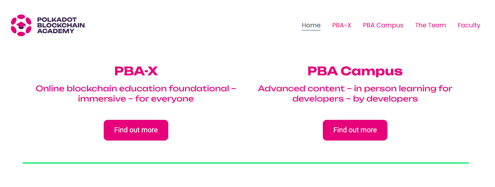

# Careers

## Community Building:

### Launch marketing campaigns.

_6th February 2025 | A thread by Pooja G._

**Exploring the Polkadot Marketing Bounty Program!** A unique opportunity for creators and strategists to shape the future of Web3 marketing. Discover how you can contribute to this exciting initiative.&#x20;

<figure><figcaption></figcaption></figure>

The Marketing Bounty program is Polkadot's way of capturing fresh outreach perspectives. Whether you're experienced in content creation, influencer partnerships, or #community building, your ideas can be funneled into growing the ecosystem.

The submission process has been designed with simplicity in mind.&#x20;

Start by downloading the proposal template, outline your vision, and submit it through the official Marketing Bounty Proposal Form. Curators will review, share their feedback, or get you on board straightaway.

<figure><figcaption></figcaption></figure>

When it comes to marketing strategies, the [Polkadot DAO](../content/3.operations/voting/) welcomes original ideas for storytelling, community engagement, and brand building. Think about how you can create value while staying true to Web3 principles of decentralization and user empowerment.

Key focus areas include:

* KOL and influencer collaborations
* Strategic media partnerships
* Creative content production
* Community-driven campaigns

Transparency is fundamental to the program. Every proposal, budget allocation, and outcome is publicly tracked. Monthly reports provide insights into successful strategies and areas for improvement. Check the Marketing bounty website to understand what works.

<figure><figcaption></figcaption></figure>

The Marketing bounty emphasizes quality over quantity. Your proposal should demonstrate a deep understanding of the Web3 landscape and Polkadot's unique position in the industry. Consider how your #marketing strategy can enhance both brand awareness and community engagement.

Take a look at [marketingbounty.notion.site](https://marketingbounty.notion.site/) to kickstart your proposal. Remember: great marketing in Web3 is about highlighting the value of community-driven products.

***

### Organise events and conferences.

_23rd January 2025 | A thread by Pooja G._

**Building the Future of Web3 Events!** Discover how the Events Bounty is uplifting community gatherings through dedicated event funding.&#x20;

<figure><figcaption></figcaption></figure>

The curators of the Events bounty understand that meaningful connections happen face-to-face. That's why they're actively supporting event organizers who are keen to bring the community together.

What makes this initiative special? More than money, it’s helping community leaders grow. Each event plays an important role in making local and global Polkadot communities stronger.&#x20;

<figure><figcaption></figcaption></figure>

Wondering what kind of events qualify?  This initiative supports various formats:

* Local community meetups
* Technical workshops
* Regional conferences
* Educational seminars

The Events bounty provides clear guidelines. From submitting an EOI to tracking your final proposal, event organizers are mentored at every step. Curators have been selected to provide valuable insights throughout and empower community managers to deliver impactful events.

<figure><figcaption></figcaption></figure>

Why is the Events bounty’s approach remarkable? It goes beyond [funding](../content/3.operations/community-building/crypto-payments.md) by offering applicants a comprehensive set of resources to ensure the success of their proposals. This includes detailed guides for your planning and direct interactions with experienced community members.&#x20;

Remember: regardless of size, any event contributes to the growth of the Polkadot ecosystem. Whether you're setting up your first workshop or your tenth conference, your gathering matters for a more connected community.&#x20;

<figure><figcaption></figcaption></figure>

Ready to strengthen the Polkadot ecosystem through events? Start your journey today with [dotevents.xyz/](https://dotevents.xyz/) to shape the future of decentralized communities!

***

### Set up a meetup.

_9th January 2025 | A thread by Pooja G._

**Want to organize a Polkadot meetup?** Here's something exciting: you can get up to 1000 USD in $DOT to cover your costs with the [Meetups bounty](https://dotmeetup.notion.site/Meetups-bounty-cd57b5990ba443559413dec3b339ab4a)! Let's break down this bounty program.

<figure><figcaption></figcaption></figure>

Important note: The bounty works as a post payment. You organize the meetup first, then apply for a reimbursement. The program is designed to support genuine community builders who are already active in the Polkadot ecosystem.&#x20;

Before diving in, make sure you have contributions to show as a Polkadot community member. Not quite there yet? No worries! Get involved in the ecosystem first: [build your presence](../content/3.operations/community-building/crypto-communities.md) and consider which audience you will target for a meetup. Quality matters more than quantity.&#x20;

Thinking of applying? The process is simple: organize your meetup, keep all invoices for venue hires, record all catering costs, and submit your proposal after the event. The community keeps track of all submissions and outcomes on a public dashboard.

<figure><figcaption></figcaption></figure>

Need guidance? DOTmeetups participants are very active on social channels. Connect with experienced organizers, ask questions in preparation of your future proposals, and get valuable insights. Focus on building meaningful connections.&#x20;

Documentation is key! Each proposal needs:

* Event details
* Costs breakdown
* Photos and videos
* Social media coverage

Here's a pro tip: Before planning your meetup, thoroughly review all guidelines. Common reasons that see a proposal rejected include insufficient documentation and failure to meet basic requirements for community engagement. Make your effort count!&#x20;

<figure><figcaption></figcaption></figure>

Get started as a community organiser with [DOTmeetups.xyz](https://t.co/mSsKjrPV8p). Remember: building local communities is crucial for Web3 adoption, and your meetup could be the spark that ignites future innovations!&#x20;

***

***

## Blockchain Education:

### Get formal blockchain training.

_30th December 2024 | A thread by Pooja G._

**Attention Future Tech Pioneers!** The [Polkadot Blockchain Academy](https://polkadot.academy/) is here to shake up how you learn blockchain technology.

<figure><figcaption></figcaption></figure>

Let's get real about blockchain education, not chasing overnight success. The Polkadot Blockchain Academy is working to transform curious minds into blockchain experts!&#x20;

What does real blockchain education look like? It’s about building meaningful skills that translate into tangible [career opportunities in Web3](blog.md#overview-of-the-web3-job-market). The academy provides 2 distinct learning experiences targeting different career stages:

1\) PBA-X: An online program designed for those wanting a comprehensive introduction to blockchain fundamentals. Perfect for professionals looking to understand the technology without leaving their current job.&#x20;

<figure><figcaption></figcaption></figure>

2\) PBA Campus: This course proposes a more intensive developer-focused curriculum. It's a deep technical training ground for those committed to building decentralized blockchain infrastructure.&#x20;

<figure><figcaption></figcaption></figure>

What makes the PBA different? Real-world expertise. Courses are crafted and delivered by individuals who have been instrumental in Ethereum and Polkadot developments, including pioneers like Dr. Gavin Wood. This means learning by applying theory to reshape the industry.&#x20;

The practical value is clear: beyond teaching blockchain, these programs provide a structured pathway into Web3. Whether you're a developer, project manager, or strategic thinker, there's a learning track that can expand your professional capabilities.

<figure><figcaption></figcaption></figure>

Your blockchain journey starts here. The tech world is changing and YOU can be at the forefront of Web3 innovation. Check out [https://polkadot.academy/](https://polkadot.academy/) to find out more.

***

### Explore dApps and blockchains.

_16th December 2024 | A thread by Pooja G._

**Discover the** [**Polkadot Wiki:**](https://wiki.polkadot.network/) **Your Central Source of Truth for Blockchain Knowledge!**  Brought to you by the Web3 Foundation - empowering the next generation of digital pioneers!&#x20;

<figure><figcaption></figcaption></figure>

What exactly is the Polkadot Wiki? It's more than just a website - it's a community-focused initiative designed to be the ultimate resource for mastering the Polkadot universe.&#x20;

The Wiki breaks down complexity into 4 sections:

EXPLORE: For newbies who want to try Polkadot products

LEARN: For those curious about Polkadot technologies

BUILD: For inventors ready to develop ground-breaking dApps

MAINTAIN: For techies who want to keep the network running&#x20;

Let's talk Polkadot 101: It's the first [network](../content/5.regulations/networks/) to provide shared security and secure interoperability to layer-1 blockchains. An ecosystem where different blockchains can communicate seamlessly - that's the magic of Polkadot!&#x20;

<figure><figcaption></figcaption></figure>

The DOT token is your key to the Polkadot ecosystem. It's not just a cryptocurrency - it's your power to:

* Participate in Polkadot OpenGov
* Vote and delegate voting power
* Stake and support the network
* Acquire coretime
* Enable crucial network functionalities

Polkadot OpenGov is revolutionizing blockchain governance. It's an on-chain system that lets the community orchestrate decisions, access treasury funds, and truly shape the network's direction. No central authority - just collective decision-making!&#x20;

<figure><figcaption></figcaption></figure>

The beauty of Polkadot lies in its abstraction and generalization. It allows applications to be built for specific use cases while communicating securely and leveraging each other's strengths. This is how we're building the trustless and interconnected future!&#x20;

Ready to dive deeper? Visit [https://wiki.polkadot.network/](https://wiki.polkadot.network/) and start your journey into Web3 today! The future is collaborative, transparent, and powered by YOU.

