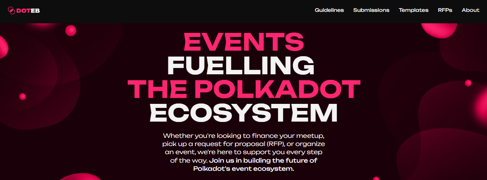
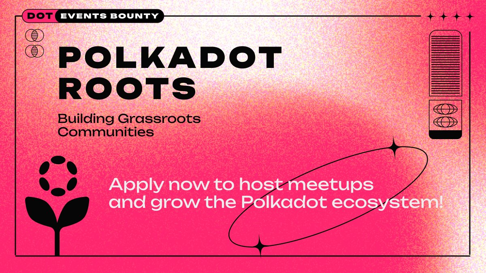
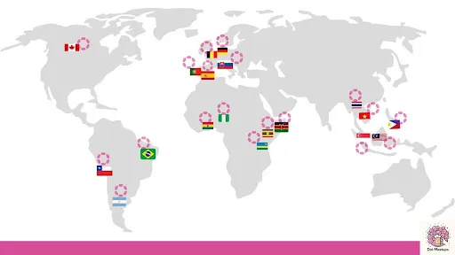
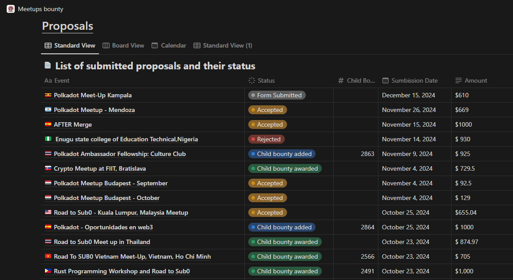

# Community building

## Generate business leads.

_20th February 2025 | A thread by Pooja G._

**Did you know? The** [**Marketing Bounty**](https://marketingbounty.notion.site/) **is fuelling business development and tech sales in the Polkadot ecosystem**. Let's explore how you can contribute to scaling the network through advertising and partnerships.&#x20;

<figure><figcaption></figcaption></figure>

&#x20;The Business Development track is focused on sustainable adoption through:

* Strategic digital advertising campaigns
* Physical advertising openings
* Platform & app integrations
* Cross-ecosystem partnerships
* Innovative business solutions&#x20;

Breaking News: A major opportunity is now open! The curators are actively seeking a _Quality Assurance Assistant_ to support both the main network and ecosystem projects. This is a chance to relay the narrative of one of Web3's most innovative [platforms](../../content/5.regulations/platforms/)!&#x20;

<figure><figcaption></figcaption></figure>

&#x20;What makes a business development proposal stand out? Scalable advertising solutions, coherent frameworks for partnerships, and measurable growth metrics. These key elements can transform your plan into a winning strategy!

Speaking of quality, recent success stories include innovative DeFi integrations and strategic collaborations with traditional tech companies. These projects thrived by bridging the gap between Web3 ecosystems and mainstream business.

Need inspiration? The monthly reports provide valuable insights such as current ecosystem priorities, examples of successful initiatives, growth opportunities, and patterns in resource allocation. Use this data to strengthen your proposal!

<figure><figcaption></figcaption></figure>

When preparing your submission, focus on scalable and sustainable solutions. Include quantifiable deliverables and provide realistic timelines for their implementation. Showcase your long-term value proposition with clarity.

Are you ready to take on your next challenge in Web3 business development? Your creativity has the potential to chart the course for the adoption of Polkadot technologies! Check out [marketingbounty.notion.site](https://marketingbounty.notion.site/).

***

## Launch marketing campaigns.

_6th February 2025 | A thread by Pooja G._

**Exploring the Polkadot** [**Marketing Bounty**](https://marketingbounty.notion.site/) **Program!** A unique opportunity for creators and strategists to shape the future of Web3 marketing. Discover how you can contribute to this exciting initiative.&#x20;

<figure><figcaption></figcaption></figure>

The Marketing Bounty program is Polkadot's way of capturing fresh outreach perspectives. Whether you're experienced in content creation, influencer partnerships, or #community building, your ideas can be funneled into growing the ecosystem.

The submission process has been designed with simplicity in mind.&#x20;

Start by downloading the proposal template, outline your vision, and submit it through the official Marketing Bounty Proposal Form. Curators will review, share their feedback, or get you on board straightaway.

<figure><figcaption></figcaption></figure>

When it comes to marketing strategies, the [Polkadot DAO](../../content/3.operations/voting/) welcomes original ideas for storytelling, community engagement, and brand building. Think about how you can create value while staying true to Web3 principles of decentralization and user empowerment.

Key focus areas include:

* KOL and influencer collaborations
* Strategic media partnerships
* Creative content production
* Community-driven campaigns

Transparency is fundamental to the program. Every proposal, budget allocation, and outcome is publicly tracked. Monthly reports provide insights into successful strategies and areas for improvement. Check the Marketing bounty website to understand what works.

<figure><figcaption></figcaption></figure>

The Marketing bounty emphasizes quality over quantity. Your proposal should demonstrate a deep understanding of the Web3 landscape and Polkadot's unique position in the industry. Consider how your #marketing strategy can enhance both brand awareness and community engagement.

Take a look at [marketingbounty.notion.site](https://marketingbounty.notion.site/) to kickstart your proposal. Remember: great marketing in Web3 is about highlighting the value of community-driven products.

***

## Organise events and conferences.

_23rd January 2025 | A thread by Pooja G._

**Building the Future of Web3 Events!** Discover how the [Events Bounty](https://dotevents.xyz/) is uplifting community gatherings through dedicated event funding.&#x20;

<figure><figcaption></figcaption></figure>

The curators of the Events bounty understand that meaningful connections happen face-to-face. That's why they're actively supporting event organizers who are keen to bring the community together.

What makes this initiative special? More than money, it’s helping community leaders grow. Each event plays an important role in making local and global Polkadot communities stronger.&#x20;

<figure><figcaption></figcaption></figure>

Wondering what kind of events qualify?  This initiative supports various formats:

* Local community meetups
* Technical workshops
* Regional conferences
* Educational seminars

The Events bounty provides clear guidelines. From submitting an EOI to tracking your final proposal, event organizers are mentored at every step. Curators have been selected to provide valuable insights throughout and empower community managers to deliver impactful events.

<figure><figcaption></figcaption></figure>

Why is the Events bounty’s approach remarkable? It goes beyond [funding](../../content/3.operations/community-building/crypto-payments.md) by offering applicants a comprehensive set of resources to ensure the success of their proposals. This includes detailed guides for your planning and direct interactions with experienced community members.&#x20;

Remember: regardless of size, any event contributes to the growth of the Polkadot ecosystem. Whether you're setting up your first workshop or your tenth conference, your gathering matters for a more connected community.&#x20;

<figure><figcaption></figcaption></figure>

Ready to strengthen the Polkadot ecosystem through events? Start your journey today with [dotevents.xyz/](https://dotevents.xyz/) to shape the future of decentralized communities!

***

## Set up a meetup.

_9th January 2025 | A thread by Pooja G._

**Want to organize a Polkadot meetup?** Here's something exciting: you can get up to 1000 USD in $DOT to cover your costs with the [Meetups bounty](https://dotmeetup.notion.site/Meetups-bounty-cd57b5990ba443559413dec3b339ab4a)! Let's break down this bounty program.

<figure><figcaption></figcaption></figure>

Important note: The bounty works as a post payment. You organize the meetup first, then apply for a reimbursement. The program is designed to support genuine community builders who are already active in the Polkadot ecosystem.&#x20;

Before diving in, make sure you have contributions to show as a Polkadot community member. Not quite there yet? No worries! Get involved in the ecosystem first: [build your presence](../../content/3.operations/community-building/crypto-communities.md) and consider which audience you will target for a meetup. Quality matters more than quantity.&#x20;

Thinking of applying? The process is simple: organize your meetup, keep all invoices for venue hires, record all catering costs, and submit your proposal after the event. The community keeps track of all submissions and outcomes on a public dashboard.

<figure><figcaption></figcaption></figure>

Need guidance? DOTmeetups participants are very active on social channels. Connect with experienced organizers, ask questions in preparation of your future proposals, and get valuable insights. Focus on building meaningful connections.&#x20;

Documentation is key! Each proposal needs:

* Event details
* Costs breakdown
* Photos and videos
* Social media coverage

Here's a pro tip: Before planning your meetup, thoroughly review all guidelines. Common reasons that see a proposal rejected include insufficient documentation and failure to meet basic requirements for community engagement. Make your effort count!&#x20;

<figure><figcaption></figcaption></figure>

Get started as a community organiser with [DOTmeetups.xyz](https://t.co/mSsKjrPV8p). Remember: building local communities is crucial for Web3 adoption, and your meetup could be the spark that ignites future innovations!&#x20;
