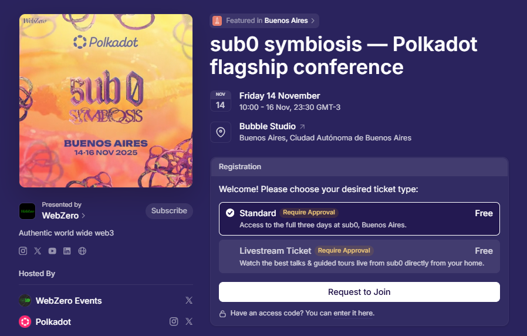

# Professional networking

## Become a community ambassador.

_6th November 2025 | A thread by Pooja G._

**Want to grow professionally in Web3 while making a real impact?** The [Polkadot Ambassador Fellowship](https://www.notion.so/dotambassadors/1c979191f39e80428450d803b8f12c31?v=1c979191f39e817481d2000cca886b05) (PAF) brings more than a community. It’s a structured path to leadership, learning, and career opportunities.&#x20;

<figure><figcaption></figcaption></figure>

The PAF is a decentralised, community-led program built on DIRECT principles: Dynamic, Inclusive, Resilient, Equitable, Clear, and Trustless. It’s designed to support and grow the Polkadot ecosystem through active engagement.

Polkadot ambassadors can progress through 6 ranks by contributing to online education, governance, events, content creation, and leadership. This Fellowship gives real visibility, mentorship, and meaningful connections to members across continents.

<figure><figcaption></figcaption></figure>

Here’s what makes this program shine:

* 160+ Ambassadors onboarded
* 12+ Phrag&#x6D;_&#xE9;_&#x6E; Initiative Fund (PIF) projects funded
* “Polkadot 101” course launched in May 2025
* A Brand toolkit + job board + onboarding platform&#x20;

With on-chain collective tools, partner programs, and localized leadership models in development, the PAF is evolving into a global engine for decentralized education and innovation.&#x20;

<figure><figcaption></figcaption></figure>

&#x20;The Polkadot Ambassador Fellowship is your launchpad into Web3 governance. Learn more at [https://polkadot.com/community/ambassador-program/](https://polkadot.com/community/ambassador-program/). &#x20;

