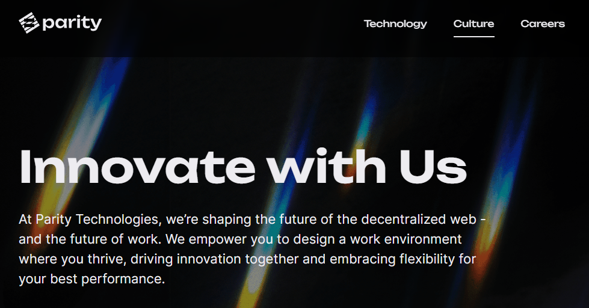
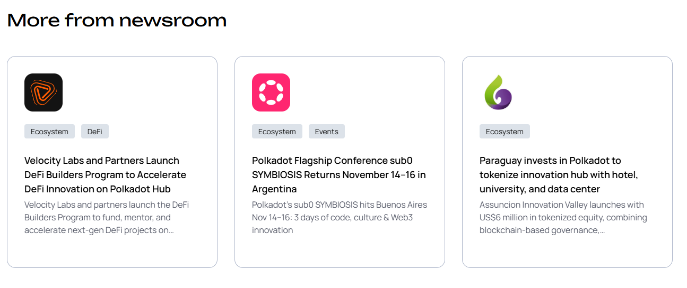
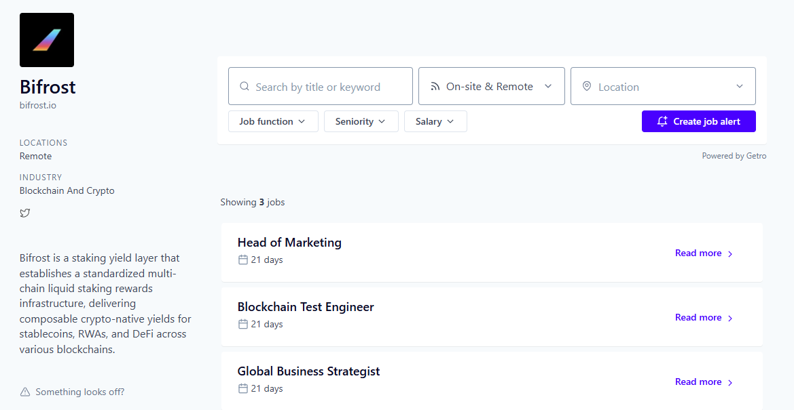

# Sustainable employment

## Work for an organisation.

_23rd October 2025 | A thread by Pooja G._

**Looking to work on blockchain infrastructure and governance?** The Web3 Foundation and Parity Technologies, two key organizations behind the [Polkadot](https://polkadot.com/) ecosystem, are actively recruiting.&#x20;

<figure><figcaption></figcaption></figure>

Parity Technologies is the engineering powerhouse behind the Polkadot SDK. This tech company creates the building blocks for decentralized networks and dApps.&#x20;

The Web3 Foundation funds research, provides developers grants, and drives growth across Polkadot network. But its focus goes beyond the ecosystem to enable the next generation of Web3 products.

<figure><figcaption></figcaption></figure>

Both organizations offer remote-first and globally accessible roles. Whether you're deeply technical or people-focused, there’s a program or a team to fit your profile.

Current openings include:

* Android Mobile Engineer
* DevEx Manager
* Decentralized Nodes for validators
* Decentralized Voices for individuals and DAOs

The bottom line? Contribute to web technologies used by thousands of developers and users worldwide!

<figure><figcaption></figcaption></figure>

Ready to grab your first corporate role? Visit[ parity.io/careers](https://www.parity.io/careers) for openings in Engineering and Product or head to [web3.foundation/about](https://web3.foundation/about) to learn about the ongoing ecosystem growth strategy.

***

## Work for a startup.

_9th October 2025 | A thread by Pooja G._

**Thinking about a career in Web3?** With dozens of startups actively hiring, now is the perfect time to explore sustainable [employment opportunities](https://polkadot.getro.com/jobs) within the Polkadot network.

<figure><figcaption></figcaption></figure>

Built for a multichain industry, Polkadot empowers parachains (rollups) to develop real-world solutions for a growing user base of institutional players. And they need talent.

The Polkadot job board lists open roles from ecosystem teams like Bifrost, Startale Labs, and more. Whether you're a developer, designer, or strategist, there’s a role that will fit your skill set.

<figure><figcaption></figcaption></figure>

Key roles currently in demand across startups include:

* Blockchain Engineers (Rust, Substrate)
* Smart Contract Developers (ink!, Solidity)
* Product Designers & UI/UX Specialists
* Marketing and Business Leads

Why join a Polkadot ecosystem startup? You will get to work on innovative technologies and be part of a product-driven environment. Many positions are remote and come with the flexibility that modern professionals seek.

<figure><figcaption></figcaption></figure>

Ready to start? Head over to[ polkadot.getro.com](https://polkadot.getro.com/jobs), filter by role or company, and apply directly! If you are not sure if a role is a good fit, join community forums to engage with teams before applying.

Pro tip: To stay informed on the latest announcements and partnerships from ecosystem startups, keep an eye on [polkadot.com/newsroom/press-releases](http://polkadot.com/newsroom/press-releases). Your Web3 journey could begin right there, with an impactful mission!

