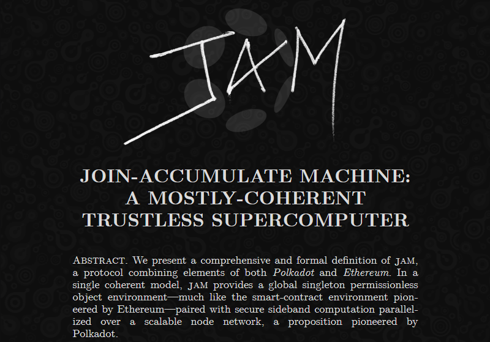
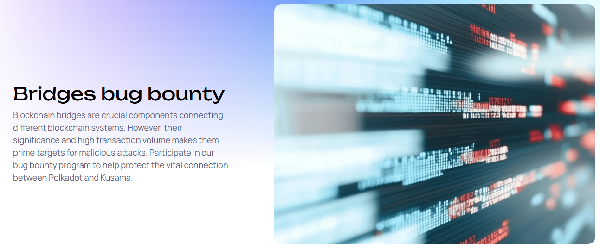
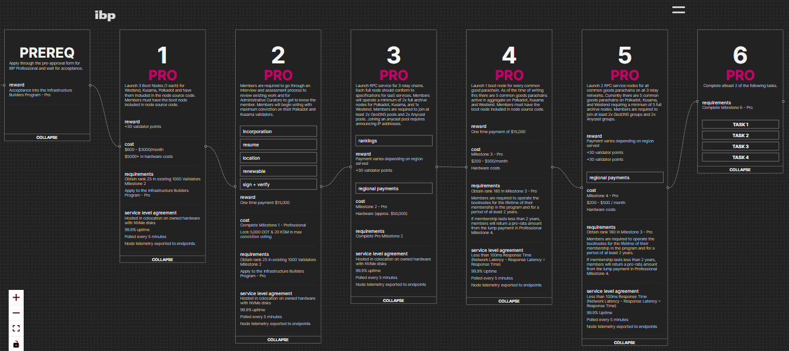
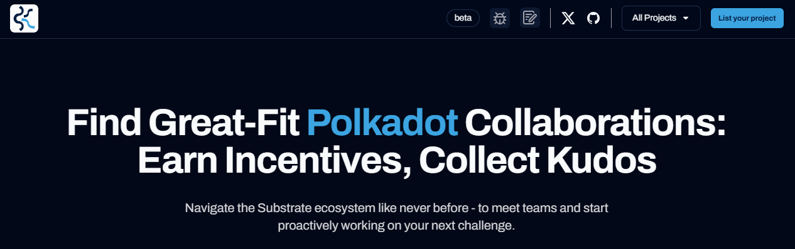

# Technical collaboration

## Develop JAM client implementations.

_21st  August 2025 | A thread by Pooja G._

**Exploring high-level technical roles in Web3?** [Decentralized JAM](https://jam.web3.foundation/) by Web3 Foundation offers a clear path for blockchain engineers to contribute meaningfully within the Polkadot ecosystem, where creativity meets open source impact.

<figure><figcaption></figcaption></figure>

So, what is Decentralized JAM (aka JAM Prize)? It's an initiative focused on supporting exceptional talent to build the future of Polkadot technologies: the "Join-Accumulate Machine" (JAM).

The JAM Prize is about developing a new foundation for the decentralized web. As the proposed successor to the Relay chain, JAM introduces a minimal and scalable base layer for all Web3 operations. This is your opportunity to help reinvent the network from the ground up!

<figure><figcaption></figcaption></figure>

Technical contributions can be submitted across diverse programming languages such as:

* Java, AspectJ, Kotlin, C#, Go
* Haskell, ML, Perl, Python, Ruby, JS, Groovy, Dart
* Brainfuck, Whitespace, Redstone

Who should apply? Protocol engineers, system designers, researchers, and builders who thrive on solving hardware and software problems. Teams are expected to deliver key technical milestones throughout.

<figure><figcaption></figcaption></figure>

Contributing allows you to gain hands-on experience with advanced blockchain architecture. You will also work on essential open-source infrastructure and collaborate with top researchers and developers from the Polkadot ecosystem. &#x20;

What else is in it for you? A total of 10 million DOT and 100,000 KSM for prizes, long-term visibility and networking, and a chance to strengthen your Web3 portfolio through client development. You will also get to fully integrate the community of JAM implementers.&#x20;

<figure><figcaption></figcaption></figure>

Whether you're an individual developer, a team, or a research group, Decentralized JAM offers an insightful pathway into the future of decentralized systems. Find out more about the rules of this top-tier competition at [jam.web3.foundation](https://jam.web3.foundation/).&#x20;

***

## Identify security vulnerabilities.

_7th August 2025 | A thread by Pooja G._

**Looking to grow your Web3 career through technical contributions?** The [Polkadot<->Kusama bridge](https://github.com/paritytech/polkadot-sdk/tree/master/bridges) presents a real opportunity for security-minded developers to get involved, contribute meaningfully, and earn bounties.

<figure><figcaption></figcaption></figure>

The Polkadot<->Kusama bridge is a major step in cross-chain interoperability, with a focus on decentralization. Securing this infrastructure has become critical, making now the perfect time for white hat hackers and security researchers to get onboard.

In partnership with experts, a security bounty has been launched to find and report vulnerabilities. This is a way to make high-impact contributions to Polkadot’s core tech stack while getting paid for your expertise.

<figure><figcaption></figcaption></figure>

What kind of security risks are covered by this bounty?

* Message forging or replay
* Remote code execution
* XCM-based attack vectors
* Critical denial-of-service issues&#x20;

This bounty isn't just about finding bugs: it’s a career-building opportunity. Valuable contributions will help secure key infrastructure and give you recognition within the Polkadot ecosystem and across the blockchain industry.

<figure><figcaption></figcaption></figure>

Who should apply? Rust developers, security engineers, white-hat hackers, and auditors with blockchain experience. If you're ready to work on meaningful code that impacts core Web3 infrastructure, this is your entry point!

Thinking of growing your career in blockchain security? Explore the Polkadot<->Kusama bridge security bounty on [https://polkadot.com/bridges-bug-bounty/](https://polkadot.com/bridges-bug-bounty/) today.&#x20;

***

## Provide decentralised infrastructure services.

_24th July 2025 | A thread by Pooja G._

**Power your Polkadot & Kusama projects with global infrastructure excellence!** The [Infrastructure Builders Program (IBP)](https://ibp.network/) connects ambitious builders with world-class node operators delivering decentralized high-performance services.

<figure><figcaption></figcaption></figure>

The IBP brings together a distributed network of infrastructure providers, from the USA through to Costa Rica, Nigeria and South India. This worldwide coverage ensures optimal performance regardless of where users are located.

The program offers three core infrastructure services: RPC endpoints maintaining 99.9% uptime, boot #nodes operating with <100ms responses, and indexer nodes providing worldwide coverage.

<figure><figcaption></figcaption></figure>

The IBP follows 5 key principles:

* Decentralization —closer to users
* Autonomy —independent operators
* Robustness —enterprise-grade equipment
* Reliability —redundant systems
* Sustainability — powered by 100% renewable energy

The program features members that are ranked based on their undertakings. Professionals like Gatotech, Turboflakes, RadiumBlock, and Dwellir bring enterprise-level reliability, while Hobbyists contribute to diversifying the set of operators.

<figure><figcaption></figcaption></figure>

The IBP prioritizes resilience through independent data centers, standalone hardware, and special-purpose monitoring systems. These setups ensure that dApps never experience unexpected downtime.

Ready to supercharge your blockchain project with world-class infrastructure? Visit[ https://ibp.network/](https://ibp.network/) to leverage a global network of operators.&#x20;

***

## Support network services.

_10th July 2025 | A thread by Pooja G._

Attention node operators! The [System Parachains Collator Bounty](https://polkadot.subsquare.io/treasury/bounties/32) supports essential infrastructure providers with monthly rewards of $300 in DOT and KSM!

This initiative addresses a critical need by incentivizing infrastructure builders to maintain System chains like AssetHub, BridgeHub, and Coretime. This is because, unlike regular rollups, system chains generate minimal transaction fees.&#x20;

The bounty is structured around performance and reliability. Collators receive monthly fixed rewards, with distribution based on their block production ratio. This model is in place to guarantee high-quality service for all system chains.

<figure><figcaption></figcaption></figure>

Here are the steps for becoming eligible as a permissionless collator:

* Deposit 1,000 DOT or 50 KSM
* Register as a collator candidate&#x20;
* Demonstrate consistent performance over time

Monthly evaluations enforce transparency. Collators receive payments based on previous month's achievements and all metrics are publicly available. This data-driven approach benefits those who contribute the most to network reliability.

Important note: The bounty is only a temporary solution, as the ecosystem is still working towards more sustainable long-term funding models. Its main role is to make sure that System chains can maintain optimal performance.

<figure><figcaption></figcaption></figure>

Interested in participating? Check out [https://polkadot.subsquare.io/treasury/bounties/32](https://polkadot.subsquare.io/treasury/bounties/32)  to learn more about technical requirements and join the growing network of node operators supporting Polkadot's infrastructure!

***

## Build open source projects.

_19th June 2025 | A thread by Pooja G._

**Developers, an opportunity awaits!** Polkadot’s [Open Source Developer Grants Bounty Program](https://github.com/PolkadotOpenSourceGrants) is now accepting applications for innovative projects! Build the future of Web3 with funding of up to $30K.

This community-guided initiative aims to onboard up to 15 promising open-source projects to expand the ecosystem. Unlike traditional funding routes, this program streamlines the grant process with milestone-based payments and expert curator oversight.

<figure><figcaption></figcaption></figure>

The program specifically targets individuals and small teams with proven experience in open-source development. Whether you're building proofs of concept, general-purpose libraries, or dApps, the bounty is there to offer support!

Here is a glimpse of the application process:

* Submit your proposal in the GitHub repository
* Include project scope, technical specifications, and sustainability plan
* Outline milestones with key deliverables
* Demonstrate how your project addresses ongoing issues

Want to maximize your chances? Focus on solving real ecosystem needs, demonstrate prior open-source contributions, and lay out specific milestones. The review process emphasizes technical feasibility and long-term value for Polkadot stakeholders.

<figure><figcaption></figcaption></figure>

For all approved projects, payments are released after successful milestone delivery. This structure ensures that funds go to teams that are actively building while maintaining transparency throughout the development process.

Ready to apply? Visit[ https://github.com/PolkadotOpenSourceGrants](https://github.com/PolkadotOpenSourceGrants) to get started.

***

## Build ink! projects.

_5th June 2025 | A thread by Pooja G._

**Unleash your blockchain potential with** [**Ink!ubator**](https://use.ink/inkubator/)**.** This is an open call for all Web3 developers to start their breakthrough projects!&#x20;

<figure><figcaption></figcaption></figure>

Ink!ubator is a comprehensive launchpad designed to supercharge the ink! smart contract ecosystem. Funded by the Polkadot Treasury, this initiative is all about empowering developers to create blockchain solutions across Polkadot, Kusama, and Substrate chains.

The program offers a comprehensive journey for developers. From ideation to deployment, Ink!ubator provides end-to-end support to transform innovative ideas into real-world dApps. It also unlocks access to core developers, personalized mentorship, and up to $50,000 in grants!

<figure><figcaption></figcaption></figure>

More than funding, Ink!ubator is about creating the next generation of blockchain solutions, such as:

* Building an advanced DEX
* Creating a modular NFT marketplace
* Developing [infrastructure](../../content/5.regulations/networks/infrastructure.md) tools
* Pioneering new smart contract technologies

What makes Ink!ubator compelling is its coverage of various project categories. Whether you're creating custom fintech services or tinkering with industry-wide frameworks, there's a track to perfect your vision.

<figure><figcaption></figcaption></figure>

The selection process is open and community-driven. Projects apply through GitHub, and monthly updates are shared on the Polkadot Forum. This ensures full visibility and helps create opportunities for feedback and collaboration.

Think your project can become a big step forward for Web3 ecosystems? Don't miss your chance to transform your vision into reality! Apply at [use.ink/ubator](https://use.ink/inkubator/).

***

## Contribute to Polkadot SDK.

_22nd May 2025 | A thread by Pooja G._

**Transform your coding journey with** [**Kudos**](https://www.morekudos.com/): where blockchain developers find their perfect match! If you have ever dreamed of seamlessly connecting with Web3 projects that align with your skills, let’s see how Kudos can empower you to contribute!&#x20;

<figure><figcaption></figcaption></figure>

Kudos is an intelligent matchmaking platform designed specifically for the Polkadot ecosystem. By bringing together talented developers and cutting-edge projects, it creates the perfect environment for incubation and growth.

Picture yourself browsing through opportunities that align with your skills and interests. Whether you're experienced in Rust, Ink!, or TypeScript, Kudos will help you discover relevant projects without endless GitHub searching.

<figure><figcaption></figcaption></figure>

For developers, the benefits are clear: find projects that match your expertise and work on meaningful contributions. Polkadot projects can tag contributions with custom rewards: native [tokens](../../content/3.operations/swapping/pairs-availability.md), NFTs, and POAPs. This setup turns interest for coding into tangible benefits.

Kudos is also pioneering a concept called "Agile Devtime" to allow projects to quickly scale their workforce when needed. This approach is effective when responding to new grants or polishing existing features, so that core developers can focus on strategic initiatives.

<figure><figcaption></figcaption></figure>

What sets Kudos apart?

* A unified access to repositories from the Polkadot ecosystem
* Smart filtering by technology or purpose
* High-quality task curation with clear context
* Automated incentives distribution
* Direct connection to 40+ leading projects

\
&#x20;Visit [morekudos.com](https://www.morekudos.com/) to join the +2000 builders that are already transforming the Polkadot ecosystem. Whether you're looking to contribute or need talented developers for your project, Kudos is where opportunity meets talent!&#x20;

***

## Hack on Polkadot SDK.

_8th May 2025 | A thread by Pooja G._

**Discover** [**OpenGuild**](https://openguild.wtf/)**!** A thriving community that's elevating projects, connecting talent, and building the decentralized future - one step at a time.&#x20;

<figure><figcaption></figcaption></figure>

What exactly is OpenGuild? It's a movement of passionate Web3 builders contributing to open-source projects across Southeast Asia. With members spanning Vietnam, Philippines, Malaysia, Thailand, and Singapore, this initiative is truly a regional powerhouse!

Their impact is real: OpenGuild has distributed over $20,000 in bounties and celebrated 20 graduates fresh from the prestigious [Polkadot Blockchain Academy](blockchain-education.md#get-formal-blockchain-training). This community doesn't just talk about Web3 - they're actively building it!

<figure><figcaption></figcaption></figure>

Want to see what OpenGuild members are creating? From PolFT (an Interchain Gaming NFT Leasing platform) to GmGN (a super-fast wallet using Passkeys), these doers are building practical solutions for everyday Web3 challenges using [Polkadot technologies](../../content/5.regulations/networks/).

The community truly shines in hackathons. In the Polkadot Vietnam Hackathon 2025, OpenGuild members dominated across multiple tracks - NFT, PayFi, DeFi, and UI/UX. Their creative problem-solving and technical know-how is generating a lot of enthusiasm beyond digital spaces.

<figure><figcaption></figcaption></figure>

Here are some benefits on offer in this initiative:

* Connect with 3,500+ passionate builders
* Participate in regular knowledge-sharing events
* Contribute to 50+ open-source projects
* Earn XP for community participation

Ready to level up your Web3 journey? OpenGuild welcomes builders of all levels. Check out their Community Handbook at [openguild.wtf](https://openguild.wtf/) to get started. Remember: in Web3, building together is where the magic happens.
