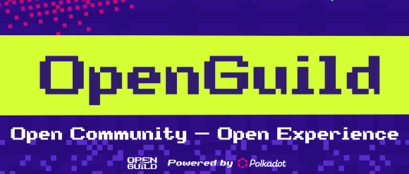

# Technical collaboration

## Hack on Polkadot SDK.

_8th May 2025 | A thread by Pooja G._

**Discover** [**OpenGuild**](https://openguild.wtf/)**!** A thriving community that's elevating projects, connecting talent, and building the decentralized future - one step at a time.&#x20;

<figure><figcaption></figcaption></figure>

What exactly is OpenGuild? It's a movement of passionate Web3 builders contributing to open-source projects across Southeast Asia. With members spanning Vietnam, Philippines, Malaysia, Thailand, and Singapore, this initiative is truly a regional powerhouse!

Their impact is real: OpenGuild has distributed over $20,000 in bounties and celebrated 20 graduates fresh from the prestigious [Polkadot Blockchain Academy](blockchain-education.md#get-formal-blockchain-training). This community doesn't just talk about Web3 - they're actively building it!

<figure><figcaption></figcaption></figure>

Want to see what OpenGuild members are creating? From PolFT (an Interchain Gaming NFT Leasing platform) to GmGN (a super-fast wallet using Passkeys), these doers are building practical solutions for everyday Web3 challenges using Polkadot technologies.

The community truly shines in hackathons. In the Polkadot Vietnam Hackathon 2025, OpenGuild members dominated across multiple tracks - NFT, PayFi, DeFi, and UI/UX. Their creative problem-solving and technical know-how is generating a lot of enthusiasm beyond digital spaces.

<figure><figcaption></figcaption></figure>

Here are some benefits on offer in this initiative:

* Connect with 3,500+ passionate builders
* Participate in regular knowledge-sharing events
* Contribute to 50+ open-source projects
* Earn XP for community participation

Ready to level up your Web3 journey? OpenGuild welcomes builders of all levels. Check out their Community Handbook at [openguild.wtf](https://openguild.wtf/) to get started. Remember: in Web3, building together is where the magic happens.
