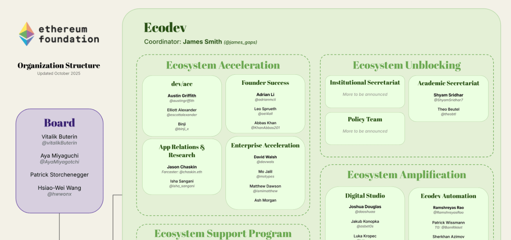

# Web3 careers

## Sustainable employment.

_3rd December 2025 | A thread by Pooja G._

**What does a long-term career in Web3 look like?**\
In ecosystems like Ethereum and Polkadot, it’s more than just coding. It’s about building the future Web technologies.

<figure><figcaption></figcaption></figure>

The most in-demand roles today are Blockchain Engineers, Smart Contract Developers, DevOps, and Product Designers. But beyond tech, there's also a growing need for community managers, copywriters, and marketers to drive engagement and scale projects.

Leading organizations like DoraHacks and Parity Technologies have global openings. Engineering focuses on building and maintaining core blockchain infrastructure. Product development turns ideas into usable tools, while community and marketing improve adoption.&#x20;

<figure><figcaption></figcaption></figure>

Many established startups are looking for both tech and non-tech talent to expand their products. These roles cover managing DAOs, running validators, and sourcing partnerships.

What’s in it for you?\
\- Remote-first work\
\- Open-source projects\
\- Purpose-driven teams\
\- Cutting-edge tech

Explore open roles [dotjobs.online](https://dotjobs.online/). Contribute to GitHub repos like polkadot-sdk to gain visibility amongst core teams. Browse community spaces and forums to find new projects.

<figure><figcaption></figcaption></figure>

Web3 offers a future-proof career path: take part in hackathons or apply for grant programs from ecosystem organisations to land your first role.

***

## Technical collaboration (Part 2).

_25th September 2025 | A thread by Pooja G._

**Let’s explore how developers and infrastructure engineers can solve meaningful problems and earn high rewards in the Polkadot ecosystem.**

[Technical collaboration](technical-collaboration.md) isn’t about tinkering, but contributing to foundational systems. Many programs across Polkadot network bring structured paths for experienced developers to work on real challenges and get compensated well for it.

System chains like AssetHub and BridgeHub rely on permissionless collators to power DeFi interactions with Base and Soneium. These roles are incentivised to support critical public good infrastructure that underpins Polkadot Hub.

<figure><figcaption></figcaption></figure>

The Infrastructure Builders Program (IBP) connects developers with top-tier node operators across the globe. From RPC and boot nodes to indexers, this decentralized infrastructure guarantees optimal performance, uptime, and sustainability for emerging projects.

For security engineers, the Polkadot<->Kusama security bridge bounty offers compensation for uncovering critical bugs in cross-chain messaging, execution, and denial-of-service vulnerabilities. This is all in collaboration with [HackenProof](https://hackenproof.com/programs/polkadot-bridge)!&#x20;

<figure><figcaption></figcaption></figure>

Decentralized JAM by the Web3 Foundation spearheads long-term collaborative innovation by gathering protocol engineers to build the future of Web3 while competing for a share of 10M $DOT and 100K $KSM.

<figure><figcaption></figcaption></figure>

These are only a few examples out of many initiatives catering for skilled programmers and high-level thinkers who want to level up Web3 infrastructure.&#x20;

Get on board to learn more at [jam.web3.foundation](https://jam.web3.foundation) and [dotbountieshub.online](https://dotbountieshub.online/)!

***

## Technical collaboration (Part 1).

_11th September 2025 | A thread by Pooja G._

**Polkadot network is a leader in blockchain technologies that enable secure, scalable, and interoperable applications. The ecosystem offers a range of opportunities for meaningful** [**technical collaboration**](technical-collaboration.md) **to budding developers and seasoned researchers alike.**&#x20;

Polkadot SDK is the open source framework that sustains the network. Developers can contribute to the creation and maintenance of runtime modules and tools to improve core functionalities offered within the ecosystem.&#x20;

Platforms like [Polkadot Africa](https://www.polkadot.africa/) match developers with real ecosystem tasks. These aren’t test projects: your code supports live dApps and networks. Completing their challenges is a practical way to build experience and reputation!

<figure><figcaption></figcaption></figure>

New to blockchain tech? You can create APIs, wallets, and write ink! and Solidity smart contracts with R0GUE's POP CLI. Community maintainers are there to guide you through your first issues. This is perfect for learning on-chain logic.

<figure><figcaption></figcaption></figure>

Web3 flips the script on traditional jobs. You can apply for ecosystem grants, complete bounties, or lock in funding through WebZero hackathons while building in public. Many full-time roles were started just like this.

<figure><figcaption></figcaption></figure>

Polkadot’s vision of multichain dApps calls for constant interactions with other ecosystems. Bridge protocols and shared standards are exciting developments to contribute to, if you're into interoperability, networking, or security.&#x20;

Start small, contribute often. The Polkadot ecosystem rewards builders with funding, mentorship, and community. Your next big break in Web3 might start with a GitHub issue.&#x20;

***

## Community building.

_24th April 2025 | A thread by Pooja G._

**Let's explore the world of** [**Community Building**](community-building.md) **in Web3 - where passionate individuals come together to grow and strengthen their ecosystems!**

Community building is the heartbeat of the Blockchain industry. It's about creating spaces where people connect, learn, and collaborate. From local meetups to global conferences, every gathering helps build a more robust ecosystem.

<figure><figcaption></figcaption></figure>

Ever wondered about the roles that are available in the field? Here are some key job opportunities:

* Marketing & Content Creation
* Event Organization & Management
* Meetup Coordination
* Community Moderation
* Anti-scam Initiatives
* Educational Program Development

There is also support through [community-led programs](https://ethglobal.com/) such as bounties, matching rounds, and public good funding. Sponsors welcome original takes for promoting their products, while event organisers can receive incentives in crypto to improve industry coordination.&#x20;

<figure><figcaption></figcaption></figure>

Building a diverse community is a special task that requires an open mind and user-friendly resources. You get to build routines around a DAO, onboard people to new roles, and interact directly with OGs on social channels.

<figure><figcaption></figcaption></figure>

Once you are ready to set up your first initiative, look out for guidance available in the Web3community. You won’t have to go at it alone, because strong ecosystems are always built one connection at a time!

***

## Blockchain education.

_10th April 2025 | A thread by Pooja G._

**What does excellence in** [**blockchain education**](blockchain-education.md) **look like? Let's explore the new standards in Web3 learning through extensive courses, hackathons, tutorials, and documentation.**

Quality blockchain education needs three essential ingredients:

* Expert-led instruction from industry pioneers
* Hands-on experience with decentralised applications
* Flexible learning paths that match your career goals

Courses designed by experienced founders allow you to learn from those who have built the industry from the ground up. A dual-path approach blending online learning and in-person workshops means that there’s always a route available for you. &#x20;

<figure><figcaption></figcaption></figure>

Impactful [tutorials](https://www.cyfrin.io/updraft) focus on practical application. You wouldn’t just be memorizing concepts, but learning how to use them in real-world scenarios. When exploring data structures or building complex dApps, progression from theory to practice must be seamless.&#x20;

<figure><figcaption></figcaption></figure>

No matter the ecosystem, docs are the living library of blockchain knowledge. Community-driven resources are always evolving with technology. You'll find everything from breakthrough concepts to development guides, which must be updated to match industry needs.

<figure><figcaption></figcaption></figure>

Before you dive into blockchain education, make sure that the platform you choose offers training that will set you up for long-lasting success in the industry. More than knowledge, it is skills that are your ticket to securing a career in Web3.&#x20;

