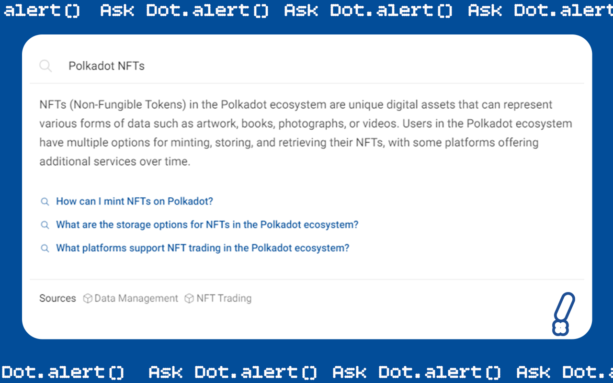
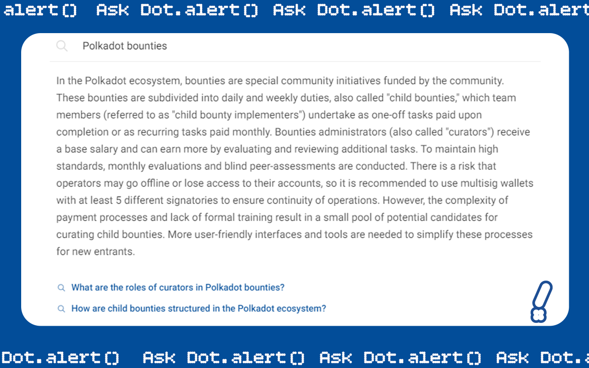
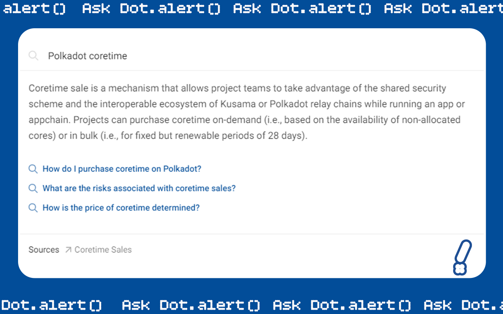
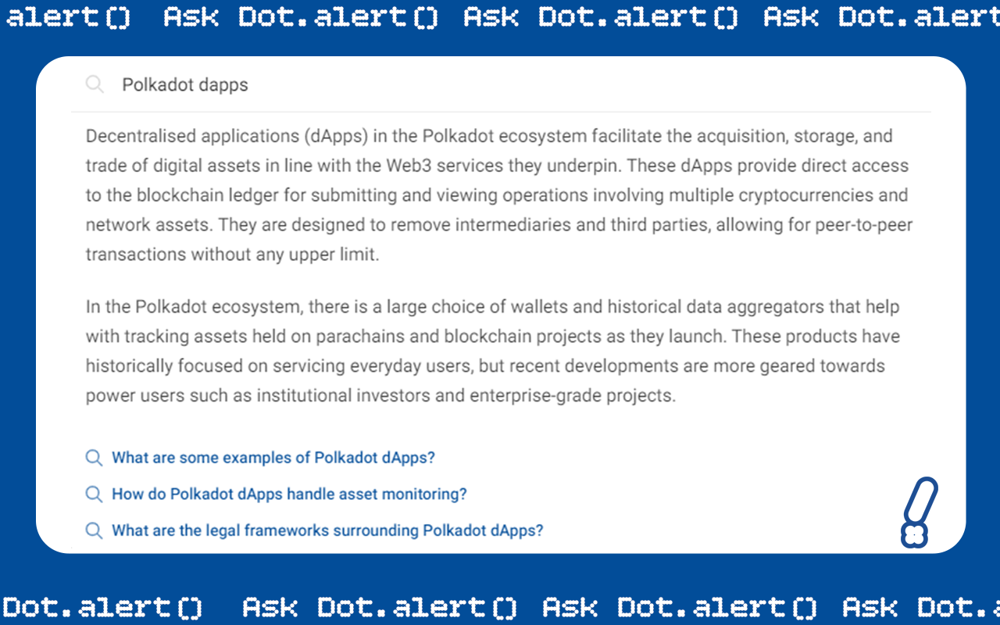

# Products

### NFTs

<figure><figcaption></figcaption></figure>

### Bounties

<figure><figcaption></figcaption></figure>

### Coretime

<figure><figcaption></figcaption></figure>

### dApps

<figure><figcaption></figcaption></figure>

