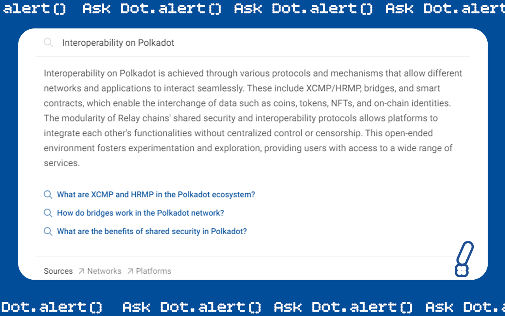

# Technologies

### Community

<figure><figcaption></figcaption></figure>

### Treasury

<figure><figcaption></figcaption></figure>

### Privacy

<figure><figcaption></figcaption></figure>

### Interoperability

<figure><figcaption></figcaption></figure>

