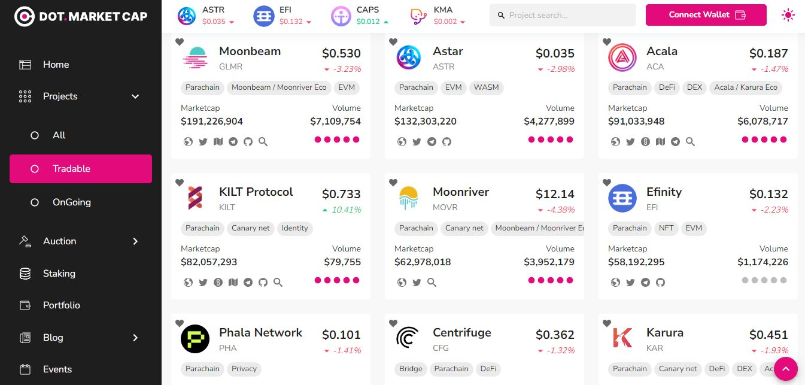

# 1.Acquisition

There are various avenues for obtaining Polkadot assets ahead of **onboarding the ecosystem**.&#x20;

These include :

* Getting a [gift](https://gifts.polkadot.network/#/generate) (ex: Polkadot/Kusama vouchers)
* Getting a [payout ](https://polkadot.js.org/apps/?rpc=wss%3A%2F%2Fkusama-rpc.polkadot.io#/society)(ex: _Kappa Sigma Mu_ pot)
* Getting a [tip ](https://polkadot.js.org/apps/?rpc=wss%3A%2F%2Fkusama.api.onfinality.io%2Fpublic-ws#/treasury/tips)(ex: Polkadot/Kusama Treasury tips)
* Getting [funding](https://polkadot.js.org/apps/?rpc=wss%3A%2F%2Fkusama.api.onfinality.io%2Fpublic-ws#/treasury)/a [grant](https://web3.foundation/grants/) (ex: Polkadot/Kusama Treasury spends, W3F grants)
* Buying through fiat on-ramp on a webapp (ex: __ [_Singular_](https://singular.rmrk.app/)_,_ [_KodaDot_](https://kodadot.xyz/rmrk/credit/)_,_ [_Talisman_](https://app.talisman.xyz/portfolio))
* Swapping on a Decentralised exchange (ex: [_Karura_](https://apps.karura.network/)_,_ [_ZenLink_](https://dex.zenlink.pro/#/swap))&#x20;
* Swapping on a Centralised platform (ex: [_Swapspace_](https://swapspace.co/)_, ****_ [_Changelly_](https://changelly.com/))&#x20;
* Buying/swapping on a Centralised exchange (ex: [_Kraken_](https://www.kraken.com/)_,_ [_Binance_](https://www.binance.com/en))

You will need a Polkadot account to receive your coins/tokens, along with some understanding of the following concepts:&#x20;

* Depending on the coins/tokens that you receive, you might need to pay attention to existential deposits.
* Depending on the dapps that you use, you might need to investigate address formats.
* Depending on the methods that you choose, you might need to make use of transaction explorers.

<figure><figcaption>
Overview of listed ecosystem tokens/coins on <a href="https://www.dotmarketcap.com/listed">DotMarketCap</a>.
</figcaption></figure>

**In this section, we review key information for sending, receiving, and teleporting assets safely across Polkadot networks.**&#x20;

****
