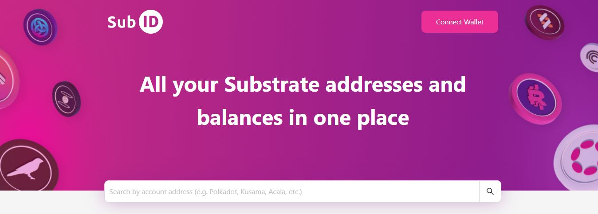

# Address formats

## What are they?

Address formats are a method used to represent a single account across different networks. Relay chains have their own recognisable address format, but this is not always the case for Parachains.&#x20;


**DotSama accounts are purpose-built for interoperability: users only need to create **_**one**_** account to instantly interact with a variety of networks.**&#x20;


Fortunately, there is no need to open or connect your wallet every time you need to access address formats for your account. There are some online utilities that will convert any DotSama account address into all available address formats across all networks, provided that the address that you enter is valid.

<figure><figcaption>
 <a href="https://sub.id/">SubID</a> gives a user-friendly access to account formats.
</figcaption></figure>

## How do they work?

Even though the same DotSama account will work on interoperable networks, address formats prevent DotSama addresses from being interchangeable. Addresses are still strictly linked to a specific network and a Relay chain ecosystem when it comes to transactions.&#x20;

In practice, this means that:

* you might be able to send/receive Polkadot assets onto a Polkadot parachain, but you won't be able to send/receive Polkadot assets onto a Kusama Parachain (yet).&#x20;
* you will not be able to sign a transaction on a Polkadot parachain with the Polkadot Ledger app.
* you might not be able to use a Polkadot address on a transaction explorer built for Kusama.

## Why are they important?

Given that there is no universal method for handling these address formats, each wallet is free to adopt their own approach. Some wallets require you to manually select a network to have access to the relevant address, one network at a time. While other wallets allow you to search and select a specific address from all available network addresses. You will need to pay close attention to this feature when choosing your wallets.

When you connect your account to a dapp, the address that you see on the screen will automatically switch to match the network that you are using. Users who don't know about address formats are often confused about what has happened to their Polkadot/Kusama address and wrongly conclude that their DotSama wallet has been compromised by the dapp.

