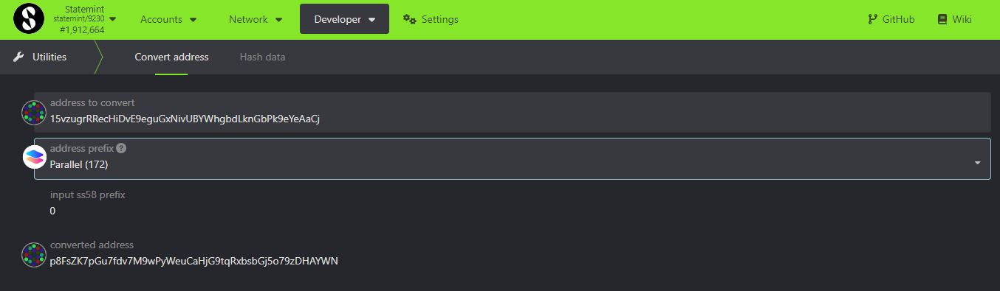
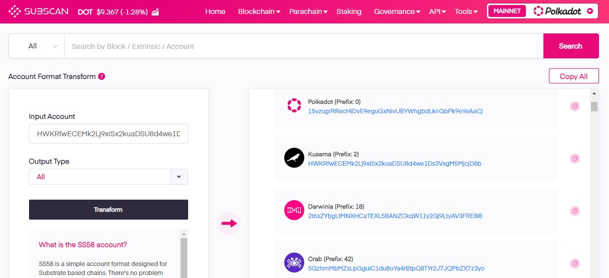
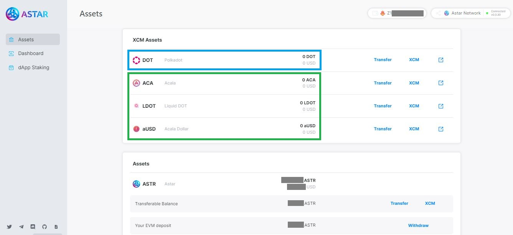
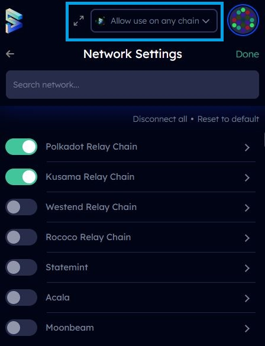
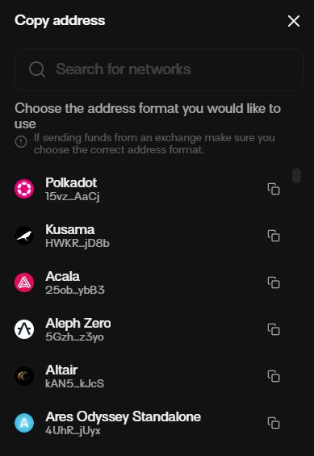

# Address Formats

## What are Address Formats?

Address formats are a method used to represent a single account across different [networks](../5.regulations/networks/). Relay chains have their own recognisable address format, but this is not always the case for Parachains.&#x20;


**Polkadot accounts are purpose-built for interoperability: users only need to create **_**one**_** account to instantly interact with a variety of networks.**&#x20;


Fortunately, there is no need to open or connect your wallet every time you need to access address formats for your account. There are some online utilities that will convert any Polkadot account address into all available address formats across all networks, provided that the address that you enter is valid.

<figure><figcaption>
View specific address formats for the same account on <a href="https://polkadot.js.org/apps/?rpc=wss%3A%2F%2Fpublic-rpc.pinknode.io%2Fstatemint#/utilities">Polkadot-JS Apps</a>.
</figcaption></figure>

<figure><figcaption>
View all address formats for the same Polkadot account on Subscan.
</figcaption></figure>

<figure><figcaption>
 SubID gives a user-friendly access to account formats.
</figcaption></figure>

### How do Address Formats Work?

Even though the same Polkadot account will work on interoperable networks, address formats prevent Polkadot addresses from being interchangeable. Addresses are still strictly linked to a specific network and a Relay chain ecosystem when it comes to [transactions](../3.operations/).

<figure><figcaption>
Dashboard for Polkadot (Relay chain) and Acala (Polkadot parachain) assets on Astar (Polkadot parachain).
</figcaption></figure>

In practice, this means that:

* you might be able to send/receive Polkadot assets onto a Polkadot parachain, but you won't be able to send/receive Polkadot assets onto a Kusama Parachain (yet).&#x20;
* you will not be able to sign a transaction on a Polkadot parachain with the Polkadot Ledger app.
* you might not be able to use a Polkadot address on a transaction explorer built for Kusama.

### Why are Address Formats Important?

Given that there is no universal method for handling these address formats, each wallet is free to adopt their own approach. Some wallets require you to manually select a network to have access to the relevant address, one network at a time. While other wallets allow you to search and select a specific address from all available network addresses. You will need to pay close attention to this feature when choosing your wallets.

<figure><figcaption>
Network search and selection functionality on SubWallet.
</figcaption></figure>

<figure><figcaption>
Address formats search and copy functionality on Talisman wallet.
</figcaption></figure>

When you connect your account to a dapp, the address that you see on the screen will automatically switch to match the network that you are using. Users who don't know about address formats are often confused about what has happened to their Polkadot address and wrongly conclude that their Polkadot wallet has been compromised by the dapp.

