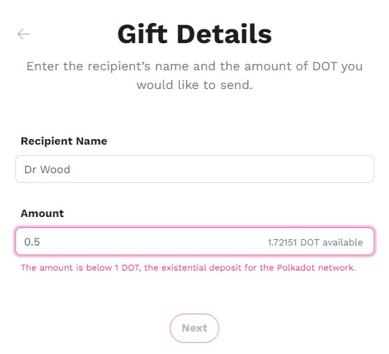

# Existential Deposits

## What are Existential Deposits?

Existential Deposits (ED) are a specific number of coins needed to ensure that your account is kept "alive" on the network, whether it be a Relay chain (Polkadot, Kusama), a Parachain (Parallel Finance, Interlay) or a Common Good parachain (Asset Hubs).&#x20;


**An account is activated on a network once its balance is **_**above**_** the existential deposit.**&#x20;


Since each chain sets its own existential deposit, users rely on [wallets](../2.storage/) to keep track of existential deposits alongside their balances. Most wallets have in-built mechanisms to prevent accounts from falling below the existential deposit of their respective networks. Still, certain Polkadot wallets and dapps allow users to make custom decisions regarding existential deposits.

### How do Existential Deposits Work?

Existential Deposits work as an anti-spam measure on the networks. If your Polkadot account's balance drops below this amount, your account will be deactivated and any balance that was left will be sent to the network's [Treasury](../3.operations/crowdfunding/treasury-spends.md). You can always reactivate your account later on, but the funds that were destroyed will not be restored.&#x20;

It is important to note that existential deposits apply to account balances altogether. You will not suffer deactivation or loss of funds if the account has:

* **vested** balances (ex: crowdloan rewards)
* **locked** balances (ex: vote with conviction)
* **bonded** balances (ex: staking/unstaking funds, proposing treasury spends)
* **reserved** balances (ex: vote delegations, on-chain identity, proxy setups)

<figure><figcaption>
Polkadot network's existential deposit requirements on <a href="https://gifts.polkadot.network/#/generate"><em>Polkadot Gifts</em></a>.
</figcaption></figure>

### Why are Existential Deposits Important?

Before you can receive custom assets on Asset hubs, you will need to activate your account on these Common Good networks. Being aware of existential deposit requirements for these networks will prevent delays and mishaps while transacting.

Numerous Polkadot projects use data related to active accounts and on-chain activity as a benchmark when running their reward and airdrop campaigns. An account that is accidentally deactivated, even for as little as a few minutes, could therefore disqualify you from receiving these extra perks.

In the past, many users have made the mistake of keeping fractions of the existential deposit after spinning a new Polkadot account, and then lost their funds. Because they didn't know about existential deposits, they concluded that their wallet was hacked or that the network was faulty. Also, given the fluctuations in Polkadot cryptos' valuations, what might have been a small amount at the time of the loss could very well become a substantial sum that will never be recovered.

