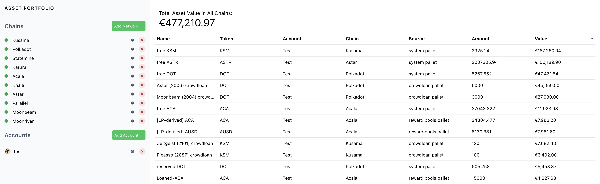

# Transaction explorers

## What are they?

Transaction explorers are special-purpose dapps that aggregate and display operations made on a given network. They are used to query and collect a wide range of on-chain data without running a full node or a light client, which means that you cannot use transaction explorers to submit or sign transactions.


**Transaction explorers are read-only: they can only show transactions that have been submitted or signed in the distant or recent past.** &#x20;


Transaction explorers are similar to a dynamic spreadsheet that is updated every time the chain produces a block. They come with a range of filters and admin-friendly utilities that allow users to collate, customise, and export the data that they need in real time.&#x20;

## How do they work?

Once an account has been activated on-chain with an existential deposit, its data become visible on transaction explorers that support the network. Typically, you will need to use the corresponding address format to explore information about the account.

You can get very specific information about any account through transaction explorers, such as what date and time the account was activated, how many coins are available or locked on the account, on which parachain the account has sent assets, with which addresses, platforms, and web3 services the account has interacted, etc.&#x20;

<figure><figcaption>
Customisable view of assets on <a href="https://substrate-portfolio.github.io/polkadot-portfolio/">Polkadot Portfolio</a> with no account sign-in needed.
</figcaption></figure>

## Why are they important?

When you are sending assets or when you are due to receive coins on a network, you can use transaction explorers to track the progress of the transfer. If there is a problem down the line, you can always use on-chain data to troubleshoot your issues. This is particularly relevant if you are using Centralised platforms or Centralised exchanges to obtain DotSama assets, as they will often ask for a proof that a transaction has been made in the first place.

Transaction explorers are also very useful to monitor accounts when you don't have direct access to your wallet. Users who suspect that their account has been hacked often go through on-chain data to flag transactions that they do not recognise along with the associated addresses. Sometimes, investigations through transaction explorers can lead to the actual real-life identity of scammers and phishers.

