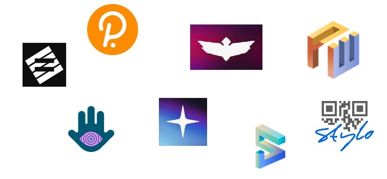

# 2.Storage

There are many options available for storing your assets, but you will first need to think about the following points:

* **Access:** How often are you going to transact with these assets?
* **Integration:** How many dapps are you going to use with these assets?&#x20;
* **Security features:** How valuable are these assets?
* **Storage duration:** How long are you going to hold onto these assets?

<figure><figcaption>
Polkadot <a href="https://wiki.polkadot.network/docs/build-wallets">wallets</a> ensure the availability of assets across devices and platforms.
</figcaption></figure>

Most people start with custodial wallets (i.e whereby you don't actually own the assets and these can be seized by the platform you are using at any time) before moving on to non-custodial wallets (i.e you own your assets and are free to move them around). However, to "be your own bank", you will also need to set your own processes and keep up with wallet developments. This is all to ensure that your assets remain safe at all time.&#x20;

**In this section, we look at how to secure assets in a variety of Polkadot-friendly wallets and how to ensure that those assets remain accessible across different devices.**&#x20;
