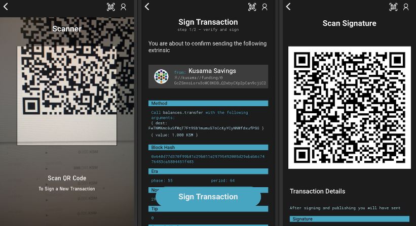

# Air-gapped Signers

## What are Air-gapped Signers?

Air-gapped signers are wallets that combine a non-connected mobile phone used as a vault for private keys with a third-party mobile or desktop app to sign transactions offline. Air-gapped signers are sometimes called "cold wallets" because they do not directly connect to Polkadot ecosystem dapps.


**Air-gapped signers require mobile phones with a working camera because they make extensive use of QR codes for transaction signing.**


Air-gapped signers integrate a two-step functionality that separates key generation and storage from public blockchain data interactions. For this reason, they are considered a lot safer than [mobile wallets](mobile-wallets.md) which store the private keys in the same application used for browsing dapps on the same device.

### How do Air-gapped Signers Work?

There are two methods that you can use to set up your accounts with air-gapped signers. One is to use a single device for both key storage and transaction signing, but with two different applications installed. The other is to use two devices, each with their own separate apps and functionalities.&#x20;

Getting started with an air-gapped signer is a process very similar to onboarding with a mobile wallet, as you can immediately create a new account or import an existing one. However, before you can start to use your accounts on Polkadot networks, you will need to add them via QR code to a dapp that supports air-gapped signers.

<figure><figcaption>
Overview of the transaction signing UX on <a href="https://www.parity.io/technologies/signer/">Polkadot Vault</a>. 
</figcaption></figure>

### Why are Air-gapped Signers Important?

Air-gapped signers are accessible, portable and affordable and still offer strong security features comparable to costly [cold storage devices](cold-storage-devices.md). Additionally, they are flexible enough to allow usage with smartphones that are used everyday or spare/unused smartphones. Nevertheless, you cannot rely on physical devices alone to store your private keys for the long haul, as they can still get stolen, lost, and damaged.

Even though air-gapped signers are designed to keep your private keys offline, they do not scan or screen your smartphone for vulnerabilities prior to running their software. Before re-purposing your smartphone for Polkadot assets storage, you will need to make sure that the operating system on your device is up-to-date, that there is no active SIM card, and that all internet connections are blocked.&#x20;

