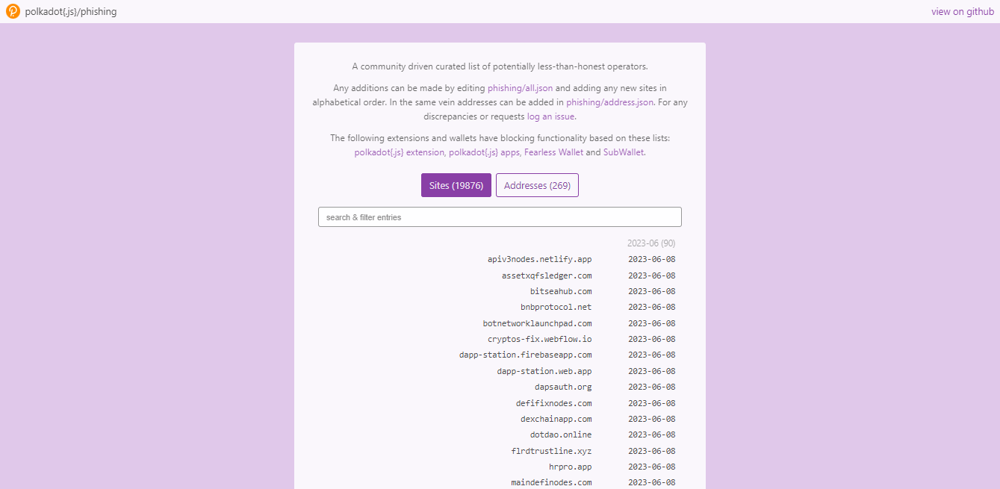
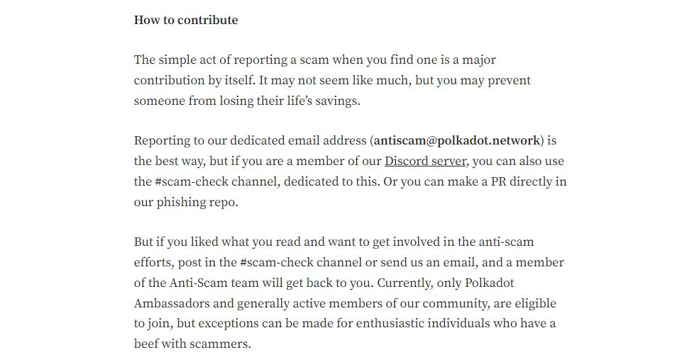

# Anti-phishing Features

_<mark style="background-color:blue;">This is a guest article from Tim Janssen, who is a member of the Polkadot Anti-Scam team.</mark>_

As the popularity of cryptocurrencies continues to grow, so does the threat of phishing attacks. Phishing is a form of cyber attack where scammers try to trick users into giving up their sensitive information, such as [Seed/Secret phrases](seed-secret-phrases.md), [JSON backup files](json-backups.md), or crypto-related credentials, by impersonating a legitimate entity. To combat this threat, the Polkadot-JS extension and other ecosystem wallets built on top of it have implemented several anti-phishing features. In this article, I will explain what these features are and how they can help protect your crypto.

## Polkadot Phishing Repository&#x20;

One of the key features of the Polkadot-JS extension is its implementation of the phishing repository. This feature is designed to detect and prevent phishing attacks by analyzing the website or application being accessed and comparing it to a list of known phishing sites and addresses. When a user attempts to visit a site or [send crypto ](../1.acquisition/)to an address on the blacklist, the extension will display a warning message, alerting the user of the potential danger.

<figure><figcaption>
The <a href="https://polkadot.js.org/phishing/">Polkadot Phishing</a> website logs all reported dishonest platforms.
</figcaption></figure>

The Polkadot-JS phishing repository is community-driven and maintained by the Polkadot Anti-scam team. This repository contains a list of known phishing sites and addresses, which is regularly updated to ensure that users are protected against the latest threats.

### Dapp Authorizations Management

Another important anti-phishing feature of the Polkadot-JS extension is its ability to manage Dapp authorizations. A Dapp, or decentralized application, is a type of software that runs on a blockchain network. To interact with a Dapp, users need to give it permission to access their wallet and read their account information such [addresses](../1.acquisition/address-formats.md), tokens, balances, etc.&#x20;

The Polkadot-JS extension allows users to manage these authorizations, giving them full control over which Dapps can access their wallet and for how long. This helps prevent unauthorized access to your wallet and reduces the risk of phishing attacks.

<figure><figcaption>
Key steps for supporting Polkadot anti-phishing initiatives.
</figcaption></figure>

### Anti-phishing Libraries

The anti-phishing library is a JSON file hosted in an open source public GitHub repository. Any junior developer on their first day can easily integrate the code with an import request using python.&#x20;

Several [wallets](../../useful-tools/wallets.md) that are built on top of the Polkadot-JS extension and have integrated these anti-phishing libraries. Among these wallets are Talisman, Subwallet, Nova wallet, and Fearless wallet.&#x20;

