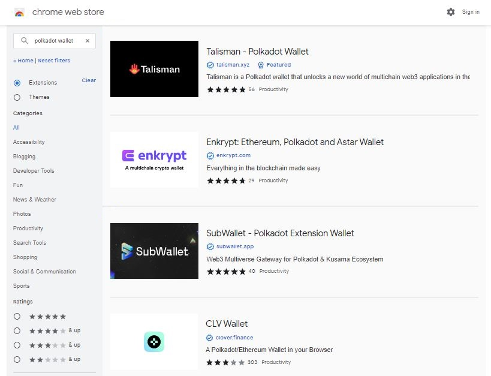
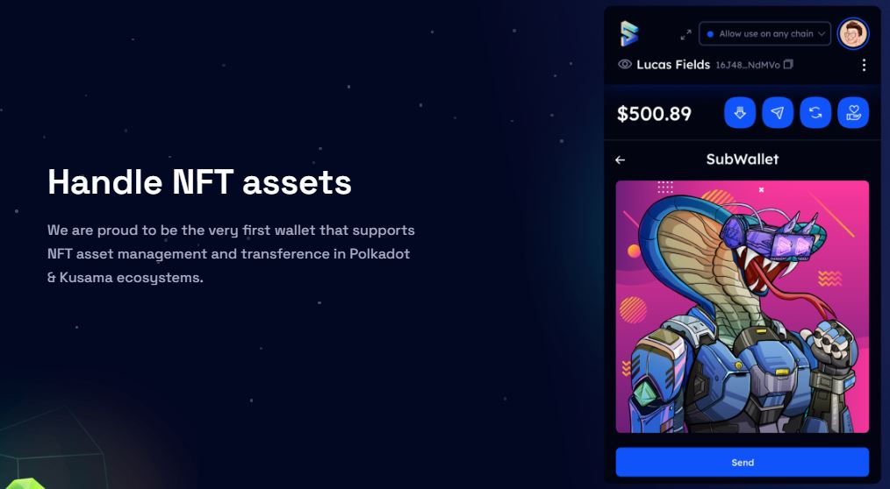
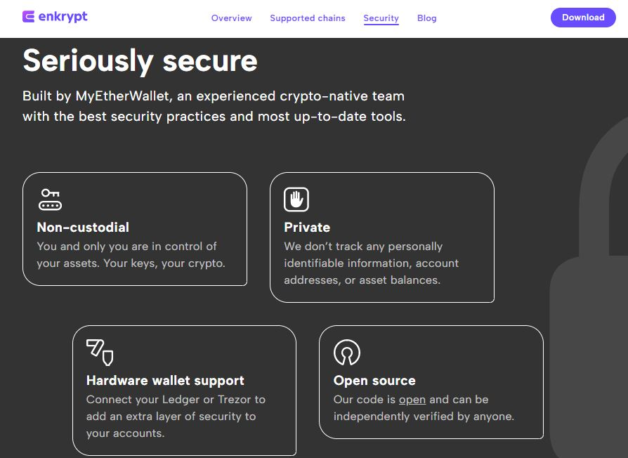
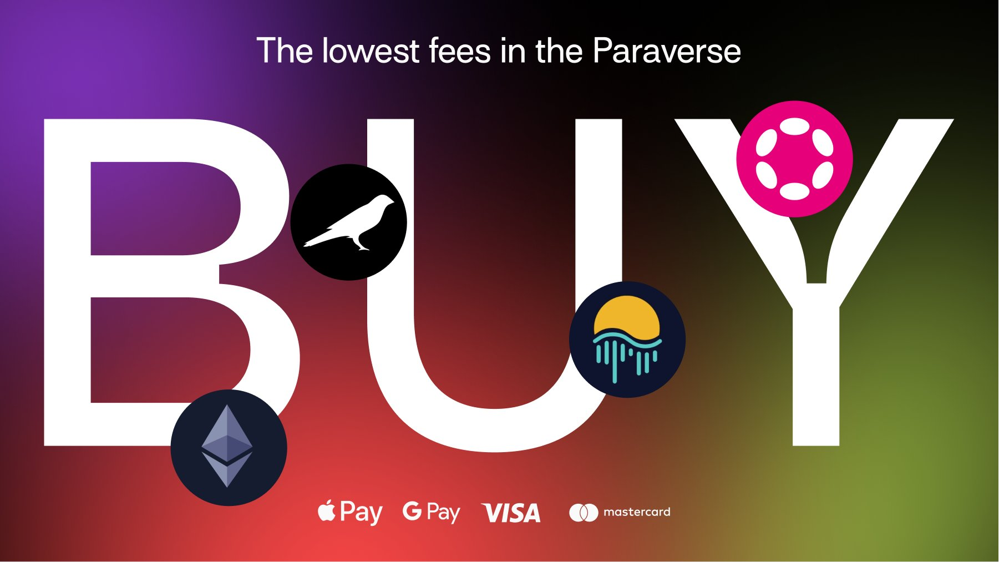
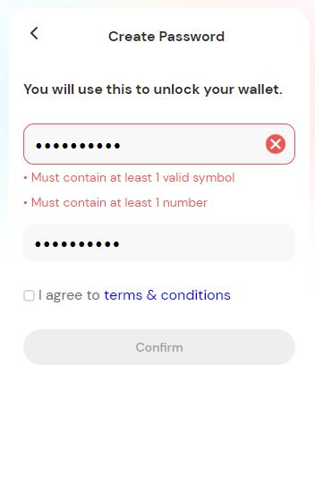

# Browser extensions

## What are they?

Browser extension wallets are a special-purpose software for managing account operations. They are developed by tech companies or open source projects, but publicly available for download on popular browsers such as Chrome, Brave, Firefox, and Edge.&#x20;


**Dapps cannot interact with your account unless you authorise them on your browser extension wallet.**&#x20;


Unlike web wallets that are managed by a third-party entity, browser extension wallets are non-custodial and run independently on a desktop or a laptop computer. Upon creating an account, the associated private key that holds users' funds is encrypted and kept on the device until the browser extension (also called "hot wallet") is removed.

<figure><figcaption>
Overview of <a href="https://chrome.google.com/webstore/search/polkadot%20wallet?_category=extensions">Browser extension wallets</a> for Polkadot on Chrome store.
</figcaption></figure>

## How do they work?

At a basic level, browser extension wallets allow users to create new accounts, import existing accounts, transfer tokens, and connect to Polkadot ecosystem dapps to sign transactions. However, a growing number of extensions now incorporate extra functionalities such as staking tokens, contributing to crowdloans, and sending NFTs.&#x20;

<figure><figcaption>
<a href="https://subwallet.app/">Subwallet</a>'s functionalities include NFT transfers.
</figcaption></figure>

Browser extension wallets are designed to support a variety of coins and tokens from multiple Polkadot networks and projects. For convenience, they can also work as a computer-based middleware to handle operations between offline devices and online dapps. Browser extension wallets are automatically updated as soon as a newer release becomes available, which helps maintain their security features.

<figure><figcaption>
Security features of <a href="https://www.enkrypt.com/">Enkrypt</a> wallet. 
</figcaption></figure>

## Why are they important?

Although some browser extension wallets aim to become entirely self-sufficient by providing users with fiat on-ramp entry into the Polkadot ecosystem, the majority don't. This means that a lot users still rely on Centralised exchanges to make their first crypto purchases and manually send the assets into their own accounts. For this reason, it is important to review the onboarding experience of a range of extension wallets before making your final choice.

<figure><figcaption>
<a href="https://talisman.xyz/">Talisman</a> supports in-wallet purchases of various crypto assets.
</figcaption></figure>

Since they store private keys in devices that are connected to the internet, browser extension wallets are more vulnerable to hacks and phishing attacks than "cold wallets". This is because they live on desktops and laptops that can be accessed remotely through malware. Users should therefore verify that the browser extension wallets that they are planning to use have been thoroughly audited; and also set strong passwords to secure their private keys.

<figure><figcaption>
<a href="https://chrome.google.com/webstore/detail/parallel-wallet/jbkgjmpfammbgejcpedggoefddacbdia/related">Parallel wallet</a>'s onboarding makes strong passwords mandatory.
</figcaption></figure>

