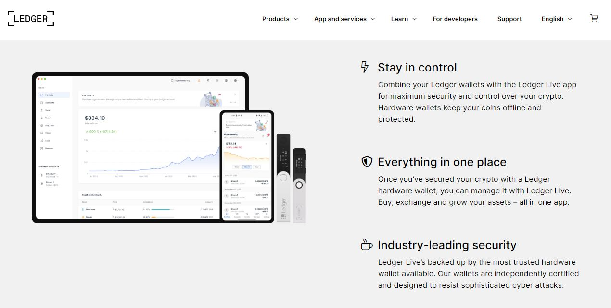
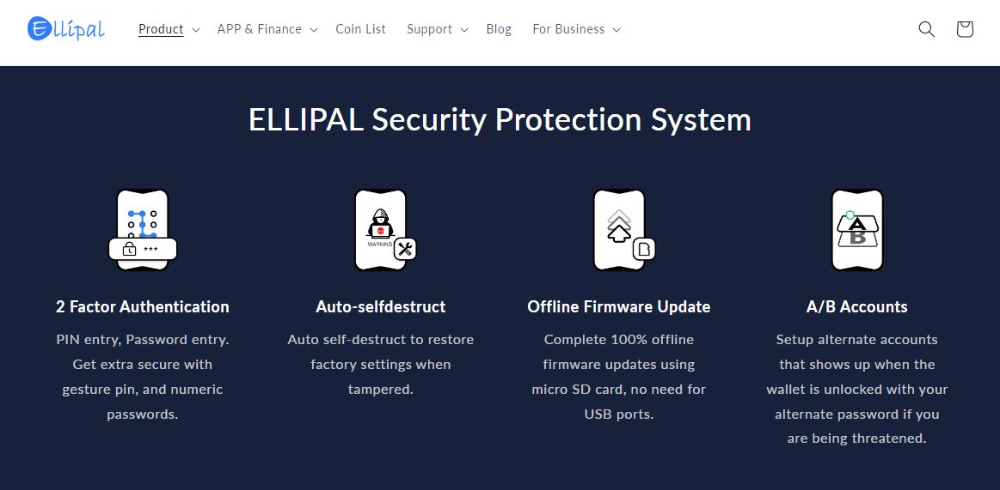
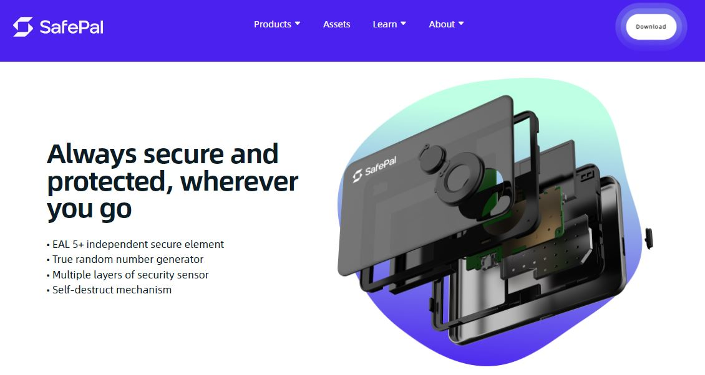
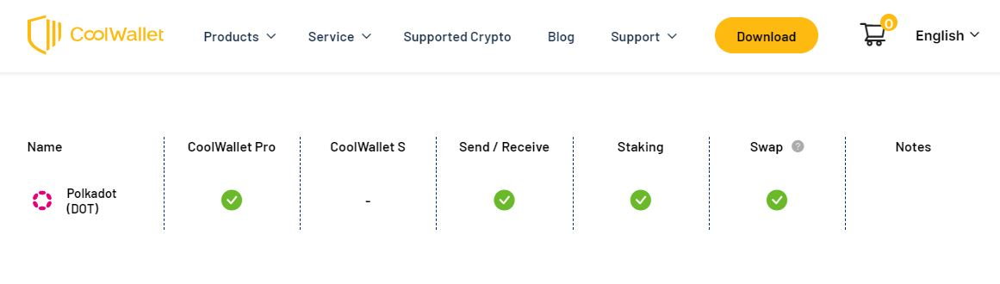

# Cold storage devices

## What are they?

Cold storage devices (also called “cold storage” or “cold wallets”) are hardware that handle private keys generation, encryption, and storage offline. They can be used to create multiple accounts across multiple wallets and to onboard new networks via firmware upgrades.


**Cold storage devices secure assets by operating in a digitally and physically isolated environment.**


The security of cold storage devices can be reinforced by making the gadgets themselves difficult to access. On top of manufacturers' authentication standards, long-term users always have the option to store their hardware in a home safe, in a vault, or even with a legal entity.

<figure><figcaption>
<a href="https://www.ledger.com/supported-services">Ledger wallets</a> support numerous Polkadot ecosystem networks and services.
</figcaption></figure>

&#x20;

## How do they work?

Cold storage devices come with an array of security features which include an in-built operating system (also called OS) and electronic chips to manage transaction signing in isolation, as well as PIN protection. They often come with a 24-word Seed/Secret phrase that can be used to recover assets independently from the device. Nevertheless, you should always order your devices from official stores to ensure that these security features have not been tampered with.

<figure><figcaption>
<a href="https://www.ellipal.com/products/ellipal-titan">Ellipal wallets</a> offer advanced security features for operations.
</figcaption></figure>

The majority of cold storage devices can be used with third-party dapps, mobile apps, or their native desktop software to interact with blockchain networks. However, you will need to connect them to a computer or a mobile phone with internet access via USB or Bluetooth beforehand.&#x20;

<figure><figcaption>
<a href="https://store.safepal.com/safepal-s1-hardware-wallet.html">SafePal wallet</a> is a new generation of portable cold storage devices.
</figcaption></figure>

## Why are they important?

Although users of cold storage devices benefit from state of the art security technology, they still have to submit their personal information to manufacturers and retailers when ordering their hardware. In the past, there have been database breaches during which email and postal addresses of buyers were stolen and subsequently used for phishing and scams.&#x20;

<figure><figcaption>
<a href="https://trezor.io/security">Trezor wallets</a> optimise all aspects of their devices' security.
</figcaption></figure>

Cold storage devices offer variable levels of support for the Polkadot ecosystem, and most of them only support the most basic transactions (i.e sending, receiving, and staking). Users who wish to carry out more complex on-chain operations like participating in governance or contributing to crowdloans still need to transfer their assets to a hot wallet to access these functionalities.

<figure><figcaption>
Overview of functionalities available for DOT on <a href="https://www.coolwallet.io/supported-crypto-assets/?keyword=&#x26;type=polkadot">CoolWallet</a>.
</figcaption></figure>

It is also important to note that due to the frequent runtime updates conducted on Relay chains and Parachains, users may experience errors while using cold storage devices from time to time. This is because the security features of these devices make it impractical to atuomatically synchronise the firmware with multiple networks and the dapps that they host.&#x20;

