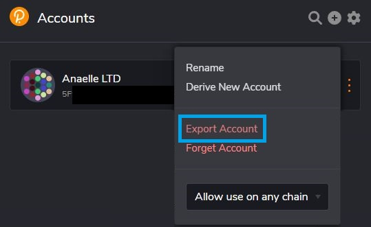
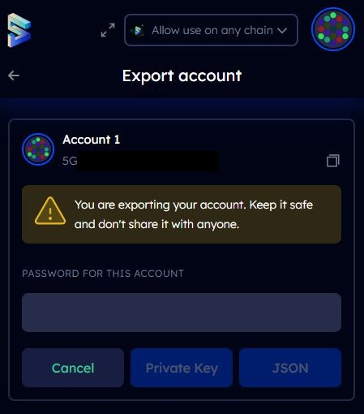
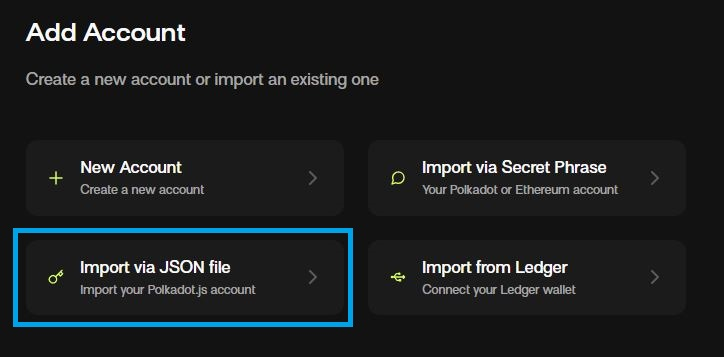
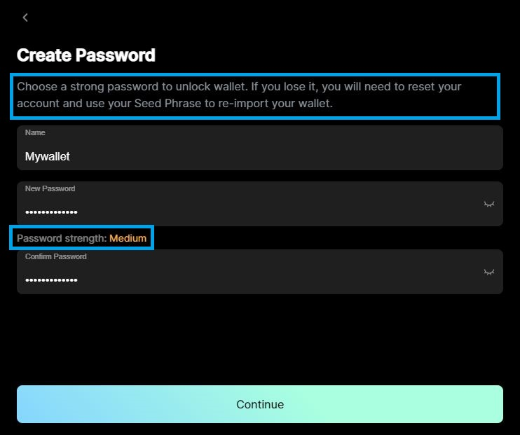

# JSON Backups

## What are JSON Backups?

JSON backups are files that contain an encrypted version of the cryptographic key (also called "private key") that secures the access to an account. JSON is a format that is used for storing and transporting data, and, in the case of a Polkadot account backup, this data is secured by a password.


**JSON backups do not store seed/secret phrases. Instead, they represent an alternative way of storing an account's private key.**


Any Polkadot account can generate a JSON backup file, even if there is no [seed/secret phrase](https://dot-alert.gitbook.io/dot.alert/content/2.storage/seed-secret-phrases) associated to it, as it is the case with derived accounts. JSON backup files can be used to recreate/import an account in any wallet, however, in practice, they are more often used in the context of [browser extensions](browser-extension-wallets.md).&#x20;

<figure><figcaption>
Exporting an account from <a href="https://polkadot.js.org/extension/">Polkadot-JS Extension</a> for use on another wallet and/or device. 
</figcaption></figure>

### How do JSON Backups Work?

As soon as an account is created through a wallet, a JSON backup file can be downloaded/exported to store this account for later or immediate use. Although each [wallet](https://dot-alert.gitbook.io/dot.alert/useful-tools/wallets) has its own specific procedure for downloading/exporting JSON backups, this functionality is usually password-protected because there is sensitive information at stake. The same password that you used to download/export the JSON backup from your account will be required when recreating/importing the account into another wallet.

<figure><figcaption>
Account export interface from <a href="https://subwallet.app/">Subwallet</a>.
</figcaption></figure>

Generally-speaking, a JSON backup file is not very usable outside a wallet. If you open a JSON backup file into a text editor, you will see some legible data such as the name given to the account, the _generic address_ of the account (starting with "5"), the type of account or derivation used to generate the account, and at which block the account was created. There will also be some encoded data that remains illegible without a software and the password associated with the JSON backup.&#x20;

## Why are JSON Backups Important?

JSON backups are a convenient way to store your account in digital format, as opposed to the hard-copy format of a [seed/secret phrase](seed-secret-phrases.md). This is useful when you need to transfer your account from one wallet to another or when you want to import a derived account into another wallet. However, this is only possible so long as you remember the original password used to create the JSON backup file.

<figure><figcaption>
JSON Backups are one of many options for creating/adding an account on <a href="https://talisman.xyz/">Talisman</a>.
</figcaption></figure>

The JSON format makes JSON backups lightweight enough so that they can be moved around from one digital location to another in minimal time. Nevertheless, since JSON backup files are password-protected, it is essential that you set a password strong enough to resist brute-force attacks from hackers, in case your file gets phished or stolen.

<figure><figcaption>
Password strength checks on <a href="https://clv.org/">Clover wallet</a>...
</figcaption></figure>

 

<figure><figcaption>
...and <a href="https://chrome.google.com/webstore/detail/parallel-wallet/jbkgjmpfammbgejcpedggoefddacbdia">Parallel wallet</a>. 
</figcaption></figure>

No matter how convenient they are, **JSON backups can never replace a seed/secret phrase**. This is because a JSON backup can be extracted from a seed/secret phrase, but a seed/secret phrase can never be recreated from a JSON backup file. For this reason, JSON backups alone should never be considered sufficient for the long term storage of assets.

<figure><figcaption>
Overview of backup options available on <a href="https://novawallet.io/">Nova wallet</a>.
</figcaption></figure>

