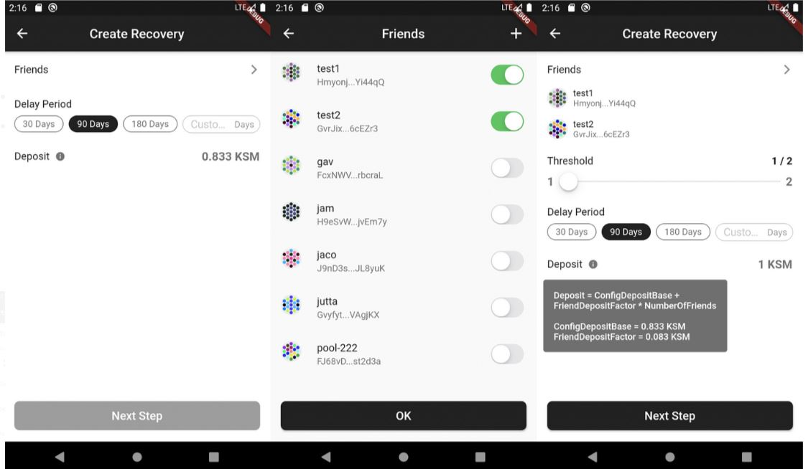
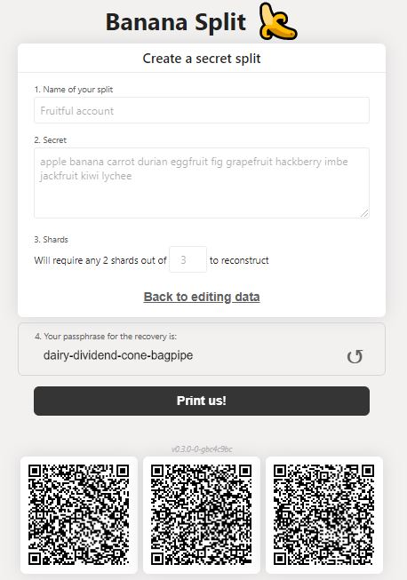
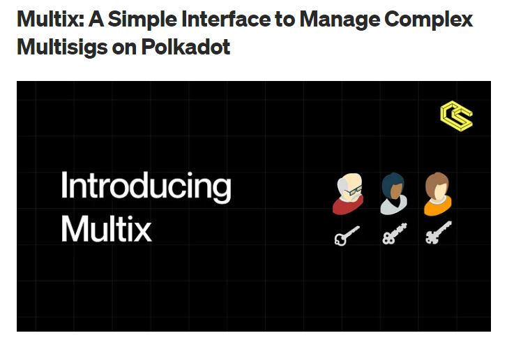
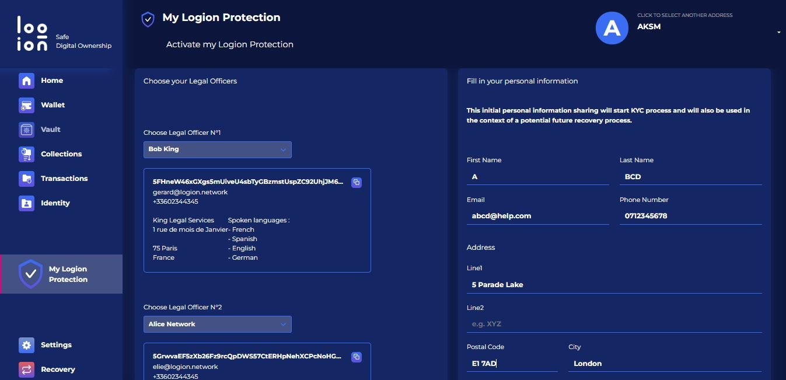
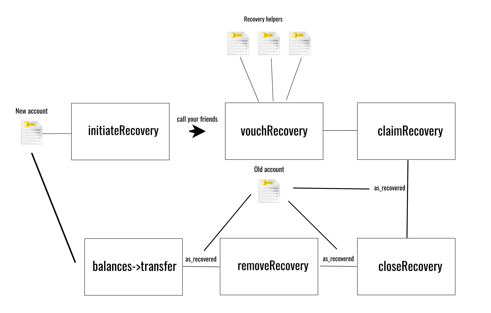

# Recovery setups

## What are Recovery Setups?

Account recovery setups are safety measures that Polkadot account users can put in place to regain access to their accounts under unforeseen or adversarial conditions. They can be created to insure access to an account owned by a single user (also called Standard account) or by multiple users (also called Multisig account).


**Social recovery for an account requires a minimum of 3 participants: 1 account holder and 2 "friends".**


Although [Seed/Secret phrases](seed-secret-phrases.md) and [JSON backup files](json-backups.md) provide an effective medium for storing accounts offline, they are insufficient as a recovery method because they rely exclusively on one individual to store and retrieve all the key information. On a longer time frame, wallet users need custom recovery setups to guarantee that they, their families, and their deceased estate managers can securely take possession of the assets held in their Polkadot accounts.&#x20;

### How do Recovery Setups Work?

Social recovery allows users to leverage their social network when retrieving their accounts. The first step is to enrol a number of trusted individuals via their Polkadot address as helpers in the recovery process, and define how many of these friends can endorse recovery requests. There is also the option to set a minimum delay period before which recovery transactions cannot be finalised. Users who have lost access to their original account can subsequently initiate the recovery process from a newly create account and contact their friends to vouch for their request.

<figure><figcaption>
<a href="https://polkawallet.io/">Polkawallet</a> has integrated social recovery features into its mobile app.
</figcaption></figure>

Key splitters make account recovery more resilient and secure by encrypting a seed/secret phrase via a password and splitting it into several parts/secrets in the form of QR codes or hashes. This ensures that account backup information is never physically stored in one location nor humanly readable. At the time of recovery, only a set number of parts will be required to reconstruct the seed/secret phrase that has been lost, along with the original encryption password. Essentially, Key splitters eliminate the risk of collusion between friends who are involved in recovery setups for a given account.

<figure><figcaption>
Parity Technologies' <a href="https://bs.parity.io/#/">Banana split</a> allows users to split their Seed/secret phrase into a given number of encrypted parts.
</figcaption></figure>

For multisig accounts, more advanced setups are required because these accounts are managed by many administrators, each with their role to play as a signatory of multisig transactions. In this context, a Pure proxy account for the multisig account itself can be created; which eliminates the need for seed/secret phrase management altogether and makes signatories the rightful protectors of the multisig.&#x20;

<figure><figcaption>
<a href="https://multix.chainsafe.io/">Multix</a> provides a user-friendly dashboard for creating, managing, and recovering multisig accounts.
</figcaption></figure>

But there is also the added option for each signatory to use a Pure proxy account for their related multisig operations that will subsequently delegate account control to different proxy accounts, many of which can be recoverable by the signatory's friends. Ultimately, these setups give team members flexible pathways for managing their pool of assets, even when access by some members' enrolled account is lost.

### Why are Recovery Setups Important?

In the Polkadot ecosystem, the same account can be used to store multiple assets across a variety of Relay chains and Parachains. This means that user interaction with dapps is heavily-dependent on having access to previously stored accounts at anytime. Recovery setups play a central role in ensuring that users maintain ownership of their assets over longer time frames in practice. However, it is recommended that you choose the schedules that best meet your needs, keeping in mind that there are certain risks associated with each type of recovery setups.

<figure><figcaption>
The <a href="https://github.com/logion-network">logion blockchain</a> offers account protection and recovery via legal officers as part of its services. 
</figcaption></figure>

In the case of basic social recovery, users need to carefully vet their friends and keep them updated about any change to the setups. This is particularly important if the trusted person changes Polkadot account, as the recovery process needs to be maintained over time. It is also essential to make use of a reasonably long delay period that will enable early detection and prevention of malicious recovery by social peers.&#x20;

<figure><figcaption>
An overview of the steps needed to fully and securely <a href="https://wiki.polkadot.network/docs/kusama-social-recovery">recover a Polkadot account via Polkadot-JS Apps</a>.
</figcaption></figure>

Account recovery setups can offer higher levels of security when used in combination. Nevertheless, the complexity of multisig accounts management and the risk of human error in relation to proxies makes them unsuitable for the average user. Instead, users need to develop a good understanding of Proxy accounts' parameters and processes through testnets prior to using these tools for the recovery of valuable assets.&#x20;

