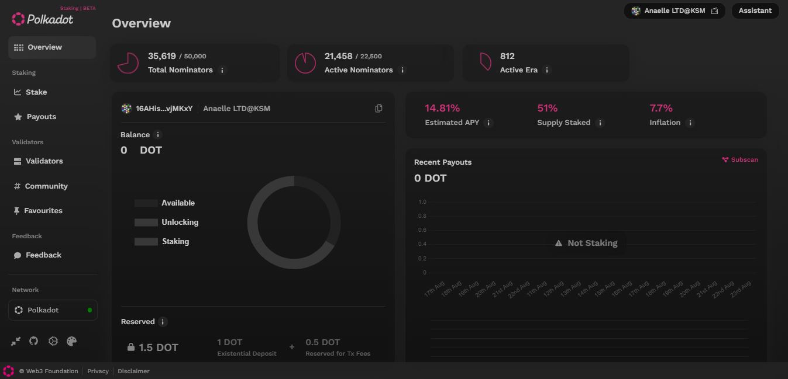

# 3.Operations

Being the custodian of your assets allows you to access a wide range of protocols and **web3 services**.&#x20;

Depending on your interests, you will be able to:

* [join or launch](bidding/) collectives
* [participate](voting/) in governance
* [crowdfund](crowdfunding/) for projects
* [stake](staking/) assets
* [swap](swapping/), [borrow](borrowing/), and [lend](lending/) assets
* [mint](nft-trading/data-management.md) and [sell](nft-trading/marketplace-activities.md) NFTs
* access [auto-compounding](auto-compounded-staking.md) and [listing](lbp-listing.md) services
* create and manage gameverses
* set up and monetise social media-based communities
* capitalise on prediction markets
* activate and maintain IoT subscriptions
* generate and amplify metaverse-based brands
* issue and trade fractionalised NFTs and real-world assets
* build and maintain climate solutions via carbon credits markets&#x20;

<figure><figcaption>
<a href="https://staking.polkadot.network/dashboard#/overview">Polkadot Dashboard</a> for staking assets on network's validators.
</figcaption></figure>

Nevertheless, operating on blockchain by your own means requires you to pay close attention to the underlying rules of the platforms that you use. This is because for each use case (ex: Governance, DeFi, Staking, etc.) there are multiple implementations (ex: forums, pools, rewards, etc.) available to users.&#x20;

**In this section, we look at how to optimise your interactions with various Polkadot network protocols and avoid signing your assets away.**
