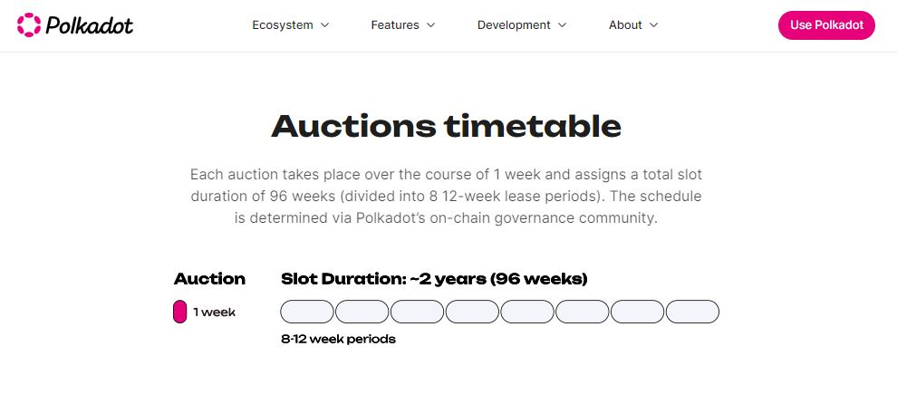

# Bidding

Bidding operations are fairly limited in scope within the Polkadot ecosystem. Users can place bids for very specific purposes such as:

* a [membership](kappa-sigma-mu-ksm-membership.md) on _Kappa Sigma Mu_ Society&#x20;
* a [parachain slot lease](parachain-slot-lease.md) during Parachain auctions (Phased out)

<figure><figcaption>
Polkadot auctions were the main entry point for Web3 projects, but have been phased out by <a href="../coretime-sales.md">Coretime sales</a>. 
</figcaption></figure>

