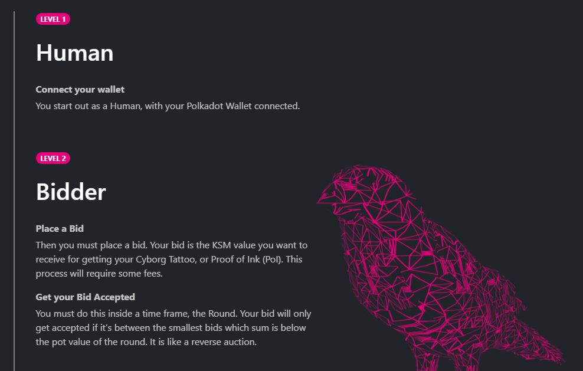
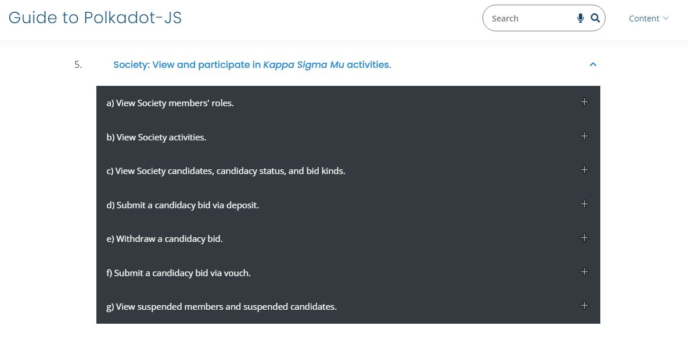
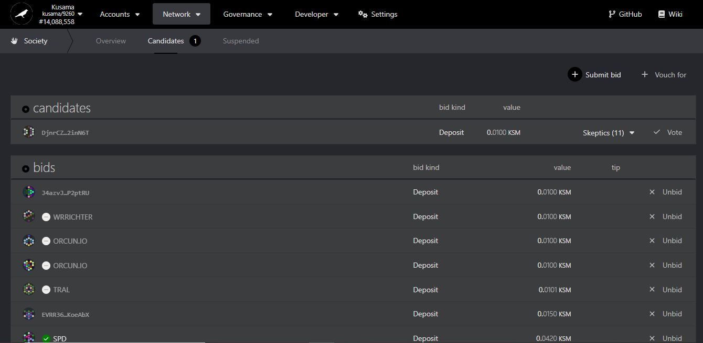

# Kappa Sigma Mu (KΣM) Membership

## What is Kappa Sigma Mu (KΣM)?

The _Kappa Sigma Mu_ is a Kusama-based collective whose objective is to create a Human blockchain via a process called "Proof-of-Ink". Members of this Society are eligible for rewards called "payouts" taken out of the Society's pot, which is funded by the Kusama Treasury.

<figure><figcaption>
Overview of the bidder's role in <a href="https://ksmsociety.io/"><em>Kappa Sigma Mu</em></a> Society.
</figcaption></figure>

### How-to: Becoming a Kappa Sigma Mu (KΣM) Member

To become a member, users need to deposit a certain amount of KSM into the [protocol](../../5.regulations/networks/infrastructure.md). They can either do so themselves through a bid or get somebody else to vouch for their suitability. After which, if shortlisted, they will need to meet the PoI requirements (i.e getting a tattoo) to become a member.&#x20;

<figure><figcaption>
Step-by-step tutorials on Kappa Sigma Mu operations in the <a href="https://anaelleltd.github.io/polkadotjs-guide/2.network.html#society"><em>Guide to Polkadot-JS</em></a>.
</figcaption></figure>

### Risks: Safe Management of Kappa Sigma Mu (KΣM) Memberships

Bidding for a KSM membership can be a bit of a guessing game because it is the smallest bid that gets priority for shortlisting and because there is no certain way to know how much other people are bidding once we get to very small KSM values.&#x20;

<figure><figcaption>
Membership bids placed through <a href="https://polkadot.js.org/apps/?rpc=wss%3A%2F%2Fkusama.public.curie.radiumblock.xyz%2Fws#/society/candidates"><em>Polkadot-JS Apps</em></a>,
</figcaption></figure>

As a general rule, it is best to prepare for the PoI ceremony while placing small bids, because as soon as you are shortlisted, you will be asked to submit a photo of your real-life tattoo. If you fail at PoI, you run the risk of getting suspended/blocked from applying to the Society at a later time.&#x20;

