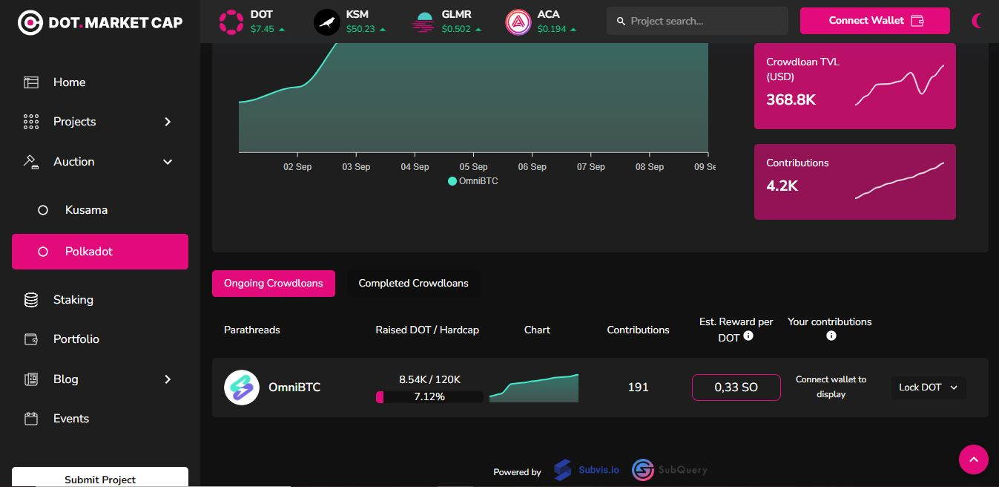

# Parachain slot lease

Any individual or project that wants to run a parachain must first lease a slot on Kusama or Polkadot relay chains. They can lease a parachain slot for up to 48 weeks on Kusama or 96 weeks on Polkadot. During this time, they will benefit from the shared security scheme of the Relay chains and also be able to exchange assets with other parachains through the XCMP (currently HRMP) protocol.

## How-to:

To obtain a lease, individuals or projects need to register a Parathread and get a ParaID for their on-chain entity which will be used during cross-chain operations within the ecosystem. Individuals or projects also need to raise funds (through crowdfunding or self-funding) that will be used to place bids during parachain slot auctions.&#x20;

Slot auctions run in batches that are scheduled in advanced through on-chain governance, but the timings can vary depending on network activity. So far, auctions have been running every 7 days on Kusama and every 12 days on Polkadot. In between batches, unsuccessful bidders will refund their crowdloan contributors and take the time to review their strategies.

## Risks:

Parachain slot auctions are an intricate combination of a candle auction mechanism with an on-chain Verifiable Random Function (VRF), which means that:

* the auction runs for a fixed time
* there is a fixed period during which ParaIDs can be submitted
* there is a fixed period during which bids can be submitted
* there is an exact time at which the winner will be selected
* the exact time of the selection can only be determined retroactively&#x20;

For these reasons, it is possible to have the biggest bid for the longest time and until the end, yet still fail to secure a parachain slot at a given auction.

Parachain slot leases can be broken down into different lease periods, each of either 6 weeks on Kusama or 3 months on Polkadot. This means that individuals and projects can configure their lease for a short as 6 weeks and as long as 96 weeks, depending on their needs.&#x20;

<figure><figcaption>
<a href="https://www.dotmarketcap.com/auction/polkadot">DotMarketcap</a>'s overview of funds collated by OmiBTC for a Polkadot auction.
</figcaption></figure>

However, there is an extra layer complexity in the bidding process because the VRF is designed to optimise the number of lease periods locked during an auction at the time it selects the winner. Therefore, it is often recommended to bid for the full duration of the lease period to maximise the chances of winning a bid, and also to allow for some buffer time during the gradual deployment of the parachain.

