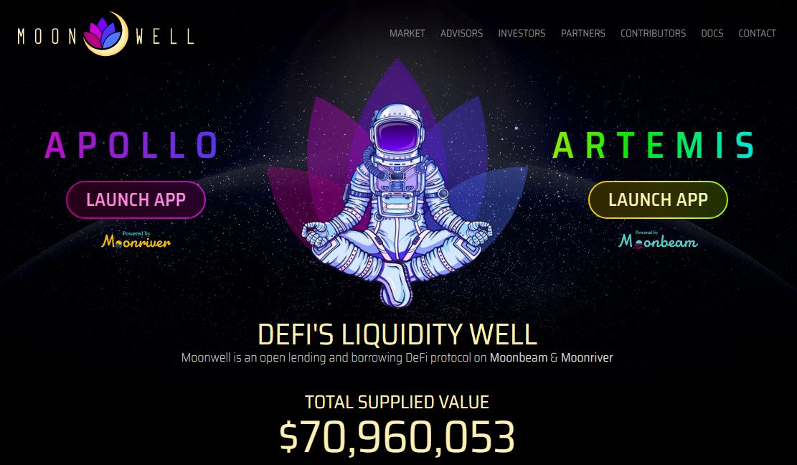
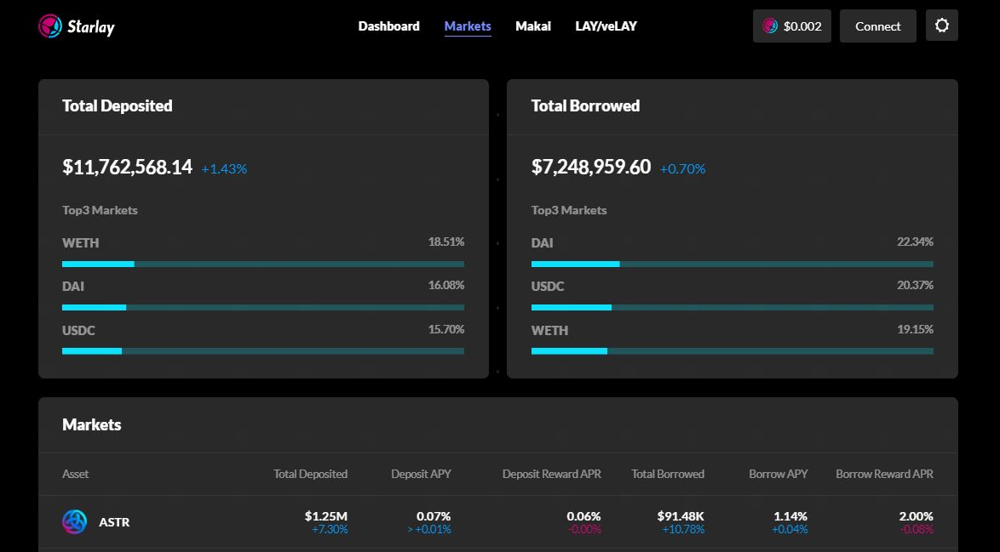
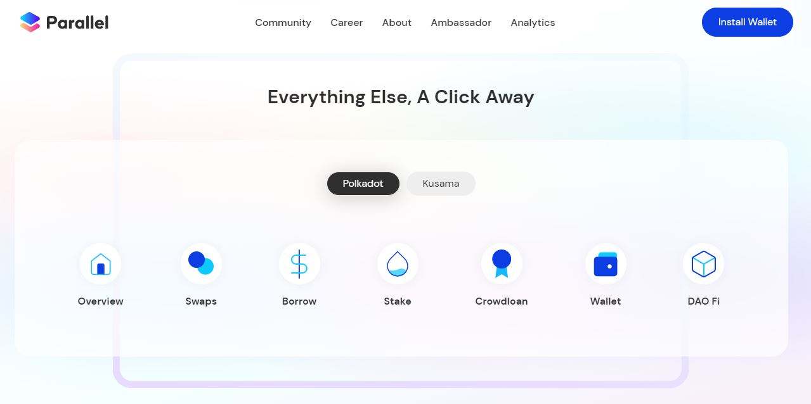

# Collateralisation

## What is Collateralisation?

Collateralisation on DeFi platforms is a process that allows users to borrow multiple types of assets such as stablecoins, network tokens, and platform tokens in exchange for a fee. The cost of borrowing often depends on the interest rates set by the free market and how long you borrow the assets for.

<figure><figcaption>
<a href="https://moonwell.fi/">Moonwell Finance</a> offers extensive liquidity for borrowing operations.
</figcaption></figure>

### How-to: Defining a Collateralisation Ratio 

In the current state of DeFi where users are anonymous and we don’t have assessment tools like credit scores, protocols require loans to be over collateralised. For example, to borrow $100, you would need to deposit $150 worth of assets. DeFi protocols set their own minimum collateralisation ratio, which are usually somewhere between 120% and 250%.&#x20;

<figure><figcaption>
<a href="https://starlay.finance/app/markets">Starlay Finance</a> charts the most sought-after coins on its platform.
</figcaption></figure>

Altogether, [assets ](../../1.acquisition/)provided as collateral are simply insurance for the DeFi platform that you will repay your loan. Typically, the criteria for defining which assets are eligible to be used as collaterals are very strict, as platforms do not want to be dealing with tokens that may end up worthless. Furthermore, DeFi protocols automatically monitor their Total Supplied Value to avoid becoming insolvent, since assets borrowed by some users need to be supplied by other users.&#x20;

### Risks: Safety Checks for Collateralisation 

Whether built with Smart Contracts or pallets, no DeFi application is immune to problems because bugs and vulnerabilities will always exist in some form or another. While there are no fail-proof ways to mitigate these risks (short of not using DeFi protocols at all!), you can do some basic research to source platforms that have had their code audited by reputable third-party entities.&#x20;

<figure><figcaption>
<a href="https://parallel.fi/">Parallel Finance</a> has designed a user-friendly dashboard for all its DeFi services.
</figcaption></figure>

Since DeFi [platforms](../../5.regulations/platforms/) juggle a complex suite of interconnected protocols, programmes, and interfaces, there is also the possibility that user errors lead to loss of funds. The best way to prevent this mishap is to use platforms with well-designed dashboards that are supported by thorough tutorials and user guides. You can also connect to testnets to try applications out before using them on live networks.

