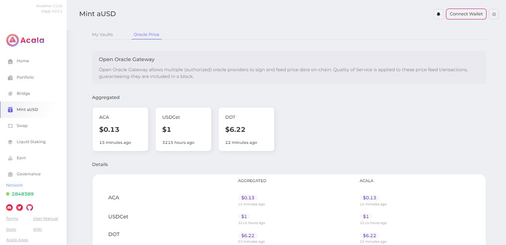
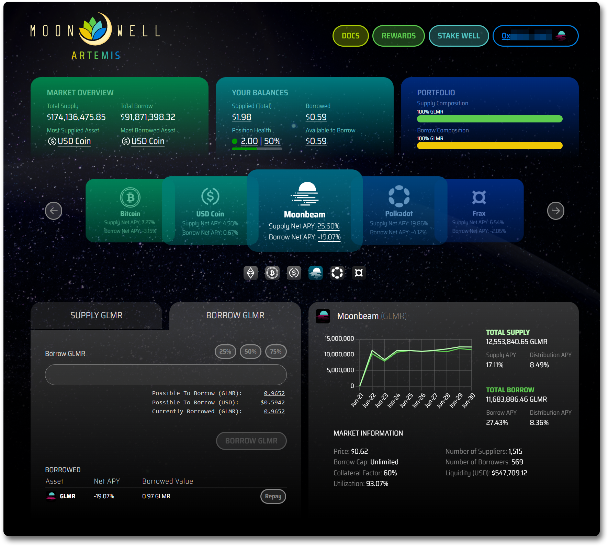
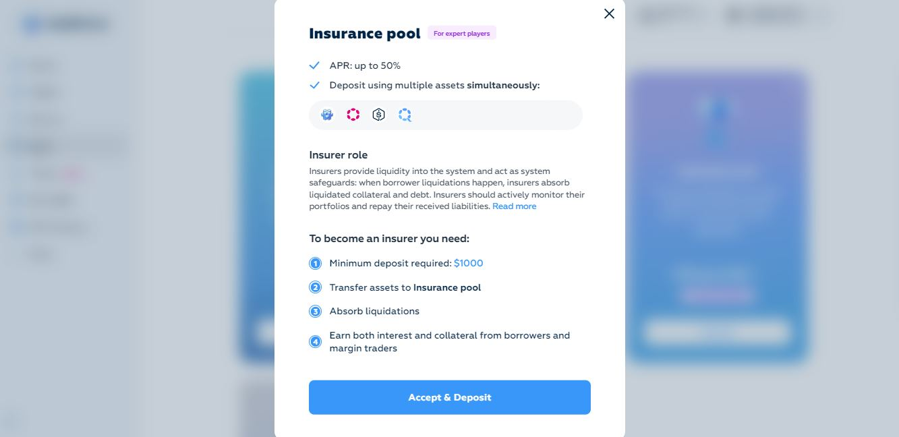

# Liquidation

_<mark style="background-color:red;">Disclaimer: This article is written by</mark> <mark style="background-color:red;"></mark><mark style="background-color:red;">**Dot.alert()**</mark> <mark style="background-color:red;"></mark><mark style="background-color:red;">contributors for educational purposes only. This article should not be used as a substitute for competent legal or financial advice from a licensed professional in your country.</mark>_

## What is Liquidation?

Liquidation on DeFi platforms is the biggest downside of borrowing operations. It involves having [collateralised assets](collateralisation.md) sold when they fall below a certain value. The liquidation fee imposed on borrowers during this process depends on the parameters of the protocol.

<figure><figcaption>
<a href="https://apps.acala.network/vault/oracle">Acala</a>'s oracles ensure that on-chain price feeds for supported assets remain available. 
</figcaption></figure>

### How-to: Exploring Liquidation Mechanisms 

How liquidations take place in practice varies by platform, with a range of methods used in the Polkadot ecosystem. Nevertheless, the result remains the same from an end user’s point of view.

<figure><figcaption>
<a href="https://moonwell.fi/artemis/GLMR">Moonwell Finance</a> provides portfolio management tools for tracking liquidation risk. 
</figcaption></figure>

On a DeFi protocol with automated on-chain liquidation, collateralised assets are sold via the DEX so that the protocol can repay the loan. Through this mechanism, the platform collects a liquidation fee for its treasury, and returns any leftover collateral to the user.

In an off-chain worker-based liquidation process, the system checks if any loan needs to be closed at every block, and any operator can initiate the liquidation. The borrower’s loan will be repaid, the borrower will suffer a liquidation penalty, and the operator that initiated the liquidation will receive a reward.

<figure><figcaption>
<a href="https://app.equilibrium.io/earn?action=insurance-pool-learn-more">Equilibrium</a>'s Insurance pool allows expert DeFi users to optimise their portfolio through liquidations.  
</figcaption></figure>

In another setup, borrowers can use their entire portfolio as collateral for a loan, instead of just a single asset. However, during a liquidation, this entire portfolio (including the loan) is transferred to an insurance pool, and a set of depositors (also called bailsmen) are tasked with closing out the loan in exchange for a small fee.

### Risks: Useful Resources on Liquidation 

Assets liquidations generally occur more frequently during times of extreme market volatility, which cannot always be anticipated. Still, the risk of liquidation can be minimised by ensuring that your collateralisation ratio remains significantly above the protocol’s minima (i.e a positive Health Factor). This is even more important in the case where your collateral is made of multiple assets.

<figure><figcaption>
Parallel Finance has introduced a <a href="https://docs.parallel.fi/parallel-finance/parallel-finance-protocol/parallel-product-guides/money-market-guide/liquidation-free-loan">Liquidation-free protocol</a> for borrowing DOT and KSM.
</figcaption></figure>

Perhaps the simplest way to protect yourself from liquidation is to use [price-tracking dapps](../swapping/portfolio-management.md) to monitor the valuations of your collateralised assets. You can also subscribe to alerts to get notifications on your phone when prices start to drop. That way, you can choose to deposit more collateral or close out your loan before you lose your assets.

