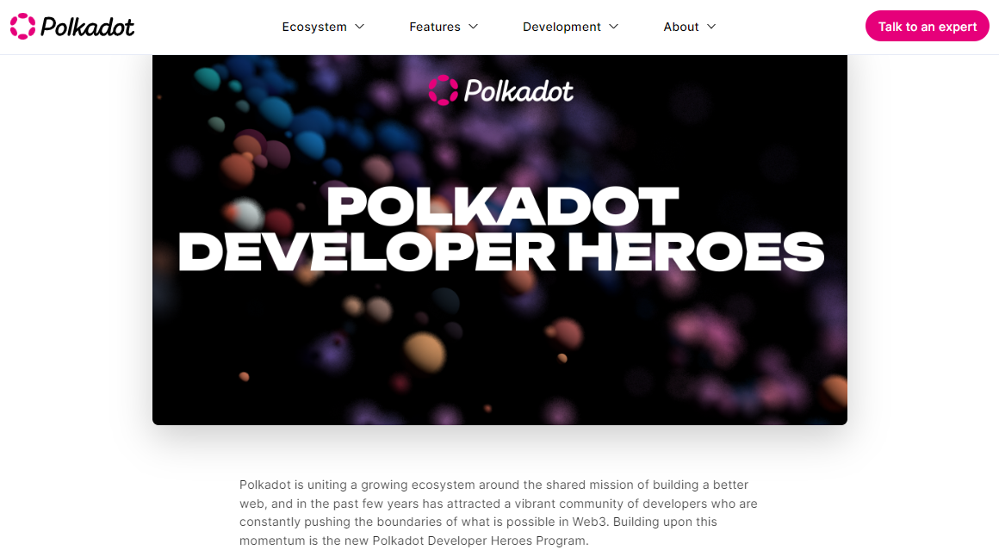

# Community Building

Community building is the sum of all off-chain operations and on-chain transactions that contribute to the creation and the maintenance of social media spaces dedicated to a project.

In the Polkadot ecosystem, self-directed crypto communities take inspiration from the DAO model to [onboard new contributors](crypto-communities.md) and [retain active participants](crypto-payments.md).

<figure><figcaption>
The <a href="https://www.polkadot.network/blog/introducing-the-polkadot-developer-heroes-program">Polkadot Developer Heroes</a> programme formally enrols beginner and experienced coders as community contributors.
</figcaption></figure>

