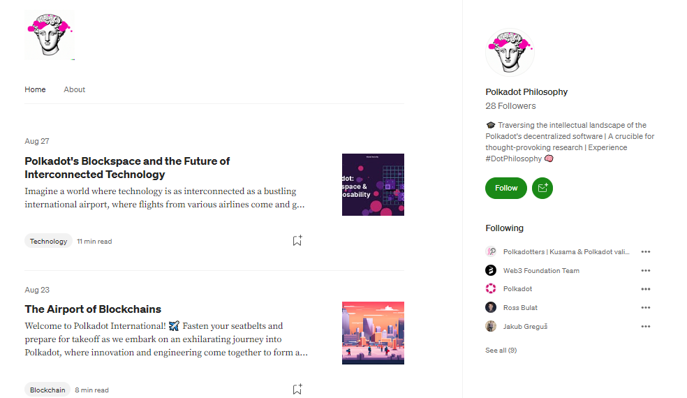

# Crypto Communities

## What are Crypto Communities?

Crypto communities are groups of [blockchain network participants](../../5.regulations/networks/participation.md) who undertake specific tasks and duties to build an audience or an online presence. These communities have low barriers to entry and are usually open to anybody with a basic understanding of blockchain technologies and Web3.

### How-to: Building and Maintaining Communities

Generally-speaking, there are as many crypto communities as there are crypto projects, but their size and reach will vary depending on their history, visibility, rate of adoption, and incentive systems. Within the Polkadot ecosystem, the foundation of crypto communities is established via three different but interconnected tasks: moderation, scam prevention, and content creation.

Moderators are active community participants who have a good knowledge of ecosystem projects and play the role of stewards for new entrants. On a day-to-day basis, they work on answering users' concerns, providing [technical support](broken-reference), running contests, and rewarding community members. They also contribute to drafting and enforcing community rules by identifying and addressing malicious behaviours and suspending or banning users.

<figure><figcaption>
The <a href="https://forum.polkadot.network/t/code-of-conduct/17">Code of conduct</a> summarises Moderation rules for Polkadot community channels.
</figcaption></figure>

Even though some crypto projects tend to conduct regular in real life (IRL) events and meetups, the majority of crypto communities belong exclusively to the digital realm. As they grow in popularity, these online gatherings can become the target of bad actors of all sorts. In the Polkadot ecosystem, the Anti-Scam team exists to report and take down unofficial servers, websites, and apps that attempt to scam users or make a fraudulent use of the Polkadot brand.

[Content creation](../../../useful-tools/misc.md) plays a central role in the life of a crypto community because it represents a way to promote a project and a mean to onboard new collaborators. This usually involves creating informal videos and podcasts or publishing beginner-friendly infographics and blog posts. More experienced creators often strive to highlight the unique features and use cases of a project, which helps attract potential users and investors.  &#x20;

<figure><figcaption>
<a href="https://polkadotphilosophy.medium.com/">Polkadot Philosophy</a> publishes in-depth articles on the roadmap of Polkadot developments.
</figcaption></figure>

### Risks: Managing Online Reputations&#x20;

One major challenge for crypto communities is to verify and monitor the integrity of core contributors under remote conditions, because there is always the risk that community members in a position of responsibilities abuse their power. Hence, some crypto communities impose restrictions on who can undertake important tasks and often give priority to long-standing ambassadors with a solid reputation.&#x20;

As public-facing representatives, moderators often have to handle difficult situations in the aftermath of a hack and during industry-wide bear markets. For many anonymous or pseudonymous users, it is too easy to vilify an entire community for [technical mishaps](../../5.regulations/networks/) or human errors, which can lead to loss of confidence in the project. To mitigate this risk, it is essential to onboard moderators with good communication skills and a deep understanding of their community's values, cultures, and dynamics.&#x20;

Within content creation communities that tend to be less structured and more open-ended, intellectual property rights of existing creators can often get overlooked. When the focus shifts to self-promotion and visibility against all odds, plagiarism becomes rampant in more or less obvious forms. Unfortunately, unless there are official community rules in place, it is difficult to report these breaches. Dissatisfied creators often opt to quietly leave the community and share their negative experience with the general public later on.

