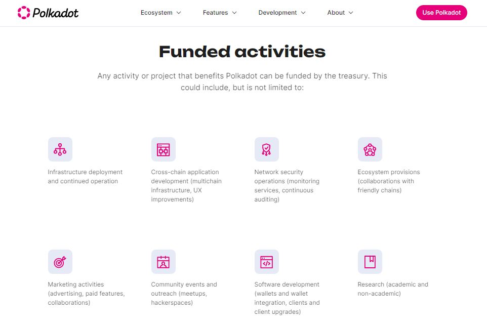

# Crowdfunding

The Polkadot ecosystem offers many options for raising funds as part of Web3 developments. Token holders and prospective projects can obtain funding through Relay chain protocols or Parachain-based platforms.

Currently, the most accessible fundraising avenues include:

* [Crowdloans](crowdloans.md)
* [Treasury spends](treasury-spends.md)
* [DAO incubators](dao-incubators.md)
* [Initial DEX Offerings](initial-dex-offerings.md)

<figure><figcaption>
The <a href="https://polkadot.network/ecosystem/treasury/">Polkadot Treasury</a> empowers Web3 projects to get rewarded for ecosystem developments.
</figcaption></figure>

