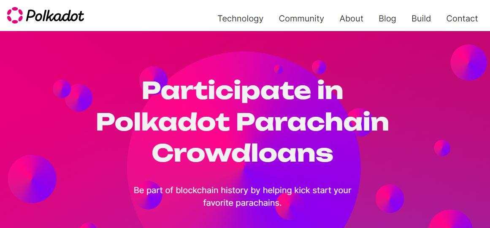

# Crowdfunding

The Polkadot ecosystem offers many options for raising funds as part of Web3 developments. Token holders and prospective projects can obtain funding through Relay chain protocols or Parachain-based platforms.

Currently, the most accessible fundraising avenues include:

* [Crowdloans](crowdloans.md)
* [Treasury spends](treasury-spends.md)
* DAO incubators
* IDOs

<figure><figcaption>
<a href="https://polkadot.network/crowdloans/">Crowdloans</a> empower Web3 projects to launch a parachain on Polkadot.
</figcaption></figure>

