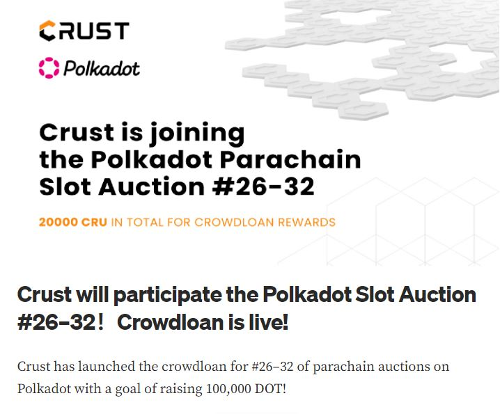
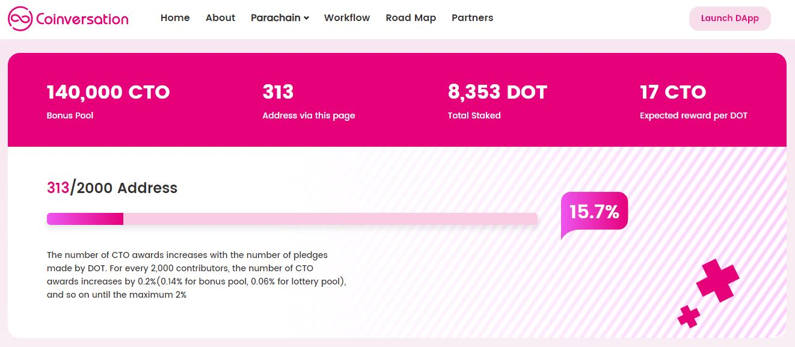
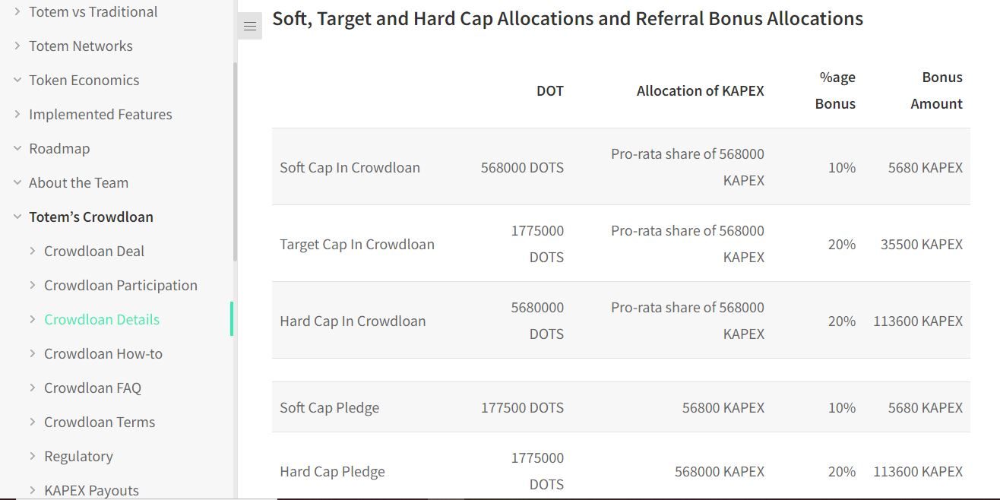
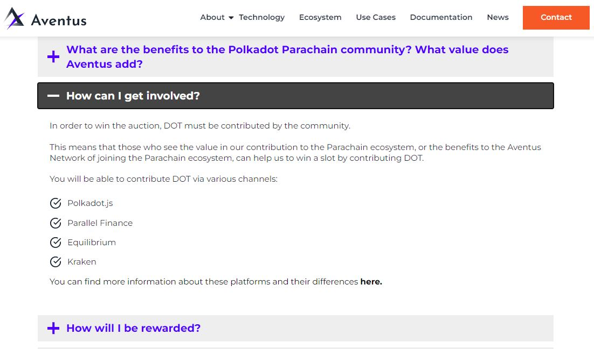

# Crowdloans

## What are Crowdloans?

Crowdloaning is a way for projects to get the support of the community when trying to secure a [Parachain slot lease](../bidding/parachain-slot-lease.md). Funds loaned by the community under this process are locked up: they do not go to the project team and they remain inaccessible for the duration of the lease.

<figure><figcaption>
<a href="https://medium.com/crustnetwork/crust-will-participate-the-polkadot-slot-auction-26-32-crowdloan-is-live-99564cdd1af1">Crust Network</a>'s crowdloan campaign for a Parachain slot lease on the Polkadot Relay chain.
</figcaption></figure>

### How-to: Contributing to Crowdloans

In exchange for locking their KSM or DOT in support of a crowdloan, community members get some rewards that are rolled out over time (also called "vesting"). This compensation might be in the form of Parachain tokens, NFTs, derivative tokens, Metaverse lands, etc. Parachain projects usually make provision for these rewards in their tokenomics, but the percentages vary greatly. For example, a project might give out 15% of its coin supply during its initial crowdloan, but then give less than 5% when renewing its slot lease.

<figure><figcaption>
<a href="https://www.coinversation.io/joinus">Coinversation</a>'s custom-made crowdloan dashboard.
</figcaption></figure>

Some projects further reserve a portion of their overall rewards to participants who meet certain criteria through whitelists, referrals, and contributions benchmarks. Projects might also require you to pass certain checks before you can participate in their crowdloans, for security and legal purposes. This usually involves pre-registration to filter spam contributors and whitelisting to isolate participants from restricted countries.

<figure><figcaption>
<a href="https://docs.totemaccounting.com/#/crowdloan/crowdloan-details">Totem network</a>'s crowdloan details.
</figcaption></figure>

### Risks: Safety Checks for Crowdloans procedures

Since there are many ways for contributing to crowdloans, there are also varying levels of risk, depending on the platforms that you use.&#x20;

* If you participate directly on-chain, you use the most secure option. But you might also have to learn a few advanced setups to retrieve your rewards down the line.&#x20;
* If you use custom-made dapps, you have access to a more user-friendly option. But there is also a higher risk of being phished into scam websites.&#x20;
* If you join via Centralised exchanges or use liquid crowdloan protocols, it is easier to crowdloan for many different projects. However, you are not guaranteed to get your rewards because these platforms can choose not to distribute them to you.

<figure><figcaption>
Crowdloan options available on <a href="https://www.aventus.io/polkadot-parachain-bid/">Aventus network</a>.
</figcaption></figure>

It is important that you do your research well and not just get carried away by beautiful project descriptions, strong personalities, or juicy rewards. When learning about crowdloan projects, confirm all information that you get by checking [official channels](../../4.social-support/) and media. You should remember never to send tokens to any account yourself, because crowdloans accounts are created and funded with special transactions on the Polkadot and Kusama Relay chains.

