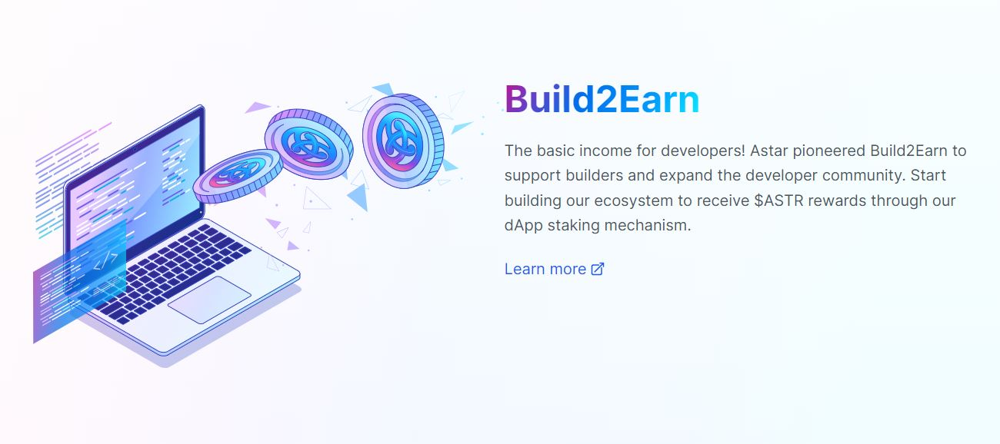
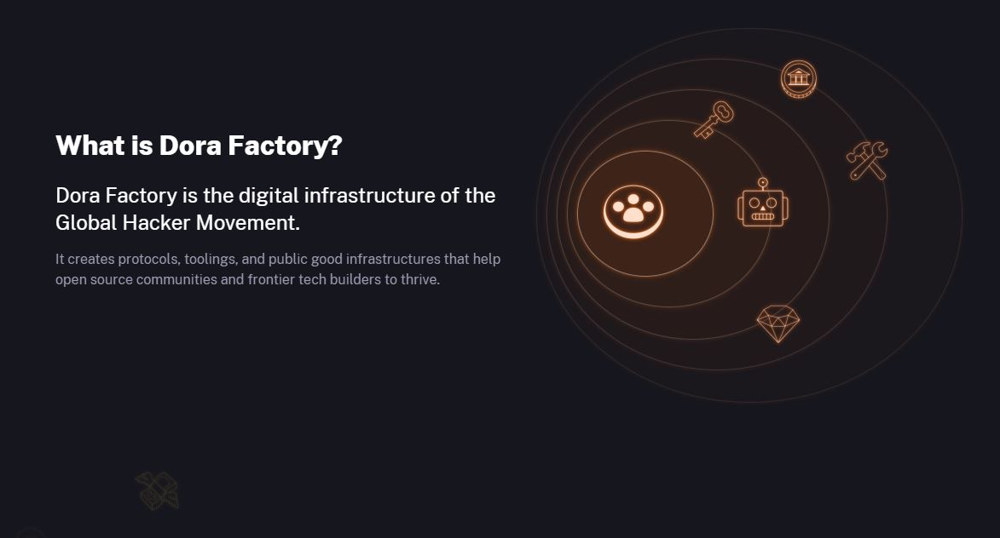
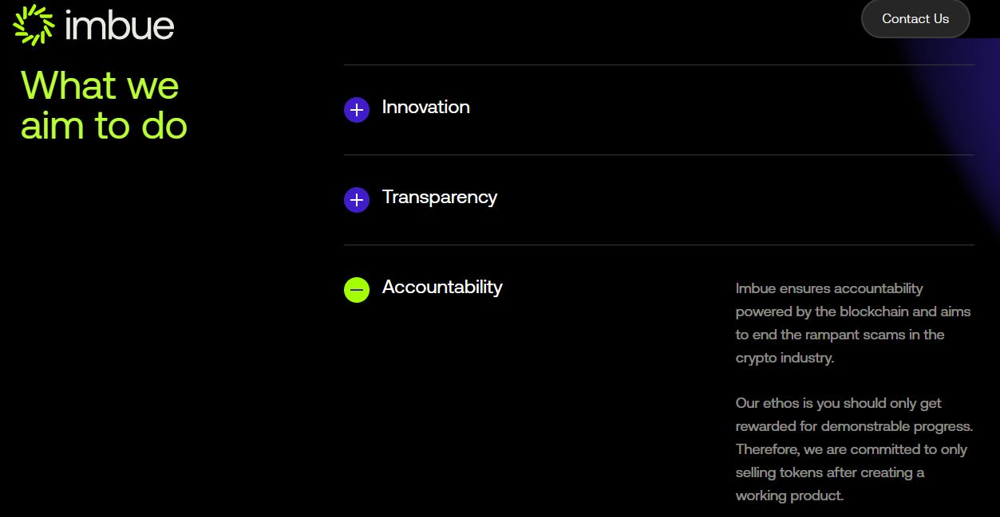
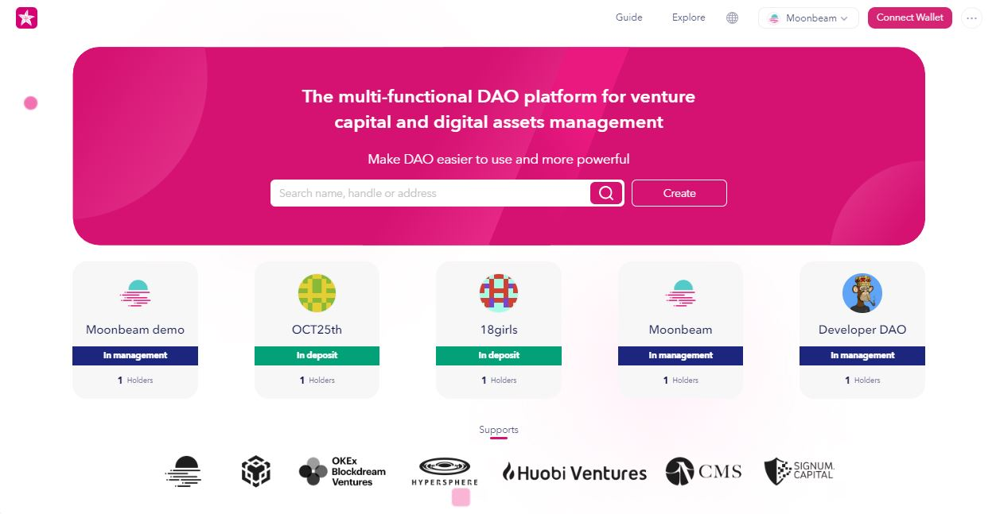
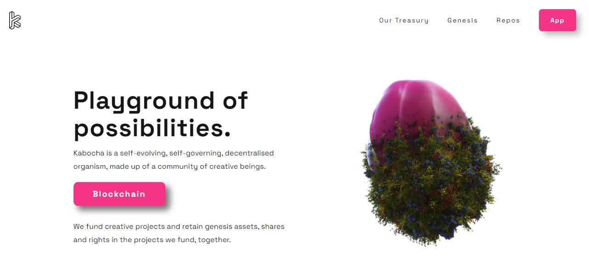

# DAO incubators

A Decentralized Autonomous Organisation (also DAO) is a community-led group in which control and decisions are effected based on computer-coded guidelines. Prior to launching, DAOs often need support from incubators or programmes to fund their initial operations and design self-sustaining models for their treasuries.&#x20;

<figure><figcaption>
<a href="https://astar.network/">Astar network</a>'s Build2Earn programme allows dapp developers to build their own self-sustaining communities.
</figcaption></figure>

## How-to:

Most DAO incubators require project teams to complete an application detailing their ideas/solutions, the resources they will need, and their funding goals. This initial application can be voted on by the community in first instance to signal approval or rejection, in line with the platform's selection criteria (i.e proven history, engagement with the community, real-world impact of the project, etc.).&#x20;

<figure><figcaption>
<a href="https://dorafactory.org/">Dora Factory</a> is a community-led platform crowdfunding decentralised infrastructure builders.
</figcaption></figure>

Some [platforms](../../5.regulations/platforms.md) allow teams to submit their application along with milestones for developments and crowdfunding directly on their dashboard, as a first step for community onboarding. In this case, funds are unlocked upon meeting each individual milestone to assist the project with transparent treasury management.

<figure><figcaption>
<a href="https://www.imbue.network/">Imbue network</a> incubates DAOs with a focus on two-way accountability.
</figcaption></figure>

Apart from providing a gateway to financial support, DAO incubators can also assist projects with roadmap development and asset management. Projects can access integrated tools for token vesting schedules, governance, [staking](../staking/) or DeFi through third-party platforms. These features are offered to help projects diversify their treasuries across multiple networks so that they can continue their operations during periods of downturn.

<figure><figcaption>
<a href="https://www.subdao.network/">SubDAO</a> proposes multichain tools for DAO management.
</figcaption></figure>

## Risks:

Before applying for an incubator programme, it is important to research the history of the platform itself to evaluate the transparency of processes in place. This is because funds raised from the community are often held on the platform's smart contracts or wallets before being disbursed to projects, and any hacks or misappropriation of funds by the DAO incubator's team can lead to irreparable losses for onboarded projects and their stakeholders.&#x20;

<figure><figcaption>
<a href="https://www.kabocha.network/">Kabocha</a> is an accelerator for experimental projects sustained by grassroot organisations.
</figcaption></figure>

DAO incubators operate with different standards and requirements, which has a direct effect on the outcome of teams' applications. Depending on the platform used, priority can be given to technical, social, financial, or artistic initiatives. Going through published guidelines helps prevent common mistakes such as duplicated solutions, absence of technical specifications, or unclear schedules.&#x20;

