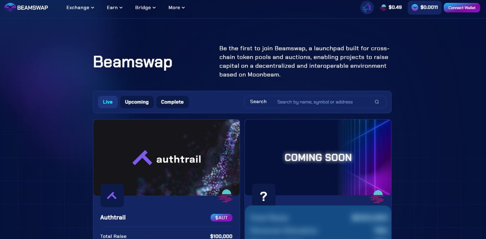
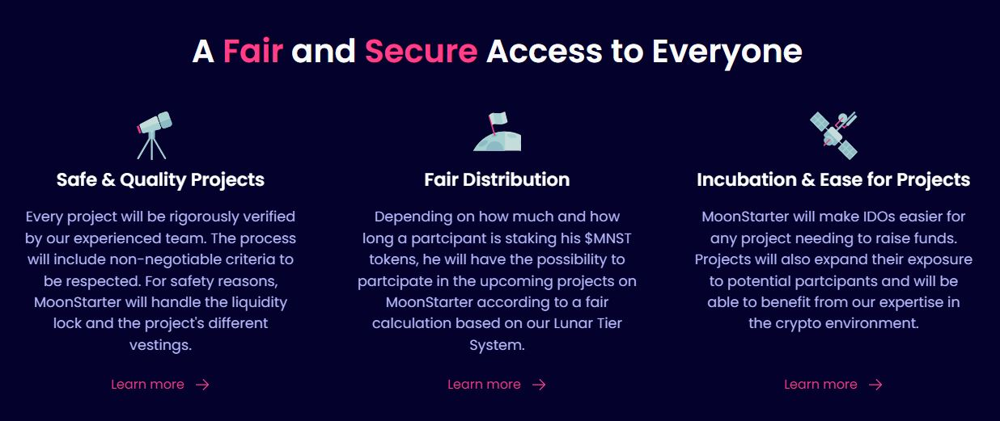
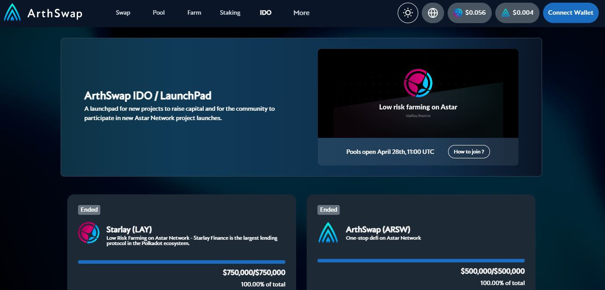
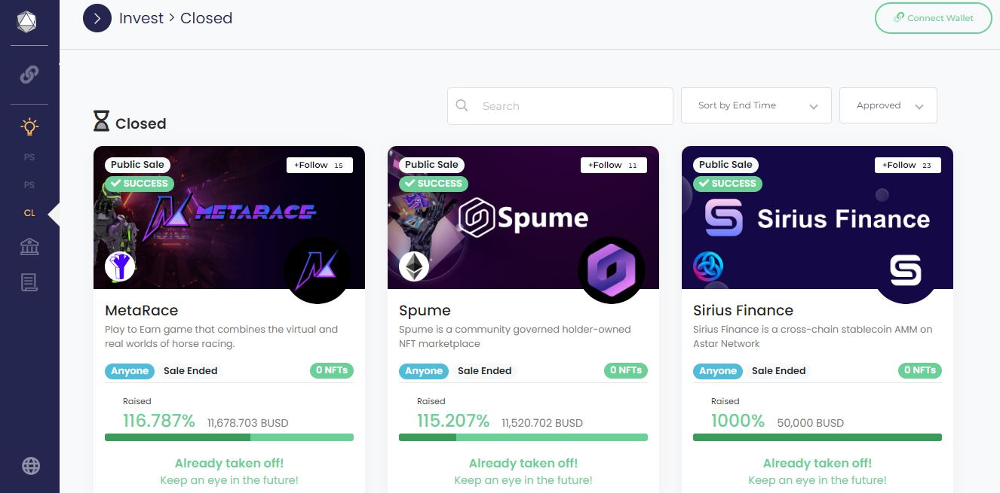

# Initial DEX Offerings

## What are IDOs?

IDOs (Initial DEX Offerings) involve launching a token sale via Decentralised Exchanges to raise funds for a project. These crowdfunding operations are coordinated through Smart Contracts deployed on the DEX, which facilitates the listing process for project teams.

<figure><figcaption>
Beamswap Docks is an IDO platform for upcoming projects in the Moonbeam ecosystem.
</figcaption></figure>

### How-to: Selecting an IDO Platform

Unlike ICOs (Initial Coin Offerings) and IEOs (Initial Exchange Offerings), IDOs do not involve any formal intermediaries or established entities. Projects can reach out directly to investors themselves via Decentralised platforms. As a result, it is becoming cheaper for innovative or unique solutions to attract funding and build an immediate liquidity pool for [trading their tokens](../swapping/pairs-availability.md).

<figure><figcaption>
PolkaEX is a multichain launchpad for crowdfunding in the Astar ecosystem. 
</figcaption></figure>

There are two types of special-purpose dapps designed for IDOs: **Launchpads and Starter platforms**. Launchpads are usually entirely run through code and operate in a multichain environment. Ecosystem participants only need an account funded with the launchpad's native tokens to access funding in various stablecoins or highly liquid cryptocurrencies. By contrast, Starter platforms are often tied to the blockchain networks on which they are built. They implement a vetting process (i.e KYC and Whitelisting) before projects can run their IDO, and can also offer extra services to project teams as part of their business model.

<figure><figcaption>
MoonStarter supports project teams and investors through a full suite of IDO-related services.
</figcaption></figure>

Typically, IDOs run for a very short period of time (i.e less than 1 month) and for small amounts (i.e less than $100,000). At the end of the IDO, project tokens are released to investors during a Token Generation Event (also called TGE), which occurs after a set period. However, most IDO platforms will favour projects that propose to lock their liquidities for extra rewards through yield farming operations. In return, this extra liquidity helps reduce sharp fluctuations in the valuations of project tokens, which sends a positive signal to the wider community.

### Risks: Safety Checks for DEX-based Crowdfunding

Although crowdfunding through DEXes might seem more secure compared to ICOs/IEOs because they are trustless, they still remain vulnerable to bugs. Incomplete or faulty parameters in Smart Contracts can impact the running of IDOs and possibly stall even the most promising projects.&#x20;

<figure><figcaption>
ArthSwap has successfully conducted high-value IDOs on its platform.
</figcaption></figure>

Because of the rising popularity of IDOs as an alternative to other more time-consuming crowdfunding methods, some platforms choose not to implement checks on participants' account addresses. As a result, these platforms are swarmed by trading bots that purchase a big chunk of project's tokens, and rob actual investors of these unique investment opportunities.

<figure><figcaption>
StellaSwap secures IDO participation through the staking of its native token.
</figcaption></figure>

In light of the above risks, it is recommended that prospective IDO proponents and investors carefully read through the documentation of each individual platform to get a good understanding of their terms and conditions of [services](../../5.regulations/platforms/services.md). This is particularly important because vesting periods might apply and TGEs can be delayed for unforeseen reasons.

<figure><figcaption>
DAOLaunch facilitates the creation of custom financial products for startups with no code.  
</figcaption></figure>

At minima, research on IDO platforms should provide answers to the following questions:&#x20;

* Are there any proven successful IDOs that were conducted on the platform? If so, are they backed by reviews from the community and/or statements from known business leaders?
* Are there security checks in place on the platform to reduce the likelihood of bugs in its Smart Contracts? &#x20;
* Are the platform's team members experienced in their field and/or known to a certain capacity in the ecosystem and its community?
* Are there any measures implemented on the platform to ensure that a fair chance is given to all participants?

