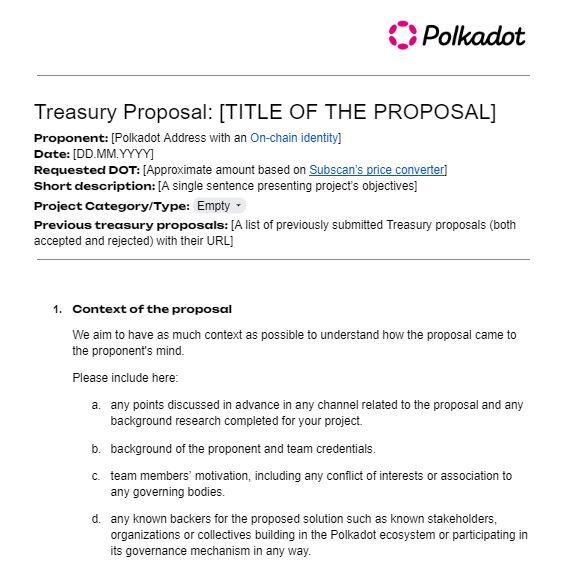

# Treasury Spends

_<mark style="background-color:red;">Disclaimer: This article is written by</mark> <mark style="background-color:red;"></mark><mark style="background-color:red;">**Dot.alert()**</mark> <mark style="background-color:red;"></mark><mark style="background-color:red;">contributors for educational purposes only. This article should not be used as a substitute for competent legal or financial advice from a licensed professional in your country.</mark>_

## What are Treasury Spends?

Relay chains come with on-chain treasuries whose funds are used to finance or reward activities that work towards the growth of their ecosystem. These funds are mainly generated through transaction fees and inflation, and a percentage of the total pot is regularly burnt.

### How-to: Submitting a Treasury Spend Proposal

Anyone can apply and receive treasury funding, so long as their spend proposal gets passed by community [votes](../voting/) for an automatic allocation via on-chain governance (i.e OpenGov's referendum tracks). Spend proposals are usually submitted for major tasks or activities (eg. Software development, community events, ecosystem-wide tools, education hubs, etc.) that require advanced funding.

Proposals can be divided into two categories:&#x20;

1. Requests for one-off financial assistance.
2. Requests for recurrent funding (also called "social contracts").&#x20;

The application process requires extensive project documentation with clear specifications and deliverables, as well as a deposit prior to submission and a report upon milestone completion.&#x20;

By contrast, bounties are used to reward specific tasks that need to be completed over a given period. They are normally supervised by a curator who allocates rewards directly from the Treasury pot.  However, this process would be too complicated for relatively smaller but notable contributions (e.g. translation, tutorials, dashboards, etc.). In such cases, it is simpler to apply for a payout via the tipping mechanism (i.e OpenGov's _SmallTipper_ or _BigTipper_ referendum tracks).

<figure><figcaption>
The standardised Treasury spend proposal <a href="https://docs.google.com/document/d/1O_84mXYFERCavmnJyxbIPKFkG0bVBySRjCVy-d-VKcc/edit">template.</a>
</figcaption></figure>

### Risks: Safe Management of Treasury Spends procedures

While the opportunity to get financial support through Treasury spends encourages individuals to contribute to the expansion of the Polkadot ecosystem, they still need to submit well thought-out proposals ahead of their project's deadline. In the past, some proposers have made the mistake of requesting considerable amounts from the Treasury without giving enough lead time for a decision, which led to the rejection of their request for funds.

Furthermore, before submitting a proposal on-chain, it is important to gather support from a range of ecosystem [participants](../../5.regulations/networks/participation.md) that can follow through during the voting period. Since the Treasury is a common good that belongs to every token holders, proposers must listen to suggestions from community members and be ready to rework their proposals. Failing to acknowledge constructive feedback can negatively impact the outcome of proposal and also damage an individual's or a team's social standing for a long time.

