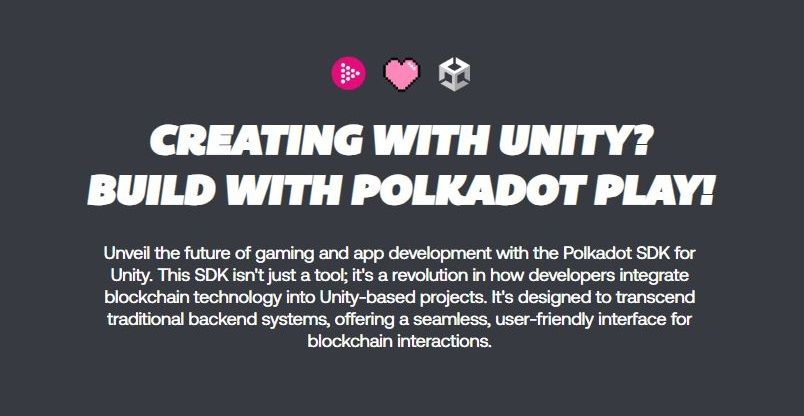

# Gaming

Gameverses are standalone universes and communities that emerge from blockchain-based games and come with their own economies and rules for social interactions.

In the Polkadot ecosystem, creators and developers propose [highly-customisable assets](game-assets.md) tied to unique narratives to offer an engaging [on-chain gaming experience](game-development.md) for a range of players profiles.

<figure><figcaption>
Polkadot's <a href="https://polkadotplay.org/">Unity SDK</a> supports beginner and professional game developers. 
</figcaption></figure>

