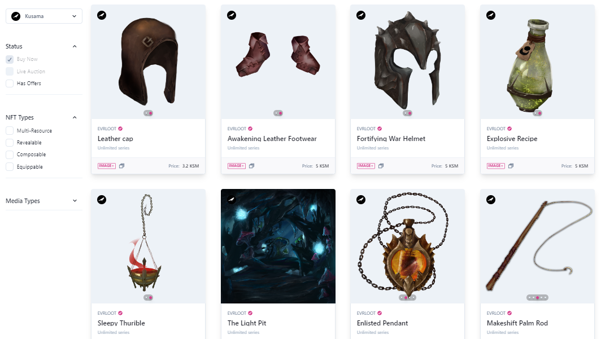

# Game Assets

_<mark style="background-color:red;">Disclaimer: This article is written by</mark> <mark style="background-color:red;"></mark><mark style="background-color:red;">**Dot.alert()**</mark> <mark style="background-color:red;"></mark><mark style="background-color:red;">contributors for educational purposes only. This article should not be used as a substitute for competent legal or financial advice from a licensed professional in your country.</mark>_

## What are Game Assets?

Game assets are [NFTs](../nft-trading/), in-game tokens, and other forms of digital assets that are issued during the genesis and expansion of NFT or gaming projects. These assets span numerous classes, including avatars, items, lands, and special-purpose NFTs that bring value to the in-game experience.

### How-to: Exploring Gameverses Offerings

While the majority of NFTs have pre-assigned functionalities for gameplay, others only become usable once they are "composed" with others.

Character NFTs represent a class of assets that players need to get before they can gain access to a specific gaming universe and participate in related events. They often serve as avatars and are essential for giving an identity to each individual player and unlocking the full features of the game. Character NFTs vary in nature and are their utility is linked to the [developments](game-development.md) of their associated gameverse.

In addition to the initial offerings, Gameverses enable players to collect and use generic and custom NFTs to enhance their in-game status. There are items that give a noted advantage to the holders in the course of the game, and others that serve as gatekeepers to further achievements. Some tokens can also be used for marketplace purchases, upgrades, and gas fees to make the game more accessible.

Gameverses are often spearheaded and supported by strong communities that are bootstrapped before the [official launch](../../5.regulations/investments/issuance.md) through various incentive mechanisms such as whitelists, airdrops, and private sales. There is also a growing diversity of gameverses in the Polkadot ecosystem, with themes such as planetary exploration, medieval travels, cyberpunk dystopia, racing, and magical quests.&#x20;

<figure><figcaption>
Examples of <a href="https://singular.app/collectibles/kusama/54bbd380dc3baaa27b-EVRLOOT?isVerified=false&#x26;showPending=true&#x26;hideRelated=false&#x26;network=kusama&#x26;sortBy=minted_at:desc&#x26;page=1">composable NFTs</a> used as game assets.
</figcaption></figure>

### Risks: Mitigating Assets Losses

Project roadmaps often hint at which asset classes could yield to greater in-game value in future developments. And so, misusing or squandering these items and tokens will result in a downgraded experience for inattentive players. For these reasons, users need to get a good understanding of the overall features and utility of game assets as part of their explorations of gameverses.

As gameverses experience rapid adoption, the valuation of their associated assets tend to increase. In this context, losing access to a wallet can be devastating for users who have accumulated a lot of collectibles. Players must remember to review their own practice for [self-custody](../../2.storage/), as this will help maintain their in-game status and scoring over time.

On-chain gaming comes with an extra layer of complexity which is linked to the irreversibility of blockchain-based transactions and the novelty of protocols. Glitches, migrations, and faulty upgrades that regularly occur on dApps can interfere with gameplay and assets handling. It is therefore important that players stay up-to-date with the latest project developments.&#x20;

