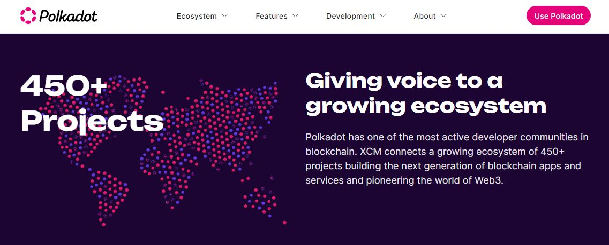

# Lending

Lending tokens is an essential feature of Decentralised exchanges (DEXes) and a core aspect of Decentralised Finance (DeFi) operations. By depositing their assets in [liquidity pools](liquidity-provision.md), users endorse the functionalities of protocols and are rewarded in return.

In the Polkadot ecosystem, the circulation of capital across DeFi-specific parachains creates a competitive environment in which platforms offer refined financial instruments to attract and retain lenders for the long term.

<figure><figcaption>
The Polkadot ecosystem hosts many <a href="https://polkadot.network/features/cross-chain-communication/">interoperable platforms</a> centered on DeFi services. 
</figcaption></figure>

