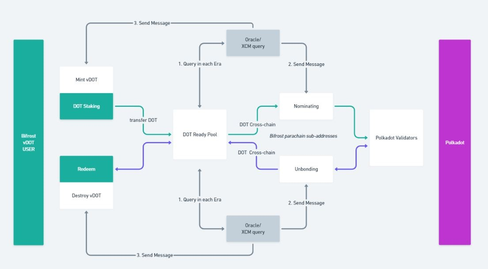
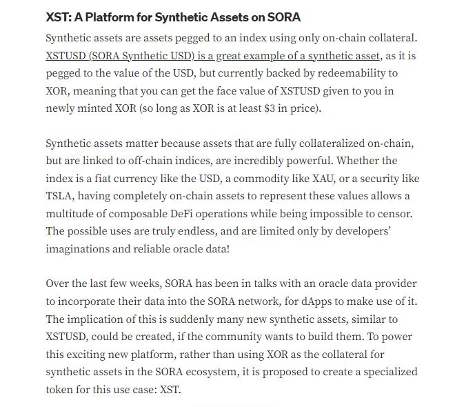
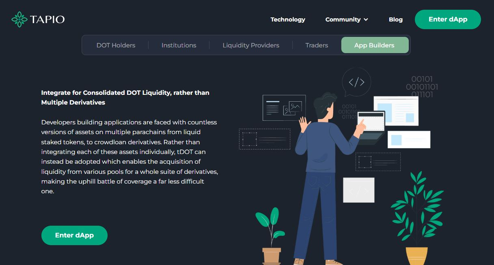
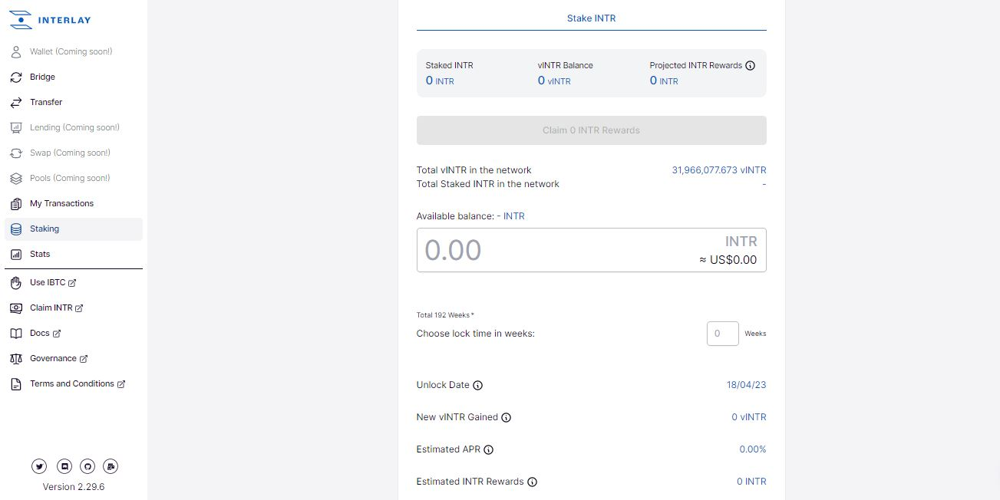
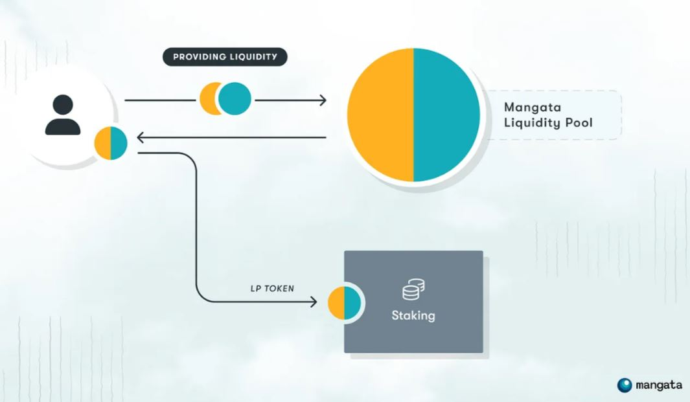

# Derivatives Markets

_<mark style="background-color:red;">Disclaimer: This article is written by</mark> <mark style="background-color:red;"></mark><mark style="background-color:red;">**Dot.alert()**</mark> <mark style="background-color:red;"></mark><mark style="background-color:red;">contributors for educational purposes only. This article should not be used as a substitute for competent legal or financial advice from a licensed professional in your country.</mark>_

## What are Crypto Derivatives?

Crypto derivatives are products or contracts whose value is determined by an underlying asset. Their primary use case is to increase capital efficiency for token holders through yield farming protocols. Crypto derivatives also allow DeFi participants to hedge against market-related risks by diversifying their holdings and speculating on assets valuations.&#x20;

<figure><figcaption>
An overview of Bifrost Finance's <a href="https://wiki.bifrost.finance/staking-liquidity-protocol-slp/vdot">Staking Liquidity Protocol</a> for DOT.
</figcaption></figure>

### How to: Minting Derivatives on Ecosystem Platforms&#x20;

Most crypto derivatives minted within the Polkadot ecosystem belong to two categories: liquid staking and liquid crowdloan.&#x20;

For [staking](../staking/) derivatives, users need to deposit their assets into a liquid staking protocol to obtain the corresponding liquid staking tokens. These derivative tokens can then be used to earn both staking rewards and farming rewards. Most platforms have restrictions on which types of assets can be used for minting staking derivatives through their pools, and the rewards can vary considerably based on the share and the duration of users' contributions to the assets pool.&#x20;

<figure><figcaption>
Parallel Finance's <a href="https://docs.parallel.fi/parallel-finance/parallel-finance-protocol/parachain-crowdloans">liquid crowdloan services</a> allow users to claim various ecosystem tokens at once.
</figcaption></figure>

Crowdloan derivatives can only be issued during parachain slot auctions, as they are tied to individual projects' lease periods and reward schemes. To obtain these derivative tokens, users need to contribute their Relay chain tokens to projects' crowdloans via a liquid crowdloan protocol. These derivatives can then be traded directly on their native DeFi platforms or used to provide liquidity within the ecosystem, so long as cross-chain transfers are available between parachains.

More recently, some DeFi protocols have started to introduce synthetics, which are assets that can track the value of tradeable crypto and non-crypto assets, including crypto derivatives. In the Polkadot ecosystem, synthetic assets are issued by platforms to mirror the demand for their native stablecoins and overhaul the need for over-collateralisation. This issuance process involves complex algorithmic operations for automated mint and burn transactions that ultimately aim to limit the impact of markets' volatility on the native protocol.

<figure><figcaption>
SORA network has developed a <a href="https://medium.com/sora-xor/xst-a-platform-for-synthetic-assets-on-sora-b45ca526d8d5">special-purpose platform for minting Synthetics</a>.
</figcaption></figure>

It is important to note that most derivative protocols have specific terms and conditions for the redemption of underlying assets, which can include a minimum lock/waiting period after which the derivative tokens will be destroyed and the original assets released. However, users also have the option to use a DEX to swap their derivative tokens for other assets, including the derivatives tokens' underlying assets.

### Risks: Safety Checks for Derivatives Markets

Minting staking and [crowdloan](../crowdfunding/crowdloans.md) derivatives is an alternative to using Relay chain's native staking and crowdloan modules, which means that there are third-party platforms acting on behalf of participants. Users need to be aware that, once they deposit their assets into commercial DeFi protocols, a bug or a technical issue could lead to asset losses. Carrying out due diligence on projects and monitoring platforms' developments is a necessary step to mitigate this risk.

<figure><figcaption>
<a href="https://www.tapioprotocol.io/">Tapio protocol</a> provides a wide range of use cases for its derivative tokens.
</figcaption></figure>

While liquid staking protocols provide more flexible for participating in network security operations, users could lose the opportunity to engage with Governance, because derivative tokens cannot be used for on-chain voting. Token holders might need to carefully consider the impact of such restrictions in the short term before going ahead with minting and trading derivatives.

<figure><figcaption>
<a href="https://app.interlay.io/staking">Interlay</a>'s vINTR is a derivative token that unlocks staking functionalities and governance rights.
</figcaption></figure>

Although protocols assert that underlying assets will always be redeemable on a 1-to-1 basis against their derivative tokens, the price of the underlying assets is still subject to fluctuations. Depending on the timing of the redemption, the volatility experienced in the markets can dramatically affect the overall value of a portfolio. For this reasons, users should always exercise caution when partaking in derivatives markets.

<figure><figcaption>
Mangata Finance's <a href="https://mangata-finance.medium.com/launching-proof-of-liquidity-e699af279d0b">Proof-of-Liquidity</a> is an alternative to the traditional PoS Staking model.
</figcaption></figure>

