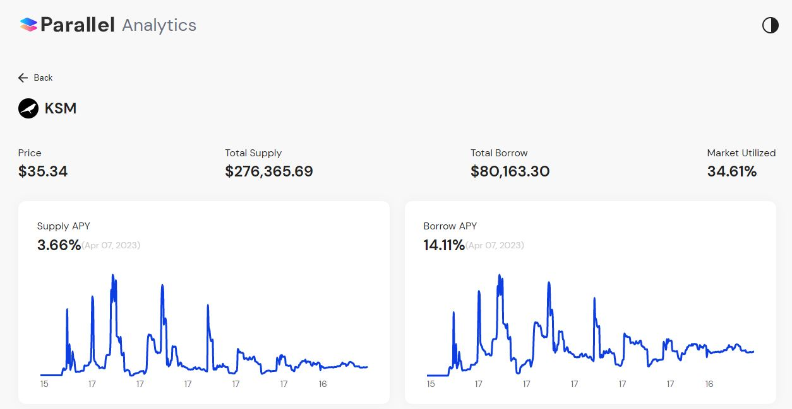
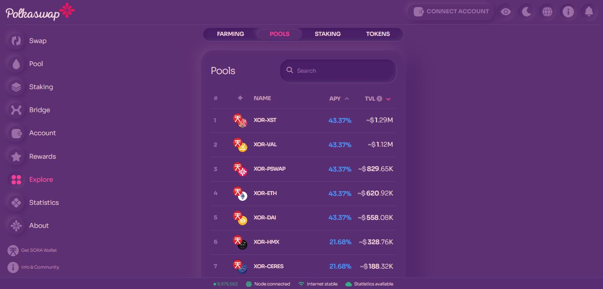
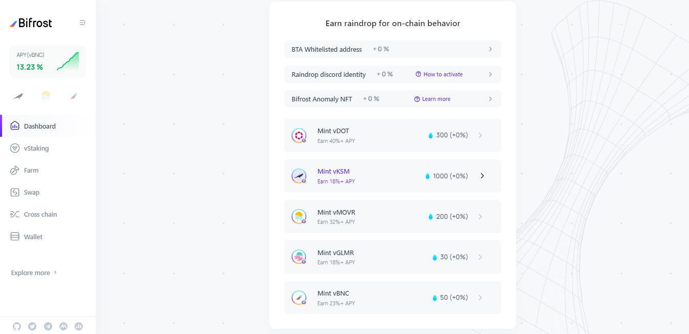
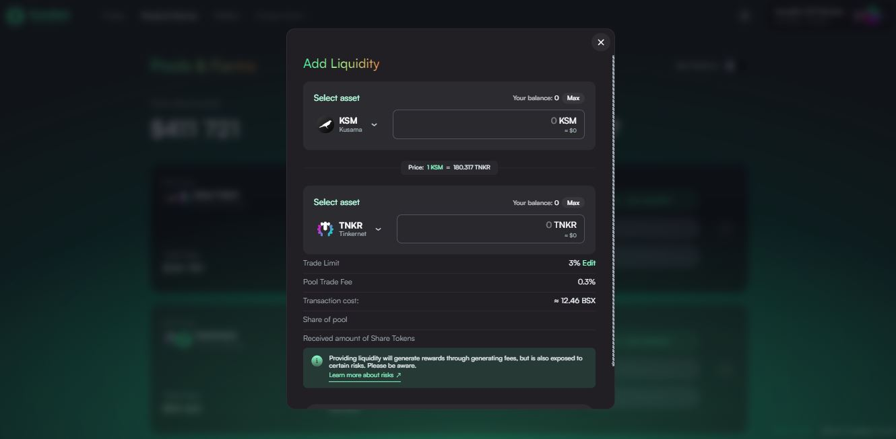
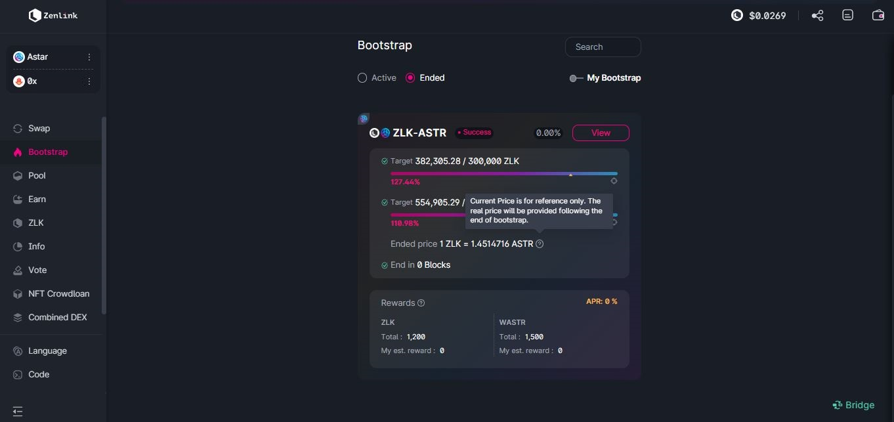
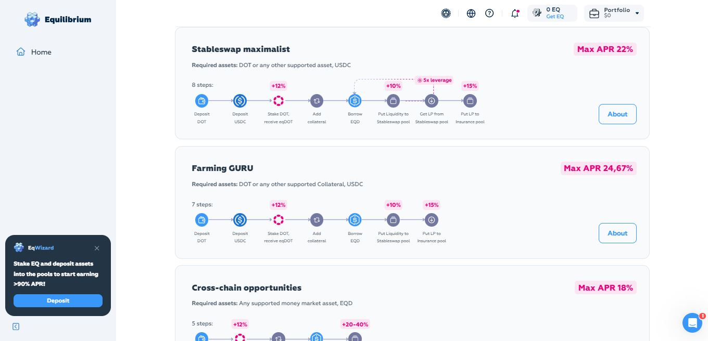

# Liquidity provision

_<mark style="background-color:red;">Disclaimer: This article is written by</mark> <mark style="background-color:red;"></mark><mark style="background-color:red;">**Dot.alert()**</mark> <mark style="background-color:red;"></mark><mark style="background-color:red;">contributors for educational purposes only. This article should not be used as a substitute for competent legal or financial advice from a licensed professional in your country.</mark>_

## What is Liquidity Provision?

Liquidity provision involves locking a pool of assets on a given Decentralised exchange (DEX) for some return. The types of assets that can be used to provide liquidity are based on the demand from [borrowers](../borrowing/) and [traders](../swapping/) who require them for their DeFi operations. The availability of assets is determined by the number of holders who are willing to lend these through DeFi platforms.

<figure><figcaption>
An overview of Money markets analytics for KSM on <a href="https://analytics.parallel.fi/moneymarket/KSM">Parallel Heiko</a>.
</figcaption></figure>

### How to:  Providing Liquidity on DEXes

At a basic level, users can provide liquidity by depositing their assets in liquidity pools from Automated Market Makers (AMMs). These pools come with their own parameters such as the types of assets to supply and the trading fees scheme that applies. By contrast, when lending assets as part of Money Market operations (MMs), the platform will specify the interest rates to be paid and the type(s) of assets that users will be getting in return. DEXes do not take custody of users' assets, which means that, if there is no voluntary locking period in place, all assets deposited can be withdrawn by the lenders along with any interest/payment due at anytime.

<figure><figcaption>
<a href="https://polkaswap.io/#/explore/pools/">Polkaswap</a> proposes an extensive list of pools for lending native and multichain tokens.
</figcaption></figure>

DeFi protocols use various bootstrapping mechanisms to obtain liquidity for their asset pools and incentivise early adopters to participate in their operations. To increase their Total Value Locked (also called "TVL"), some platforms create [staking](../staking/) programs for in-demand assets with higher than usual rates and/or bonuses. Meanwhile, other platforms create liquidity mining programs (also called "farms") on specific asset pools to retain users over the long term. The aim is to create a virtuous cycle of growth where the initial rewards attract more participants, which in turn creates more demand for the platform and its native token. This process also assists platforms in becoming truly decentralised over time.

<figure><figcaption>
The <a href="https://bifrost.app/dashboard/boost">Rainbow boost programme</a> on Bifrost Finance links users' on-chain behaviour to cross-chain DeFi lending rewards.
</figcaption></figure>

Interoperable protocols of the Polkadot ecosystem make it possible for users to provide liquidity with a single asset across different lending programmes through the use of LP tokens, XC-tokens, derivative tokens, and synthetic tokens. By deploying cross-chain functionalities for the exchange of new assets (also called "XCMP channels"), platforms built on top of DeFi-specific parachains encourage lenders to diversify their portfolio with minimal effort, as well as discover new pools and/or products.

<figure><figcaption>
Basilisk's <a href="https://app.basilisk.cloud/#/pools-and-farms">liquidity pools</a> support assets from community-driven projects.
</figcaption></figure>

### Risks: Useful Resources on Assets Volatility

Users who partake in liquidity pooling operations expose their portfolio to impermanent loss from the moment they start to provide liquidity on a given token pair. Even if the overall value of the assets held in a pool remains constant, any change in the pricing of a token against its pair will affect the number of tokens in the portfolio when liquidity is finally withdrawn. Monitoring the daily price of tokens is an important step in managing impermanent loss in the short term, as it will ensure that all valuable assets held in your portfolio are retained over time.

<figure><figcaption>
ZenLink DEX allows users to monitor key pool data throughout <a href="https://dex.zenlink.pro/#/bootstrap/list">bootstrapping events</a>.
</figcaption></figure>

Although the majority of DeFi platforms favour the use of fiat-backed stablecoins and native coins for all their token pairs, some lending [platforms](../../5.regulations/platforms/) extend their liquidity pooling functionalities to niche assets such as DAO tokens, Algorithmic stablecoins, synthetic tokens, and tokenised securities (also called "Real World Assets or RWAs"). Locking your assets in such pools could cause noticeable dips in the value of your portfolio, because niche assets are often susceptible to extreme fluctuations in their pricing (also called "Pump and dump") and could very well go to zero.

<figure><figcaption>
<a href="https://app.equilibrium.io/earn/strategies">Equilibrium</a> provides an optimal lending experience through a clean UI with dynamic data and interactive widgets.
</figcaption></figure>

In a cross-chain and multichain environment, DeFi protocols allow users to contribute to the circulation of large pools of assets across different networks and ecosystems. But this does not guarantee that the protocols themselves will not suffer any attack as the result of a bug or a misconfiguration. Project teams need to carefully consider the overall User Experience and the security features offered by platforms before proceeding to interact with them for liquidity pooling, lending services, or bootstrapping events.

