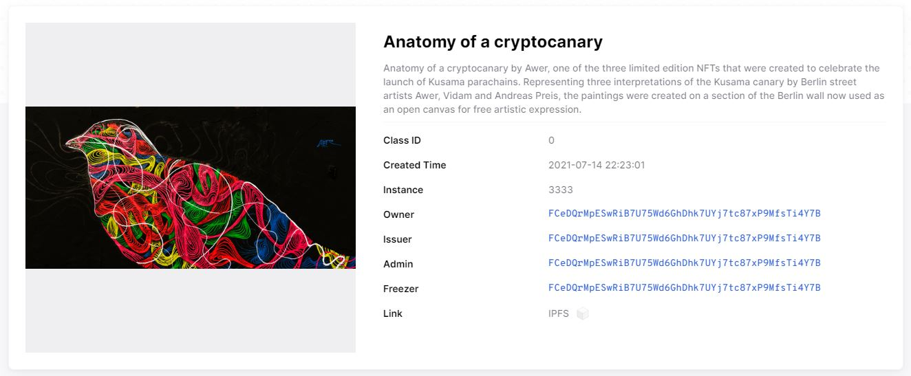

# NFT Trading

NFT trading is the practice of creating unique digital assets on-chain or purchasing non-fungible tokens from a given digital collection only to sell or exchange them at a later date.&#x20;

In the Polkadot ecosystem, users have many options for minting, storing, and retrieving their NFTs; with some platforms offering additional services to [manage](data-management.md) NFTs and secure their value over time.

<figure><figcaption>
<a href="https://statemine.statescan.io/#/uniques">Statemine</a> (Common good parachain) hosts a range of NFT assets called "Uniques".
</figcaption></figure>

