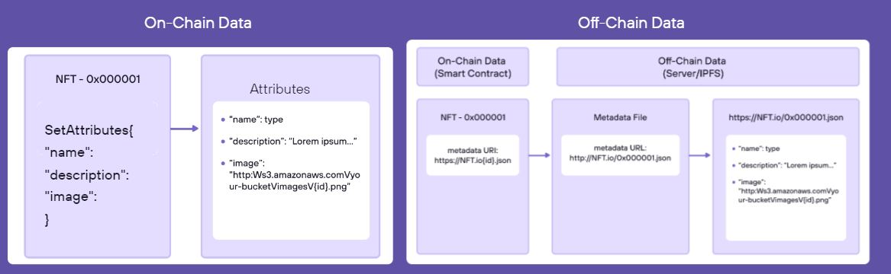
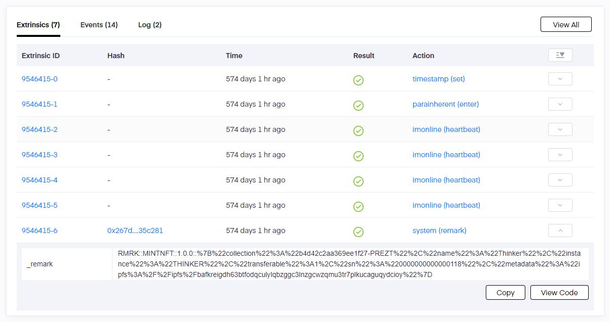
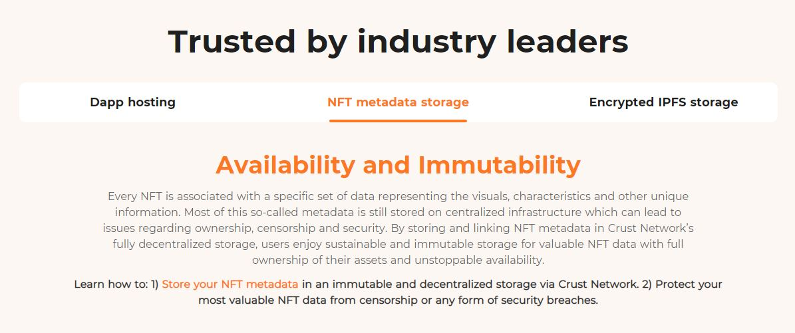
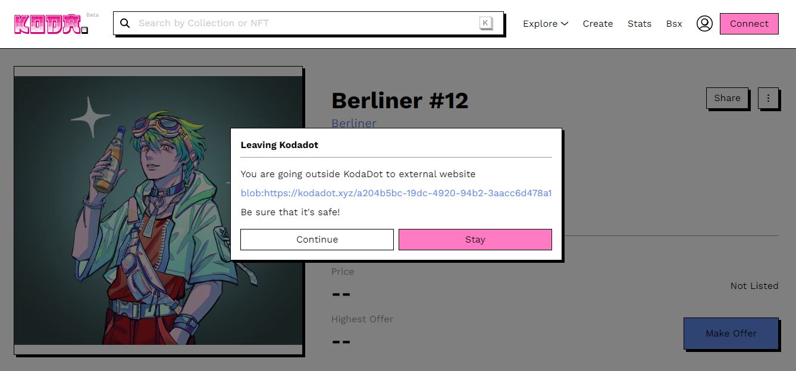
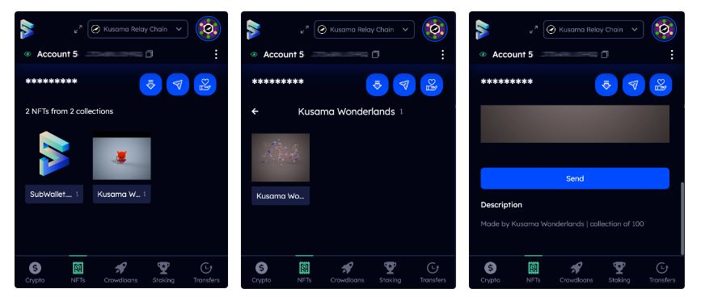

# Data Management

_<mark style="background-color:red;">Disclaimer: This article is written by</mark> <mark style="background-color:red;"></mark><mark style="background-color:red;">**Dot.alert()**</mark> <mark style="background-color:red;"></mark><mark style="background-color:red;">contributors for educational purposes only. This article should not be used as a substitute for competent legal or financial advice from a licensed professional in your country.</mark>_

## What are NFTs?

NFTs (Non-Fungible Tokens) are a category of digital assets that represent a tokenised piece of data that could be an artwork, a book, a photograph, or a video. As "non-fungible" assets, they are identifiable on-chain through minting mechanisms that assign a unique record for NFT ownership and authentication.&#x20;

<figure><figcaption>
A summary of Efinity's on-chain and off-chain architecture for NFT data management.
</figcaption></figure>

### How-to: Locating NFT Data Stores

Minting NFTs involves converting a digital item into a cryptographic token by issuing an on-chain record (also called "metadata") for the item that aggregates all the information needed to prove the ownership of this item. NFTs and their metadata are often represented on-chain as a hash, which is required to determine where the NFT is actually stored. However, there are various [asset explorers and aggregators](../../../useful-tools/explorers.md) that allow users to access their NFTs without needing to retrieve information from data stores manually.&#x20;

<figure><figcaption>
The RMRK protocol uses <a href="https://kusama.subscan.io/block/9546415">on-chain remarks</a> to mint NFTs onto the Kusama Relay chain.
</figcaption></figure>

Because NFT files themselves are not stored on-chain, they need to be hosted in storage facilities that are external to a parachain or a blockchain ecosystem. One of the most popular storage protocols is the InterPlanetary File System (also called "IPFS") which creates a unique Content ID (also called "CID") for any given file through hashing. There are also special-purpose web3 platforms that facilitate data management for NFT-related files on behalf of marketplaces, so that NFT content remains permanently accessible.

<figure><figcaption>
Crust network supports decentralised storage for NFTs' metadata.
</figcaption></figure>

Although platforms can present different interfaces, the NFT issuance process focuses on creating a token with basic information such as an ID, a name, a description, and a storage location. Some platforms offer advanced minting operations though which the creator can attach special features (also called "attributes") to an NFT to enhance its originality and/or uniqueness within a given collection. Over time, such features will unlock new use cases for NFTs such as nesting, soulbinding, and fractionalisation.

<figure><figcaption>
Unique network allows the customisation of NFT items in a collection through extended attributes.
</figcaption></figure>

### Risks: Mitigating NFT Unavailability and Losses

Despite operating on decentralised blockchain networks, some NFT [platforms ](../../5.regulations/platforms/)still choose to store NFT data from their users on centralised servers. This means that creators are at risk of losing access to their collections and digital assets if these platforms were to be shut down. Users need to pay particular attention to the storage options provided during the minting process, as only well-designed decentralised storage solutions can help make NFT content escape garbage collection over time.

<figure><figcaption>
KodaDOT uses "Permafrost" minting to permanently host or store Multichain NFT metadata.
</figcaption></figure>

When transferring NFTs between parachains and external blockchain ecosystems (i.e Ethereum, Cosmos, Avalanche, etc.) via third-party bridges, choosing the wrong network could make your NFTs permanently unavailable. This is because bridges are routinely operated via pre-programmed Smart Contracts that cannot be altered to retrieve tokens locked in other protocols. It is therefore users' responsibility to verify the parameters of their multichain transfers to avoid bad surprises.

<figure><figcaption>
Subwallet has in-built support for the collection and transfer of NFTs.
</figcaption></figure>

