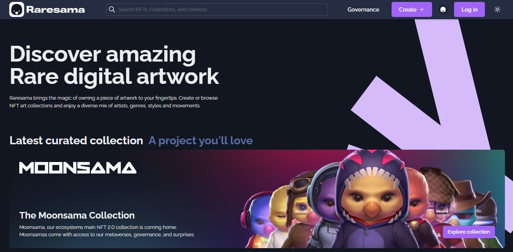
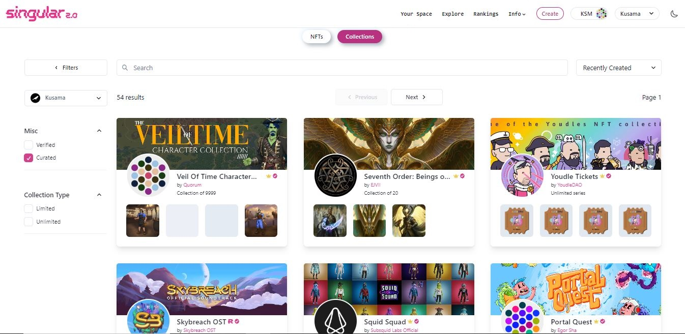
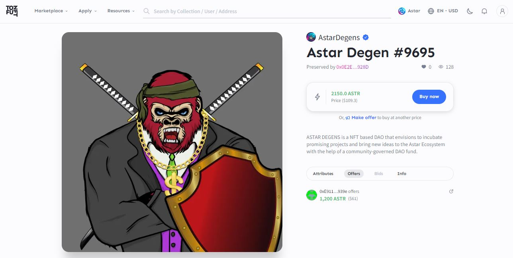
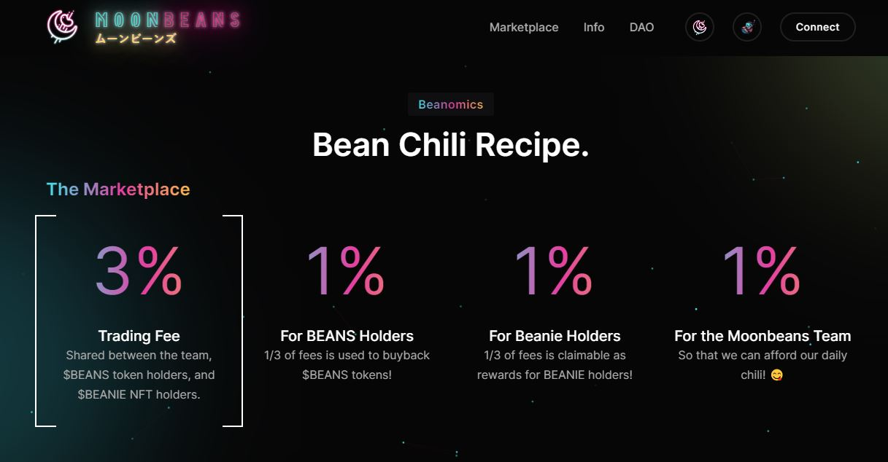
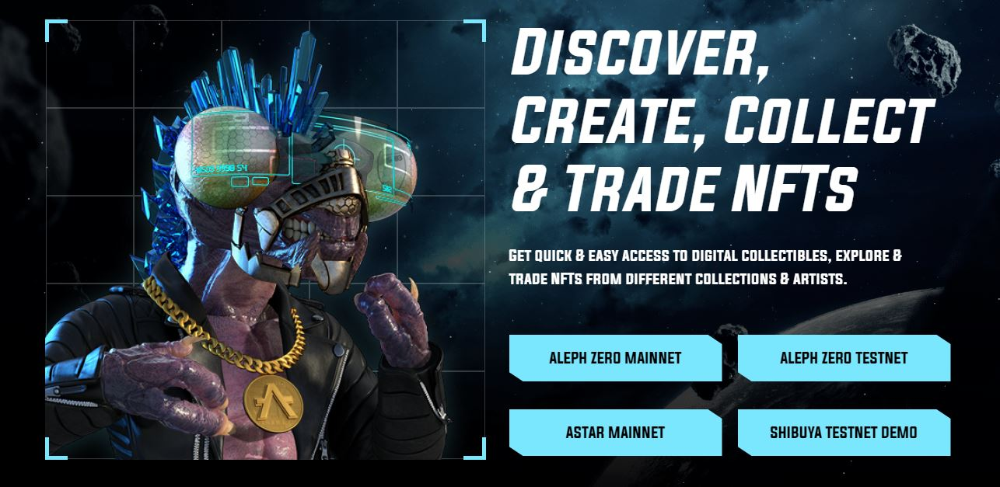
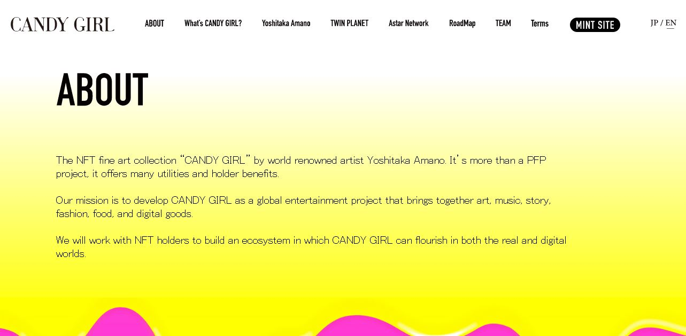
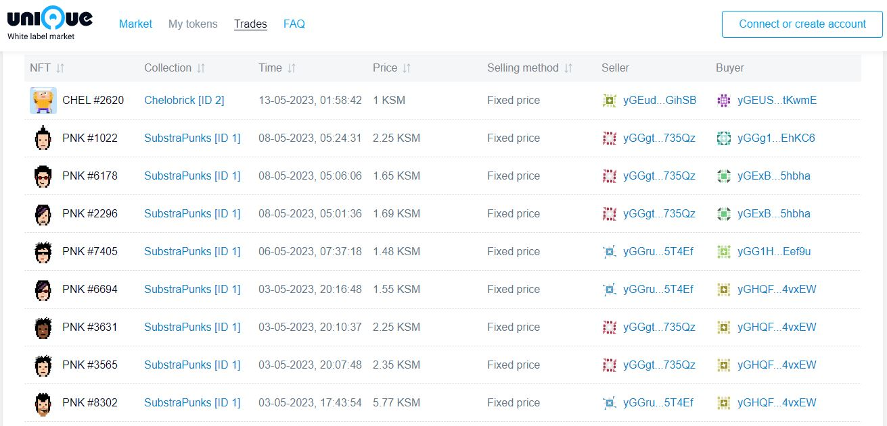

# Marketplace Activities

_<mark style="background-color:red;">Disclaimer: This article is written by</mark> <mark style="background-color:red;"></mark><mark style="background-color:red;">**Dot.alert()**</mark> <mark style="background-color:red;"></mark><mark style="background-color:red;">contributors for educational purposes only. This article should not be used as a substitute for competent legal or financial advice from a licensed professional in your country.</mark>_

## What are NFT Marketplaces?&#x20;

NFT Marketplaces are special-purpose dapps that support a range of NFT-related operations such as creating NFT collections and displaying NFTs on digital galleries. Marketplaces play an important role in the trading of NFTs and come with specific features to assist the valuations of collectibles.

<figure><figcaption>
<a href="https://raresama.com/">Raresama</a> is a multichain NFT marketplace for minting and selling digital artwork and collectibles.
</figcaption></figure>

### How-to: Maintaining NFT Collections

On marketplaces, NFTs can be minted as standalone items or as pieces of a particular collection. Just like fine arts, an NFT collection can represent a unique theme or concept that the creator explores through different digital media. An NFT collection can specify a set number of items that will be [minted](data-management.md) over time, or remain indefinitely open to further additions (also called "unlimited"). Most marketplaces offer verification and curation services to creators, which helps highlight or maintain the value of their NFT collections over time.

<figure><figcaption>
A selection of <a href="https://singular.app/explore/collections?isCurated=true&#x26;isVerified=false&#x26;network=kusama&#x26;sortBy=collections:created_at_block:desc">curated NFT collections</a> available on Singular.
</figcaption></figure>

NFTs can be listed either through direct sale or via auctions. In the case of a direct sale, there is a fixed price outlined by the seller which the buyer pays to acquire the NFT. Meanwhile, auctions happen when continuous bids are made on the NFT before the creator eventually concludes the sale with the highest bidder. Generally-speaking, creators start by selling their first NFTs through direct sales, and then progress onto auctioning their work once they are well-established in their respective communities.

<figure><figcaption>
<a href="https://tofunft.com/collection/astardegens/items">Astar Degens</a> is a verified collection with community NFTs that can be purchased via fixed price or custom offers.
</figcaption></figure>

In addition to listing, some marketplaces allow the original creators of an NFT to earn a commission of 2 to 10% every time a secondary sale of their NFT occurs (also called "royalties"). The payout mechanism for royalties is often automated through Smart Contracts to facilitate transactions between multiple parties. In this setup, creators can generate a revenue from their work long after their first sale, whereas marketplaces are able to monetise the traffic generated on their platforms through listing and sales fees.

<figure><figcaption>
<a href="https://moonbeans.io/">Moonbeans</a> redistributes its marketplace's trading fees between a variety of stakeholders.
</figcaption></figure>

### Risks: Monitoring NFT Valuations

Although marketplaces have made NFT minting very accessible for the general public, there are still some risks associated with the process. User-related mishaps such as typos, erroneous descriptions, duplicate attributes, and accidental locks/freezes can negatively impact the valuation of an existing collection, as well as the creator's standing. Creating NFT collections requires careful planning and consideration, because it is not possible to edit the metadata after minting transactions have been submitted on-chain.&#x20;

<figure><figcaption>
<a href="https://artzero.io/">ArtZero</a> marketplace gives users the option to trial NFT minting operations on Aleph Zero testnet.
</figcaption></figure>

When trading NFTs, users could end up buying replicas and counterfeit collection items that do not come with the same ownership rights as the originals. Verifying the authenticity of an NFT is an essential step before making a purchase on popular marketplaces. Some of the most common options for certifying an NFT, vetting the uniqueness of a collection, or confirming the legitimacy of a seller include badges, watermarks, on-chain identities, and landing page spotlights/mentions. Taking the time to review this information will help safeguard users from scammers and opportunists.

<figure><figcaption>
The <a href="https://candygirl-nft.com/">Candy Girl</a> website streamlined minting operations to guarantee the exclusivity of its sought-after collection.
</figcaption></figure>

Nevertheless, the biggest issue with NFT marketplaces remains that a lot of NFT valuations are heavily inflated through wash-trading. In this context, the owners of several collections or collectibles agree to take it in turn to buy and sell each other's NFTs to boost their price and volume artificially, at the expenses of real buyers. Users should always inspect the transaction history of an NFT and use [explorers](../../../useful-tools/explorers.md) to review the details of all the accounts involved in prior sales for a given collection.

<figure><figcaption>
Visitors and creators can easily identify recurring NFT traders on <a href="https://unqnft.io/quartz/trades">Unique marketplace</a>.
</figcaption></figure>

