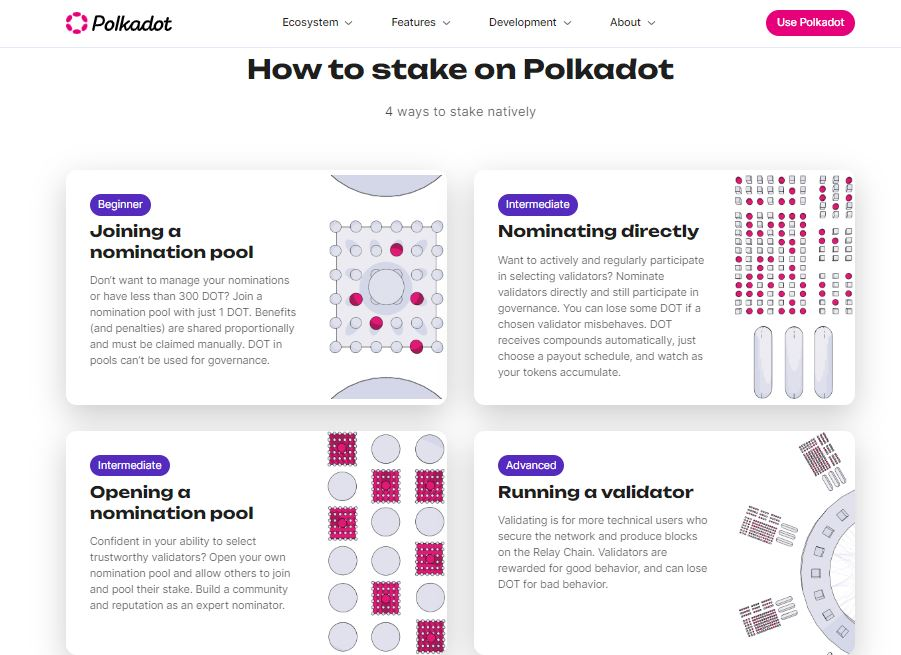

# Staking

Staking is one of the pillars of the Polkadot ecosystem because it ensures that the shared security scheme between relay chains and their parachains remains robust.&#x20;

Contrary to other Proof-of-Stake blockchains, the logic of Polkadot network's Nominated Proof-of-Stake requires a more active endeavour from all participants. In this context, [nominators](nominating.md) and [validators](validating.md) must fully engage with specific procedures for as long as their funds are a stake.

<figure><figcaption>
An overview of <a href="https://polkadot.network/features/staking/">native staking options</a> for the Polkadot Relay chain.
</figcaption></figure>

